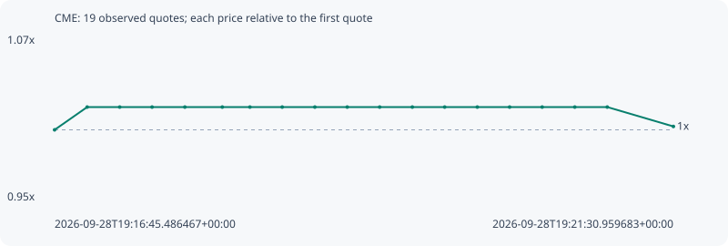

# CME

**robinhood** / `0xe2324ff2a59f8ecba8c321c6466e59121c00e795`

[All tokens](README.md) · [Market window](../README.md)

## Native assessments

This contract is in the quote cohort; it has no native model assessment in this window.

## Series 9ec97495f6676a06833a

Pool: `not supplied`

[Complete series](../series/robinhood/9ec97495f6676a06833a.json)

Every dot is a captured quote. Lines connect observations; the curve ends at the last available quote.

| Peak | Final | Return | Maximum drawdown |
| ---: | ---: | ---: | ---: |
| 1.0161x | 1.0024x | +0.24% | 1.35% |

### Complete quote timeline

| Time (UTC) | Price (USD) | Multiple | Evidence |
| --- | ---: | ---: | --- |
| 2026-09-28T19:16:45.486467+00:00 | 0.000223037 | 1.0000x | `capture:4ca26bf7-9d1e-455b-a63e-1b5df831b997:rank:89` |
| 2026-09-28T19:17:00.510014+00:00 | 0.000226633 | 1.0161x | `capture:d9309a4d-09d7-45ee-91ce-c4a055e8faac:rank:72` |
| 2026-09-28T19:17:15.523068+00:00 | 0.000226633 | 1.0161x | `capture:333d670d-dbd3-4656-95f9-1bc781b271db:rank:70` |
| 2026-09-28T19:17:30.451540+00:00 | 0.000226633 | 1.0161x | `capture:e161007c-0751-46e4-acc9-c8e28cd7190a:rank:74` |
| 2026-09-28T19:17:45.582227+00:00 | 0.000226633 | 1.0161x | `capture:a3f98285-516a-4bd4-b2c4-63596c968a6b:rank:71` |
| 2026-09-28T19:18:02.849542+00:00 | 0.000226633 | 1.0161x | `capture:53a348cd-74d6-4031-ba2b-02d70c63e42b:rank:75` |
| 2026-09-28T19:18:15.585380+00:00 | 0.000226633 | 1.0161x | `capture:ea19027f-d2c1-43cc-973f-0d8eb46ed64e:rank:77` |
| 2026-09-28T19:18:30.489414+00:00 | 0.000226633 | 1.0161x | `capture:c5cd70df-4ca4-4388-b3c5-f977fa86f8a2:rank:77` |
| 2026-09-28T19:18:45.550203+00:00 | 0.000226633 | 1.0161x | `capture:728d4974-5fe3-40a8-8e99-2139c59da3e3:rank:81` |
| 2026-09-28T19:19:00.487408+00:00 | 0.000226633 | 1.0161x | `capture:297e4fae-3bb5-49eb-b490-a4f34898851c:rank:81` |
| 2026-09-28T19:19:15.451095+00:00 | 0.000226633 | 1.0161x | `capture:0bcc0576-3637-4b2c-b0e4-f9e05871b187:rank:79` |
| 2026-09-28T19:19:30.512866+00:00 | 0.000226633 | 1.0161x | `capture:bb499bdc-159a-4072-a450-312045f32cef:rank:79` |
| 2026-09-28T19:19:45.438706+00:00 | 0.000226633 | 1.0161x | `capture:59b12f7b-2112-42c7-834a-a2eb9bcaee3d:rank:84` |
| 2026-09-28T19:20:00.494705+00:00 | 0.000226633 | 1.0161x | `capture:5b06d6b3-9eca-4487-82fb-6b28820c37d9:rank:84` |
| 2026-09-28T19:20:15.393373+00:00 | 0.000226633 | 1.0161x | `capture:17802da9-7cee-48c3-9f5b-5829781be3f6:rank:79` |
| 2026-09-28T19:20:30.417446+00:00 | 0.000226633 | 1.0161x | `capture:f2fe9ac4-89a0-4ad3-8f15-5a70d7e1d5f7:rank:92` |
| 2026-09-28T19:20:45.464282+00:00 | 0.000226633 | 1.0161x | `capture:26559b75-812f-4386-982b-eba5073faf44:rank:98` |
| 2026-09-28T19:21:00.449260+00:00 | 0.000226633 | 1.0161x | `capture:186445b2-8971-4639-85b9-26b2e8fb9d2c:rank:97` |
| 2026-09-28T19:21:30.959683+00:00 | 0.000223571 | 1.0024x | `capture:300e0f35-12d4-46a9-a17e-17adbe8e1059:rank:94` |

### Exit-policy timeline

Calculated from captured quotes under the window policy. Native assessments are linked separately above.

| Time (UTC) | Action | Price (USD) | Evidence |
| --- | --- | ---: | --- |
| 2026-09-28T19:16:45.486467+00:00 | BUY | 0.000223037 | `capture:4ca26bf7-9d1e-455b-a63e-1b5df831b997:rank:89` |
| 2026-09-28T19:17:00.510014+00:00 | HOLD | 0.000226633 | `capture:d9309a4d-09d7-45ee-91ce-c4a055e8faac:rank:72` |
| 2026-09-28T19:17:15.523068+00:00 | HOLD | 0.000226633 | `capture:333d670d-dbd3-4656-95f9-1bc781b271db:rank:70` |
| 2026-09-28T19:17:30.451540+00:00 | HOLD | 0.000226633 | `capture:e161007c-0751-46e4-acc9-c8e28cd7190a:rank:74` |
| 2026-09-28T19:17:45.582227+00:00 | HOLD | 0.000226633 | `capture:a3f98285-516a-4bd4-b2c4-63596c968a6b:rank:71` |
| 2026-09-28T19:18:02.849542+00:00 | HOLD | 0.000226633 | `capture:53a348cd-74d6-4031-ba2b-02d70c63e42b:rank:75` |
| 2026-09-28T19:18:15.585380+00:00 | HOLD | 0.000226633 | `capture:ea19027f-d2c1-43cc-973f-0d8eb46ed64e:rank:77` |
| 2026-09-28T19:18:30.489414+00:00 | HOLD | 0.000226633 | `capture:c5cd70df-4ca4-4388-b3c5-f977fa86f8a2:rank:77` |
| 2026-09-28T19:18:45.550203+00:00 | HOLD | 0.000226633 | `capture:728d4974-5fe3-40a8-8e99-2139c59da3e3:rank:81` |
| 2026-09-28T19:19:00.487408+00:00 | HOLD | 0.000226633 | `capture:297e4fae-3bb5-49eb-b490-a4f34898851c:rank:81` |
| 2026-09-28T19:19:15.451095+00:00 | HOLD | 0.000226633 | `capture:0bcc0576-3637-4b2c-b0e4-f9e05871b187:rank:79` |
| 2026-09-28T19:19:30.512866+00:00 | HOLD | 0.000226633 | `capture:bb499bdc-159a-4072-a450-312045f32cef:rank:79` |
| 2026-09-28T19:19:45.438706+00:00 | HOLD | 0.000226633 | `capture:59b12f7b-2112-42c7-834a-a2eb9bcaee3d:rank:84` |
| 2026-09-28T19:20:00.494705+00:00 | HOLD | 0.000226633 | `capture:5b06d6b3-9eca-4487-82fb-6b28820c37d9:rank:84` |
| 2026-09-28T19:20:15.393373+00:00 | HOLD | 0.000226633 | `capture:17802da9-7cee-48c3-9f5b-5829781be3f6:rank:79` |
| 2026-09-28T19:20:30.417446+00:00 | HOLD | 0.000226633 | `capture:f2fe9ac4-89a0-4ad3-8f15-5a70d7e1d5f7:rank:92` |
| 2026-09-28T19:20:45.464282+00:00 | HOLD | 0.000226633 | `capture:26559b75-812f-4386-982b-eba5073faf44:rank:98` |
| 2026-09-28T19:21:00.449260+00:00 | HOLD | 0.000226633 | `capture:186445b2-8971-4639-85b9-26b2e8fb9d2c:rank:97` |
| 2026-09-28T19:21:30.959683+00:00 | HOLD | 0.000223571 | `capture:300e0f35-12d4-46a9-a17e-17adbe8e1059:rank:94` |
