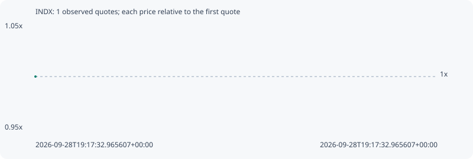

# INDX

**solana** / `GX53Ff64B9uvBLgjuDMikZup3tjFiU8xZ6SXmC5mpump`

[All tokens](README.md) · [Market window](../README.md)

## Native assessments

This contract is in the quote cohort; it has no native model assessment in this window.

## Series 8c61b739dbbb53356212

Pool: `not supplied`

[Complete series](../series/solana/8c61b739dbbb53356212.json)

Every dot is a captured quote. Lines connect observations; the curve ends at the last available quote.

Fewer than two quotes: return and drawdown are not calculated.

### Complete quote timeline

| Time (UTC) | Price (USD) | Multiple | Evidence |
| --- | ---: | ---: | --- |
| 2026-09-28T19:17:32.965607+00:00 | 1.41265e-05 | 1.0000x | `capture:0f04cfe5-88a0-4a83-ae8d-85c5cb3cdc89:rank:53` |

### Exit-policy timeline

Calculated from captured quotes under the window policy. Native assessments are linked separately above.

| Time (UTC) | Action | Price (USD) | Evidence |
| --- | --- | ---: | --- |
