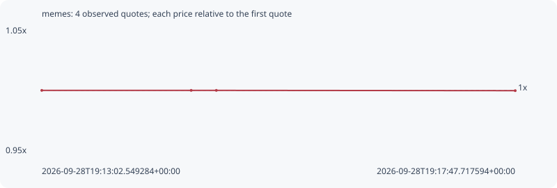

# memes

**bsc** / `0xf74548802f4c700315f019fde17178b392ee4444`

[All tokens](README.md) · [Market window](../README.md)

## Native assessments

This contract is in the quote cohort; it has no native model assessment in this window.

## Series de28cea6ec775763bc64

Pool: `not supplied`

[Complete series](../series/bsc/de28cea6ec775763bc64.json)

Every dot is a captured quote. Lines connect observations; the curve ends at the last available quote.

| Peak | Final | Return | Maximum drawdown |
| ---: | ---: | ---: | ---: |
| 1.0000x | 0.9998x | -0.02% | 0.02% |

### Complete quote timeline

| Time (UTC) | Price (USD) | Multiple | Evidence |
| --- | ---: | ---: | --- |
| 2026-09-28T19:13:02.549284+00:00 | 0.000568331 | 1.0000x | `capture:0aa38b41-b2e7-48f5-a3ba-8fd4a983fff8:rank:98` |
| 2026-09-28T19:14:32.527710+00:00 | 0.000568331 | 1.0000x | `capture:4f6a3c72-f6f0-49d7-97fe-a760f1872e88:rank:99` |
| 2026-09-28T19:14:47.684789+00:00 | 0.000568331 | 1.0000x | `capture:abe58c43-9edf-4da1-b6d9-c4db72f14d79:rank:99` |
| 2026-09-28T19:17:47.717594+00:00 | 0.000568211 | 0.9998x | `capture:2cc72c7e-c2ae-4eb2-929b-e80f3d8c4e15:rank:98` |

### Exit-policy timeline

Calculated from captured quotes under the window policy. Native assessments are linked separately above.

| Time (UTC) | Action | Price (USD) | Evidence |
| --- | --- | ---: | --- |
| 2026-09-28T19:13:02.549284+00:00 | BUY | 0.000568331 | `capture:0aa38b41-b2e7-48f5-a3ba-8fd4a983fff8:rank:98` |
| 2026-09-28T19:14:32.527710+00:00 | HOLD | 0.000568331 | `capture:4f6a3c72-f6f0-49d7-97fe-a760f1872e88:rank:99` |
| 2026-09-28T19:14:47.684789+00:00 | HOLD | 0.000568331 | `capture:abe58c43-9edf-4da1-b6d9-c4db72f14d79:rank:99` |
| 2026-09-28T19:17:47.717594+00:00 | HOLD | 0.000568211 | `capture:2cc72c7e-c2ae-4eb2-929b-e80f3d8c4e15:rank:98` |
