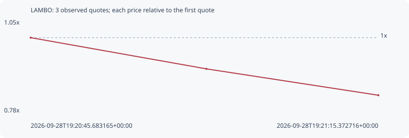

# LAMBO

**solana** / `6ge79bBZfZ9uLBYkA6bU7gSysLSpHSm9PEW6AgLB2Hrw`

[All tokens](README.md) · [Market window](../README.md)

## Native assessments

This contract is in the quote cohort; it has no native model assessment in this window.

## Series 2b2db00d7e98a1c500a1

Pool: `not supplied`

[Complete series](../series/solana/2b2db00d7e98a1c500a1.json)

Every dot is a captured quote. Lines connect observations; the curve ends at the last available quote.

| Peak | Final | Return | Maximum drawdown |
| ---: | ---: | ---: | ---: |
| 1.0000x | 0.8329x | -16.71% | 16.71% |

### Complete quote timeline

| Time (UTC) | Price (USD) | Multiple | Evidence |
| --- | ---: | ---: | --- |
| 2026-09-28T19:20:45.683165+00:00 | 9.40916e-06 | 1.0000x | `capture:17963a37-fd65-46b6-8e1c-350082721f8c:rank:56` |
| 2026-09-28T19:21:00.690136+00:00 | 8.55653e-06 | 0.9094x | `capture:f2ff842d-38e9-4cbe-a281-98c17d5a5672:rank:50` |
| 2026-09-28T19:21:15.372716+00:00 | 7.83657e-06 | 0.8329x | `capture:a923b968-a768-495e-ae33-6de2042c551f:rank:44` |

### Exit-policy timeline

Calculated from captured quotes under the window policy. Native assessments are linked separately above.

| Time (UTC) | Action | Price (USD) | Evidence |
| --- | --- | ---: | --- |
| 2026-09-28T19:20:45.683165+00:00 | BUY | 9.40916e-06 | `capture:17963a37-fd65-46b6-8e1c-350082721f8c:rank:56` |
| 2026-09-28T19:21:00.690136+00:00 | HOLD | 8.55653e-06 | `capture:f2ff842d-38e9-4cbe-a281-98c17d5a5672:rank:50` |
| 2026-09-28T19:21:15.372716+00:00 | SL | 7.83657e-06 | `capture:a923b968-a768-495e-ae33-6de2042c551f:rank:44` |
