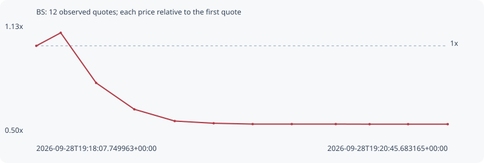

# BS

**solana** / `D19Q5trfCvpgyWtgaZ2vfTQpUfmKPjMypLmH7hoXpump`

[All tokens](README.md) · [Market window](../README.md)

## Native assessments

This contract is in the quote cohort; it has no native model assessment in this window.

## Series 43c4c65d9b4a4ec12335

Pool: `not supplied`

[Complete series](../series/solana/43c4c65d9b4a4ec12335.json)

Every dot is a captured quote. Lines connect observations; the curve ends at the last available quote.

| Peak | Final | Return | Maximum drawdown |
| ---: | ---: | ---: | ---: |
| 1.0753x | 0.5471x | -45.29% | 49.12% |

### Complete quote timeline

| Time (UTC) | Price (USD) | Multiple | Evidence |
| --- | ---: | ---: | --- |
| 2026-09-28T19:18:07.749963+00:00 | 7.0774e-06 | 1.0000x | `capture:b0fb1b47-4973-472f-9619-8480bc7d294e:rank:27` |
| 2026-09-28T19:18:17.126008+00:00 | 7.61001e-06 | 1.0753x | `capture:5ed98f51-d1e1-422a-81df-4186a8b0a0a2:rank:28` |
| 2026-09-28T19:18:30.722167+00:00 | 5.55985e-06 | 0.7856x | `capture:9f88d118-9108-4dff-bbfc-246eaed5ce38:rank:30` |
| 2026-09-28T19:18:45.386687+00:00 | 4.47999e-06 | 0.6330x | `capture:f533100a-ce62-4457-9107-42e7601ea5d7:rank:29` |
| 2026-09-28T19:19:00.883835+00:00 | 3.99994e-06 | 0.5652x | `capture:a2495d99-5671-4c7e-b87c-48f48d90f2f2:rank:26` |
| 2026-09-28T19:19:15.826416+00:00 | 3.9095e-06 | 0.5524x | `capture:ba1dc6a3-b8b7-461a-8110-8490f03539a5:rank:26` |
| 2026-09-28T19:19:30.814098+00:00 | 3.87565e-06 | 0.5476x | `capture:b25d90dc-c8db-4388-8a2b-d06541e5320f:rank:26` |
| 2026-09-28T19:19:45.817199+00:00 | 3.87565e-06 | 0.5476x | `capture:722d1b7b-ef4f-4ac5-883c-0557bae2b60b:rank:25` |
| 2026-09-28T19:20:02.715590+00:00 | 3.87565e-06 | 0.5476x | `capture:60ff17d8-3b18-4f61-9bc7-006afd324cf2:rank:23` |
| 2026-09-28T19:20:15.699547+00:00 | 3.8719e-06 | 0.5471x | `capture:10a94828-637f-4580-a9f7-2fbd34d8589a:rank:24` |
| 2026-09-28T19:20:30.480194+00:00 | 3.8719e-06 | 0.5471x | `capture:54722132-db1d-4a2b-8c1c-2b0e71d01430:rank:25` |
| 2026-09-28T19:20:45.683165+00:00 | 3.8719e-06 | 0.5471x | `capture:17963a37-fd65-46b6-8e1c-350082721f8c:rank:25` |

### Exit-policy timeline

Calculated from captured quotes under the window policy. Native assessments are linked separately above.

| Time (UTC) | Action | Price (USD) | Evidence |
| --- | --- | ---: | --- |
| 2026-09-28T19:18:07.749963+00:00 | BUY | 7.0774e-06 | `capture:b0fb1b47-4973-472f-9619-8480bc7d294e:rank:27` |
| 2026-09-28T19:18:17.126008+00:00 | HOLD | 7.61001e-06 | `capture:5ed98f51-d1e1-422a-81df-4186a8b0a0a2:rank:28` |
| 2026-09-28T19:18:30.722167+00:00 | SL | 5.55985e-06 | `capture:9f88d118-9108-4dff-bbfc-246eaed5ce38:rank:30` |
