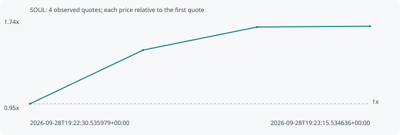

# SOUL

**robinhood** / `0x63a6b4290b1948b55f82d6ac6c6f549e53cbf562`

[All tokens](README.md) · [Market window](../README.md)

## Native assessments

This contract is in the quote cohort; it has no native model assessment in this window.

## Series 47869b3463f02392f3dc

Pool: `not supplied`

[Complete series](../series/robinhood/47869b3463f02392f3dc.json)

Every dot is a captured quote. Lines connect observations; the curve ends at the last available quote.

| Peak | Final | Return | Maximum drawdown |
| ---: | ---: | ---: | ---: |
| 1.6861x | 1.6861x | +68.61% | 0.00% |

### Complete quote timeline

| Time (UTC) | Price (USD) | Multiple | Evidence |
| --- | ---: | ---: | --- |
| 2026-09-28T19:22:30.535979+00:00 | 1.06744e-05 | 1.0000x | `capture:091fb4d2-10fc-4d5f-9c22-af9f55e90e4a:rank:37` |
| 2026-09-28T19:22:45.520851+00:00 | 1.57499e-05 | 1.4755x | `capture:128617a9-4055-4a8d-8b04-c8876bad9c70:rank:18` |
| 2026-09-28T19:23:00.594785+00:00 | 1.7923e-05 | 1.6791x | `capture:b6c633f1-3960-4db3-a2ca-34618f913368:rank:10` |
| 2026-09-28T19:23:15.534636+00:00 | 1.79979e-05 | 1.6861x | `capture:d5a0d1a4-a366-4985-80da-e34160e2f58c:rank:6` |

### Exit-policy timeline

Calculated from captured quotes under the window policy. Native assessments are linked separately above.

| Time (UTC) | Action | Price (USD) | Evidence |
| --- | --- | ---: | --- |
| 2026-09-28T19:22:30.535979+00:00 | BUY | 1.06744e-05 | `capture:091fb4d2-10fc-4d5f-9c22-af9f55e90e4a:rank:37` |
| 2026-09-28T19:22:45.520851+00:00 | PROFIT | 1.57499e-05 | `capture:128617a9-4055-4a8d-8b04-c8876bad9c70:rank:18` |
| 2026-09-28T19:23:00.594785+00:00 | TP | 1.7923e-05 | `capture:b6c633f1-3960-4db3-a2ca-34618f913368:rank:10` |
