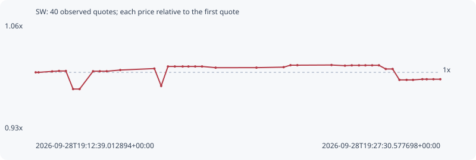

# SW

**robinhood** / `0x7325305929cb804d2fc394120622ae73afc804eb`

[All tokens](README.md) · [Market window](../README.md)

## Native assessments

This contract is in the quote cohort; it has no native model assessment in this window.

## Series 71359bea9c982629ddaa

Pool: `not supplied`

[Complete series](../series/robinhood/71359bea9c982629ddaa.json)

Every dot is a captured quote. Lines connect observations; the curve ends at the last available quote.

| Peak | Final | Return | Maximum drawdown |
| ---: | ---: | ---: | ---: |
| 1.0089x | 0.9917x | -0.83% | 2.19% |

### Complete quote timeline

| Time (UTC) | Price (USD) | Multiple | Evidence |
| --- | ---: | ---: | --- |
| 2026-09-28T19:12:39.012894+00:00 | 0.00048679 | 1.0000x | `capture:fe8ad944-154e-4481-bd56-8ab821bfbfe1:rank:87` |
| 2026-09-28T19:12:45.402569+00:00 | 0.00048679 | 1.0000x | `capture:8deb508c-ea33-4c21-a5c5-f0991dd6dcac:rank:87` |
| 2026-09-28T19:13:15.331879+00:00 | 0.00048733 | 1.0011x | `capture:c384257a-4501-4701-8a0c-a6b08fe727d5:rank:95` |
| 2026-09-28T19:13:30.402311+00:00 | 0.000487593 | 1.0016x | `capture:44090e9e-d515-41c4-a78f-893390e6f2b0:rank:85` |
| 2026-09-28T19:13:45.493213+00:00 | 0.000487593 | 1.0016x | `capture:52264519-193b-4508-b560-e9ee4e3e0963:rank:95` |
| 2026-09-28T19:14:01.407289+00:00 | 0.000476938 | 0.9798x | `capture:0a62cce6-2c27-4761-80c1-feb9130a0c83:rank:95` |
| 2026-09-28T19:14:15.755233+00:00 | 0.000476938 | 0.9798x | `capture:09651124-e158-421c-bcdc-cb2310b48412:rank:93` |
| 2026-09-28T19:14:45.422215+00:00 | 0.000487432 | 1.0013x | `capture:bf6e34c4-c499-472e-8e2b-ebbb151300e2:rank:85` |
| 2026-09-28T19:15:00.325882+00:00 | 0.000487432 | 1.0013x | `capture:663c0420-2b9e-4a94-998b-531fa9202dee:rank:81` |
| 2026-09-28T19:15:15.449577+00:00 | 0.000487432 | 1.0013x | `capture:14452070-ab94-45a0-af6d-e6c54082daec:rank:95` |
| 2026-09-28T19:15:45.353664+00:00 | 0.000488153 | 1.0028x | `capture:b9051b67-24e1-4469-9f82-bc08bd56807d:rank:75` |
| 2026-09-28T19:17:00.510014+00:00 | 0.000489009 | 1.0046x | `capture:d9309a4d-09d7-45ee-91ce-c4a055e8faac:rank:99` |
| 2026-09-28T19:17:15.523068+00:00 | 0.000478797 | 0.9836x | `capture:333d670d-dbd3-4656-95f9-1bc781b271db:rank:82` |
| 2026-09-28T19:17:30.451540+00:00 | 0.000490256 | 1.0071x | `capture:e161007c-0751-46e4-acc9-c8e28cd7190a:rank:79` |
| 2026-09-28T19:17:45.582227+00:00 | 0.000490256 | 1.0071x | `capture:a3f98285-516a-4bd4-b2c4-63596c968a6b:rank:79` |
| 2026-09-28T19:18:02.849542+00:00 | 0.000490256 | 1.0071x | `capture:53a348cd-74d6-4031-ba2b-02d70c63e42b:rank:78` |
| 2026-09-28T19:18:15.585380+00:00 | 0.000490256 | 1.0071x | `capture:ea19027f-d2c1-43cc-973f-0d8eb46ed64e:rank:80` |
| 2026-09-28T19:18:30.489414+00:00 | 0.000490256 | 1.0071x | `capture:c5cd70df-4ca4-4388-b3c5-f977fa86f8a2:rank:89` |
| 2026-09-28T19:18:45.550203+00:00 | 0.000490256 | 1.0071x | `capture:728d4974-5fe3-40a8-8e99-2139c59da3e3:rank:96` |
| 2026-09-28T19:19:15.451095+00:00 | 0.000489537 | 1.0056x | `capture:0bcc0576-3637-4b2c-b0e4-f9e05871b187:rank:98` |
| 2026-09-28T19:20:45.464282+00:00 | 0.000489558 | 1.0057x | `capture:26559b75-812f-4386-982b-eba5073faf44:rank:97` |
| 2026-09-28T19:21:45.420062+00:00 | 0.000489843 | 1.0063x | `capture:ec22b61b-732a-44d2-be85-c577051928eb:rank:83` |
| 2026-09-28T19:22:00.489634+00:00 | 0.000491007 | 1.0087x | `capture:d6c64542-18c5-48a0-a6c9-f0e2a9c54b41:rank:78` |
| 2026-09-28T19:22:15.632268+00:00 | 0.000491007 | 1.0087x | `capture:13e6d33e-e854-4b87-b3da-49aedec6950e:rank:74` |
| 2026-09-28T19:23:30.815940+00:00 | 0.000491104 | 1.0089x | `capture:c6f23ed9-c47c-4f73-bf08-86a494a11aa2:rank:99` |
| 2026-09-28T19:24:00.467430+00:00 | 0.000490726 | 1.0081x | `capture:4a231962-827e-445d-ab7d-bb974bfc841b:rank:87` |
| 2026-09-28T19:24:15.505143+00:00 | 0.00049091 | 1.0085x | `capture:b7273a78-8f87-4dcc-877e-f47f549e0fe8:rank:80` |
| 2026-09-28T19:24:31.344409+00:00 | 0.00049091 | 1.0085x | `capture:85f4db1c-c852-45c3-99aa-4320f3839031:rank:93` |
| 2026-09-28T19:24:45.576445+00:00 | 0.000490924 | 1.0085x | `capture:da07dfaa-56d9-4a51-99df-1ad071803eb0:rank:88` |
| 2026-09-28T19:25:00.412700+00:00 | 0.000490924 | 1.0085x | `capture:1dec2f8f-4694-4c32-8be8-eeec3980c853:rank:86` |
| 2026-09-28T19:25:15.316372+00:00 | 0.00049094 | 1.0085x | `capture:52eaf5a3-351e-4c29-b00b-a167107703e3:rank:80` |
| 2026-09-28T19:25:30.354898+00:00 | 0.000488778 | 1.0041x | `capture:d70b1f6a-3ec3-4ec2-8c88-db476beae4f9:rank:81` |
| 2026-09-28T19:25:45.483791+00:00 | 0.000488778 | 1.0041x | `capture:ebb21e05-3dc6-4a8f-a800-fa79ba147200:rank:81` |
| 2026-09-28T19:26:00.522113+00:00 | 0.000482345 | 0.9909x | `capture:a33301e4-8f37-4fb5-af69-629635c54fe6:rank:75` |
| 2026-09-28T19:26:16.279485+00:00 | 0.000482345 | 0.9909x | `capture:085b2ea9-3985-4608-a1cd-1eddc6b16122:rank:75` |
| 2026-09-28T19:26:30.447392+00:00 | 0.000482345 | 0.9909x | `capture:36fd4b46-5420-443d-b1ed-b86b98706671:rank:81` |
| 2026-09-28T19:26:51.039990+00:00 | 0.000482736 | 0.9917x | `capture:653b62fa-7a58-45fd-95e9-3b36912dc139:rank:87` |
| 2026-09-28T19:27:00.598930+00:00 | 0.000482736 | 0.9917x | `capture:8041f6b0-6188-445c-83ef-3a6fb7daf321:rank:89` |
| 2026-09-28T19:27:15.438746+00:00 | 0.000482736 | 0.9917x | `capture:b4c48612-e04d-4782-96a6-e80c2955d3b9:rank:97` |
| 2026-09-28T19:27:30.577698+00:00 | 0.000482736 | 0.9917x | `capture:ff6b3949-9c3c-4cdf-b48c-d4010666c140:rank:96` |

### Exit-policy timeline

Calculated from captured quotes under the window policy. Native assessments are linked separately above.

| Time (UTC) | Action | Price (USD) | Evidence |
| --- | --- | ---: | --- |
| 2026-09-28T19:12:39.012894+00:00 | BUY | 0.00048679 | `capture:fe8ad944-154e-4481-bd56-8ab821bfbfe1:rank:87` |
| 2026-09-28T19:12:45.402569+00:00 | HOLD | 0.00048679 | `capture:8deb508c-ea33-4c21-a5c5-f0991dd6dcac:rank:87` |
| 2026-09-28T19:13:15.331879+00:00 | HOLD | 0.00048733 | `capture:c384257a-4501-4701-8a0c-a6b08fe727d5:rank:95` |
| 2026-09-28T19:13:30.402311+00:00 | HOLD | 0.000487593 | `capture:44090e9e-d515-41c4-a78f-893390e6f2b0:rank:85` |
| 2026-09-28T19:13:45.493213+00:00 | HOLD | 0.000487593 | `capture:52264519-193b-4508-b560-e9ee4e3e0963:rank:95` |
| 2026-09-28T19:14:01.407289+00:00 | HOLD | 0.000476938 | `capture:0a62cce6-2c27-4761-80c1-feb9130a0c83:rank:95` |
| 2026-09-28T19:14:15.755233+00:00 | HOLD | 0.000476938 | `capture:09651124-e158-421c-bcdc-cb2310b48412:rank:93` |
| 2026-09-28T19:14:45.422215+00:00 | HOLD | 0.000487432 | `capture:bf6e34c4-c499-472e-8e2b-ebbb151300e2:rank:85` |
| 2026-09-28T19:15:00.325882+00:00 | HOLD | 0.000487432 | `capture:663c0420-2b9e-4a94-998b-531fa9202dee:rank:81` |
| 2026-09-28T19:15:15.449577+00:00 | HOLD | 0.000487432 | `capture:14452070-ab94-45a0-af6d-e6c54082daec:rank:95` |
| 2026-09-28T19:15:45.353664+00:00 | HOLD | 0.000488153 | `capture:b9051b67-24e1-4469-9f82-bc08bd56807d:rank:75` |
| 2026-09-28T19:17:00.510014+00:00 | HOLD | 0.000489009 | `capture:d9309a4d-09d7-45ee-91ce-c4a055e8faac:rank:99` |
| 2026-09-28T19:17:15.523068+00:00 | HOLD | 0.000478797 | `capture:333d670d-dbd3-4656-95f9-1bc781b271db:rank:82` |
| 2026-09-28T19:17:30.451540+00:00 | HOLD | 0.000490256 | `capture:e161007c-0751-46e4-acc9-c8e28cd7190a:rank:79` |
| 2026-09-28T19:17:45.582227+00:00 | HOLD | 0.000490256 | `capture:a3f98285-516a-4bd4-b2c4-63596c968a6b:rank:79` |
| 2026-09-28T19:18:02.849542+00:00 | HOLD | 0.000490256 | `capture:53a348cd-74d6-4031-ba2b-02d70c63e42b:rank:78` |
| 2026-09-28T19:18:15.585380+00:00 | HOLD | 0.000490256 | `capture:ea19027f-d2c1-43cc-973f-0d8eb46ed64e:rank:80` |
| 2026-09-28T19:18:30.489414+00:00 | HOLD | 0.000490256 | `capture:c5cd70df-4ca4-4388-b3c5-f977fa86f8a2:rank:89` |
| 2026-09-28T19:18:45.550203+00:00 | HOLD | 0.000490256 | `capture:728d4974-5fe3-40a8-8e99-2139c59da3e3:rank:96` |
| 2026-09-28T19:19:15.451095+00:00 | HOLD | 0.000489537 | `capture:0bcc0576-3637-4b2c-b0e4-f9e05871b187:rank:98` |
| 2026-09-28T19:20:45.464282+00:00 | HOLD | 0.000489558 | `capture:26559b75-812f-4386-982b-eba5073faf44:rank:97` |
| 2026-09-28T19:21:45.420062+00:00 | HOLD | 0.000489843 | `capture:ec22b61b-732a-44d2-be85-c577051928eb:rank:83` |
| 2026-09-28T19:22:00.489634+00:00 | HOLD | 0.000491007 | `capture:d6c64542-18c5-48a0-a6c9-f0e2a9c54b41:rank:78` |
| 2026-09-28T19:22:15.632268+00:00 | HOLD | 0.000491007 | `capture:13e6d33e-e854-4b87-b3da-49aedec6950e:rank:74` |
| 2026-09-28T19:23:30.815940+00:00 | HOLD | 0.000491104 | `capture:c6f23ed9-c47c-4f73-bf08-86a494a11aa2:rank:99` |
| 2026-09-28T19:24:00.467430+00:00 | HOLD | 0.000490726 | `capture:4a231962-827e-445d-ab7d-bb974bfc841b:rank:87` |
| 2026-09-28T19:24:15.505143+00:00 | HOLD | 0.00049091 | `capture:b7273a78-8f87-4dcc-877e-f47f549e0fe8:rank:80` |
| 2026-09-28T19:24:31.344409+00:00 | HOLD | 0.00049091 | `capture:85f4db1c-c852-45c3-99aa-4320f3839031:rank:93` |
| 2026-09-28T19:24:45.576445+00:00 | HOLD | 0.000490924 | `capture:da07dfaa-56d9-4a51-99df-1ad071803eb0:rank:88` |
| 2026-09-28T19:25:00.412700+00:00 | HOLD | 0.000490924 | `capture:1dec2f8f-4694-4c32-8be8-eeec3980c853:rank:86` |
| 2026-09-28T19:25:15.316372+00:00 | HOLD | 0.00049094 | `capture:52eaf5a3-351e-4c29-b00b-a167107703e3:rank:80` |
| 2026-09-28T19:25:30.354898+00:00 | HOLD | 0.000488778 | `capture:d70b1f6a-3ec3-4ec2-8c88-db476beae4f9:rank:81` |
| 2026-09-28T19:25:45.483791+00:00 | HOLD | 0.000488778 | `capture:ebb21e05-3dc6-4a8f-a800-fa79ba147200:rank:81` |
| 2026-09-28T19:26:00.522113+00:00 | HOLD | 0.000482345 | `capture:a33301e4-8f37-4fb5-af69-629635c54fe6:rank:75` |
| 2026-09-28T19:26:16.279485+00:00 | HOLD | 0.000482345 | `capture:085b2ea9-3985-4608-a1cd-1eddc6b16122:rank:75` |
| 2026-09-28T19:26:30.447392+00:00 | HOLD | 0.000482345 | `capture:36fd4b46-5420-443d-b1ed-b86b98706671:rank:81` |
| 2026-09-28T19:26:51.039990+00:00 | HOLD | 0.000482736 | `capture:653b62fa-7a58-45fd-95e9-3b36912dc139:rank:87` |
| 2026-09-28T19:27:00.598930+00:00 | HOLD | 0.000482736 | `capture:8041f6b0-6188-445c-83ef-3a6fb7daf321:rank:89` |
| 2026-09-28T19:27:15.438746+00:00 | HOLD | 0.000482736 | `capture:b4c48612-e04d-4782-96a6-e80c2955d3b9:rank:97` |
| 2026-09-28T19:27:30.577698+00:00 | HOLD | 0.000482736 | `capture:ff6b3949-9c3c-4cdf-b48c-d4010666c140:rank:96` |
