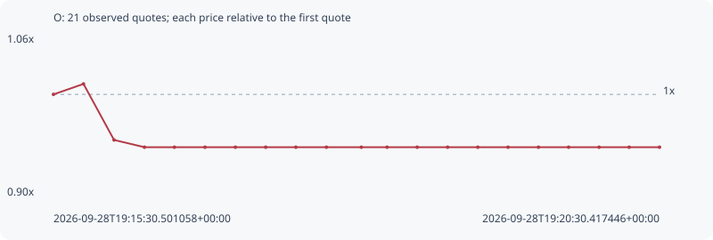

# O

**robinhood** / `0x9d6967e7f5ed93ba3fbbcb03ec2e13b617591e18`

[All tokens](README.md) · [Market window](../README.md)

## Native assessments

This contract is in the quote cohort; it has no native model assessment in this window.

## Series ed4529027af7bc07e04c

Pool: `not supplied`

[Complete series](../series/robinhood/ed4529027af7bc07e04c.json)

Every dot is a captured quote. Lines connect observations; the curve ends at the last available quote.

| Peak | Final | Return | Maximum drawdown |
| ---: | ---: | ---: | ---: |
| 1.0108x | 0.9454x | -5.46% | 6.47% |

### Complete quote timeline

| Time (UTC) | Price (USD) | Multiple | Evidence |
| --- | ---: | ---: | --- |
| 2026-09-28T19:15:30.501058+00:00 | 0.000370604 | 1.0000x | `capture:4e680297-1e75-418b-b818-8b2903e8b923:rank:55` |
| 2026-09-28T19:15:45.353664+00:00 | 0.000374614 | 1.0108x | `capture:b9051b67-24e1-4469-9f82-bc08bd56807d:rank:47` |
| 2026-09-28T19:16:00.473367+00:00 | 0.000353138 | 0.9529x | `capture:cd404827-1073-4901-b09c-82ef1488855b:rank:42` |
| 2026-09-28T19:16:15.518445+00:00 | 0.00035037 | 0.9454x | `capture:c193221c-c80a-4a3b-ad88-59f12dcb1689:rank:37` |
| 2026-09-28T19:16:30.344303+00:00 | 0.00035037 | 0.9454x | `capture:18d587e7-b24d-4b8d-82f1-0ac2903a3303:rank:40` |
| 2026-09-28T19:16:45.486467+00:00 | 0.00035037 | 0.9454x | `capture:4ca26bf7-9d1e-455b-a63e-1b5df831b997:rank:40` |
| 2026-09-28T19:17:00.510014+00:00 | 0.00035037 | 0.9454x | `capture:d9309a4d-09d7-45ee-91ce-c4a055e8faac:rank:41` |
| 2026-09-28T19:17:15.523068+00:00 | 0.00035037 | 0.9454x | `capture:333d670d-dbd3-4656-95f9-1bc781b271db:rank:40` |
| 2026-09-28T19:17:30.451540+00:00 | 0.00035037 | 0.9454x | `capture:e161007c-0751-46e4-acc9-c8e28cd7190a:rank:40` |
| 2026-09-28T19:17:45.582227+00:00 | 0.00035037 | 0.9454x | `capture:a3f98285-516a-4bd4-b2c4-63596c968a6b:rank:40` |
| 2026-09-28T19:18:02.849542+00:00 | 0.00035037 | 0.9454x | `capture:53a348cd-74d6-4031-ba2b-02d70c63e42b:rank:39` |
| 2026-09-28T19:18:15.585380+00:00 | 0.00035037 | 0.9454x | `capture:ea19027f-d2c1-43cc-973f-0d8eb46ed64e:rank:41` |
| 2026-09-28T19:18:30.489414+00:00 | 0.00035037 | 0.9454x | `capture:c5cd70df-4ca4-4388-b3c5-f977fa86f8a2:rank:41` |
| 2026-09-28T19:18:45.550203+00:00 | 0.00035037 | 0.9454x | `capture:728d4974-5fe3-40a8-8e99-2139c59da3e3:rank:42` |
| 2026-09-28T19:19:00.487408+00:00 | 0.00035037 | 0.9454x | `capture:297e4fae-3bb5-49eb-b490-a4f34898851c:rank:42` |
| 2026-09-28T19:19:15.451095+00:00 | 0.00035037 | 0.9454x | `capture:0bcc0576-3637-4b2c-b0e4-f9e05871b187:rank:42` |
| 2026-09-28T19:19:30.512866+00:00 | 0.00035037 | 0.9454x | `capture:bb499bdc-159a-4072-a450-312045f32cef:rank:41` |
| 2026-09-28T19:19:45.438706+00:00 | 0.00035037 | 0.9454x | `capture:59b12f7b-2112-42c7-834a-a2eb9bcaee3d:rank:41` |
| 2026-09-28T19:20:00.494705+00:00 | 0.00035037 | 0.9454x | `capture:5b06d6b3-9eca-4487-82fb-6b28820c37d9:rank:42` |
| 2026-09-28T19:20:15.393373+00:00 | 0.00035037 | 0.9454x | `capture:17802da9-7cee-48c3-9f5b-5829781be3f6:rank:42` |
| 2026-09-28T19:20:30.417446+00:00 | 0.00035037 | 0.9454x | `capture:f2fe9ac4-89a0-4ad3-8f15-5a70d7e1d5f7:rank:72` |

### Exit-policy timeline

Calculated from captured quotes under the window policy. Native assessments are linked separately above.

| Time (UTC) | Action | Price (USD) | Evidence |
| --- | --- | ---: | --- |
| 2026-09-28T19:15:30.501058+00:00 | BUY | 0.000370604 | `capture:4e680297-1e75-418b-b818-8b2903e8b923:rank:55` |
| 2026-09-28T19:15:45.353664+00:00 | HOLD | 0.000374614 | `capture:b9051b67-24e1-4469-9f82-bc08bd56807d:rank:47` |
| 2026-09-28T19:16:00.473367+00:00 | HOLD | 0.000353138 | `capture:cd404827-1073-4901-b09c-82ef1488855b:rank:42` |
| 2026-09-28T19:16:15.518445+00:00 | HOLD | 0.00035037 | `capture:c193221c-c80a-4a3b-ad88-59f12dcb1689:rank:37` |
| 2026-09-28T19:16:30.344303+00:00 | HOLD | 0.00035037 | `capture:18d587e7-b24d-4b8d-82f1-0ac2903a3303:rank:40` |
| 2026-09-28T19:16:45.486467+00:00 | HOLD | 0.00035037 | `capture:4ca26bf7-9d1e-455b-a63e-1b5df831b997:rank:40` |
| 2026-09-28T19:17:00.510014+00:00 | HOLD | 0.00035037 | `capture:d9309a4d-09d7-45ee-91ce-c4a055e8faac:rank:41` |
| 2026-09-28T19:17:15.523068+00:00 | HOLD | 0.00035037 | `capture:333d670d-dbd3-4656-95f9-1bc781b271db:rank:40` |
| 2026-09-28T19:17:30.451540+00:00 | HOLD | 0.00035037 | `capture:e161007c-0751-46e4-acc9-c8e28cd7190a:rank:40` |
| 2026-09-28T19:17:45.582227+00:00 | HOLD | 0.00035037 | `capture:a3f98285-516a-4bd4-b2c4-63596c968a6b:rank:40` |
| 2026-09-28T19:18:02.849542+00:00 | HOLD | 0.00035037 | `capture:53a348cd-74d6-4031-ba2b-02d70c63e42b:rank:39` |
| 2026-09-28T19:18:15.585380+00:00 | HOLD | 0.00035037 | `capture:ea19027f-d2c1-43cc-973f-0d8eb46ed64e:rank:41` |
| 2026-09-28T19:18:30.489414+00:00 | HOLD | 0.00035037 | `capture:c5cd70df-4ca4-4388-b3c5-f977fa86f8a2:rank:41` |
| 2026-09-28T19:18:45.550203+00:00 | HOLD | 0.00035037 | `capture:728d4974-5fe3-40a8-8e99-2139c59da3e3:rank:42` |
| 2026-09-28T19:19:00.487408+00:00 | HOLD | 0.00035037 | `capture:297e4fae-3bb5-49eb-b490-a4f34898851c:rank:42` |
| 2026-09-28T19:19:15.451095+00:00 | HOLD | 0.00035037 | `capture:0bcc0576-3637-4b2c-b0e4-f9e05871b187:rank:42` |
| 2026-09-28T19:19:30.512866+00:00 | HOLD | 0.00035037 | `capture:bb499bdc-159a-4072-a450-312045f32cef:rank:41` |
| 2026-09-28T19:19:45.438706+00:00 | HOLD | 0.00035037 | `capture:59b12f7b-2112-42c7-834a-a2eb9bcaee3d:rank:41` |
| 2026-09-28T19:20:00.494705+00:00 | HOLD | 0.00035037 | `capture:5b06d6b3-9eca-4487-82fb-6b28820c37d9:rank:42` |
| 2026-09-28T19:20:15.393373+00:00 | HOLD | 0.00035037 | `capture:17802da9-7cee-48c3-9f5b-5829781be3f6:rank:42` |
| 2026-09-28T19:20:30.417446+00:00 | HOLD | 0.00035037 | `capture:f2fe9ac4-89a0-4ad3-8f15-5a70d7e1d5f7:rank:72` |
