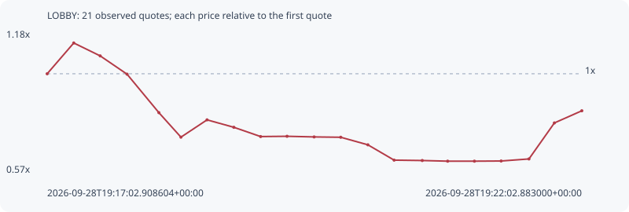

# LOBBY

**bsc** / `0x1db90b97e9ca25f69643989b37ba41210ea07777`

[All tokens](README.md) · [Market window](../README.md)

## Native assessments

This contract is in the quote cohort; it has no native model assessment in this window.

## Series d1fab732232e4ebfcaa8

Pool: `not supplied`

[Complete series](../series/bsc/d1fab732232e4ebfcaa8.json)

Every dot is a captured quote. Lines connect observations; the curve ends at the last available quote.

| Peak | Final | Return | Maximum drawdown |
| ---: | ---: | ---: | ---: |
| 1.1330x | 0.8401x | -15.99% | 45.07% |

### Complete quote timeline

| Time (UTC) | Price (USD) | Multiple | Evidence |
| --- | ---: | ---: | --- |
| 2026-09-28T19:17:02.908604+00:00 | 3.21828e-05 | 1.0000x | `capture:16fde76e-cae4-4138-b96e-57b291931df8:rank:8` |
| 2026-09-28T19:17:17.816055+00:00 | 3.64624e-05 | 1.1330x | `capture:7f9359fa-2f23-4e78-9500-f9df7d85a6b2:rank:6` |
| 2026-09-28T19:17:32.654140+00:00 | 3.46673e-05 | 1.0772x | `capture:4e95b3e2-d20d-4729-ac41-d7699561b97b:rank:4` |
| 2026-09-28T19:17:47.717594+00:00 | 3.21248e-05 | 0.9982x | `capture:2cc72c7e-c2ae-4eb2-929b-e80f3d8c4e15:rank:4` |
| 2026-09-28T19:18:05.582121+00:00 | 2.67773e-05 | 0.8320x | `capture:07127a86-393c-4e05-bde5-d28a70a854fb:rank:4` |
| 2026-09-28T19:18:17.953086+00:00 | 2.33688e-05 | 0.7261x | `capture:ca903b0a-a9a8-4246-873f-5115402fbf9c:rank:3` |
| 2026-09-28T19:18:32.607444+00:00 | 2.57744e-05 | 0.8009x | `capture:86009bbc-85b0-465e-8657-55be8d6c15de:rank:1` |
| 2026-09-28T19:18:47.632598+00:00 | 2.474e-05 | 0.7687x | `capture:bfa4352f-2279-41ec-a6fd-d3e101a21181:rank:1` |
| 2026-09-28T19:19:02.666276+00:00 | 2.34516e-05 | 0.7287x | `capture:6fe1da90-a254-48b3-b112-ab24c6060e81:rank:1` |
| 2026-09-28T19:19:17.488471+00:00 | 2.34903e-05 | 0.7299x | `capture:b87f439a-4825-4a6f-b17c-0b78464d9310:rank:1` |
| 2026-09-28T19:19:32.672995+00:00 | 2.34013e-05 | 0.7271x | `capture:ceae4194-4b79-45b3-9a66-758dd19e2a7b:rank:1` |
| 2026-09-28T19:19:47.615151+00:00 | 2.33544e-05 | 0.7257x | `capture:0dedf968-cc48-4422-8bbf-180ff2103dbf:rank:2` |
| 2026-09-28T19:20:02.835112+00:00 | 2.23042e-05 | 0.6930x | `capture:adbb19f8-5a81-4d70-8990-a6ffd414f250:rank:2` |
| 2026-09-28T19:20:17.561225+00:00 | 2.01741e-05 | 0.6269x | `capture:0feecf05-56c0-4db7-a137-f63b427a7830:rank:1` |
| 2026-09-28T19:20:33.351338+00:00 | 2.01206e-05 | 0.6252x | `capture:5752259a-2bcb-4e27-ac90-6ef5a52d1cf7:rank:1` |
| 2026-09-28T19:20:47.599416+00:00 | 2.00303e-05 | 0.6224x | `capture:1ab71e23-e150-479b-a1fa-e2a362332d1e:rank:1` |
| 2026-09-28T19:21:02.616817+00:00 | 2.00303e-05 | 0.6224x | `capture:ec0d171f-d990-484a-94d1-c335d7f6e8fb:rank:1` |
| 2026-09-28T19:21:17.612081+00:00 | 2.00534e-05 | 0.6231x | `capture:cc46cbda-0be4-42ba-bcf4-4a03c9e7e894:rank:1` |
| 2026-09-28T19:21:33.217678+00:00 | 2.03397e-05 | 0.6320x | `capture:3a34cabb-e5ee-4ff6-9f92-f0839c39884f:rank:1` |
| 2026-09-28T19:21:47.485842+00:00 | 2.53466e-05 | 0.7876x | `capture:9e0730ff-182b-409c-b854-c06b993be570:rank:0` |
| 2026-09-28T19:22:02.883000+00:00 | 2.70375e-05 | 0.8401x | `capture:eb8228cb-dfba-443e-9576-ee214dcd3354:rank:1` |

### Exit-policy timeline

Calculated from captured quotes under the window policy. Native assessments are linked separately above.

| Time (UTC) | Action | Price (USD) | Evidence |
| --- | --- | ---: | --- |
| 2026-09-28T19:17:02.908604+00:00 | BUY | 3.21828e-05 | `capture:16fde76e-cae4-4138-b96e-57b291931df8:rank:8` |
| 2026-09-28T19:17:17.816055+00:00 | HOLD | 3.64624e-05 | `capture:7f9359fa-2f23-4e78-9500-f9df7d85a6b2:rank:6` |
| 2026-09-28T19:17:32.654140+00:00 | HOLD | 3.46673e-05 | `capture:4e95b3e2-d20d-4729-ac41-d7699561b97b:rank:4` |
| 2026-09-28T19:17:47.717594+00:00 | HOLD | 3.21248e-05 | `capture:2cc72c7e-c2ae-4eb2-929b-e80f3d8c4e15:rank:4` |
| 2026-09-28T19:18:05.582121+00:00 | SL | 2.67773e-05 | `capture:07127a86-393c-4e05-bde5-d28a70a854fb:rank:4` |
