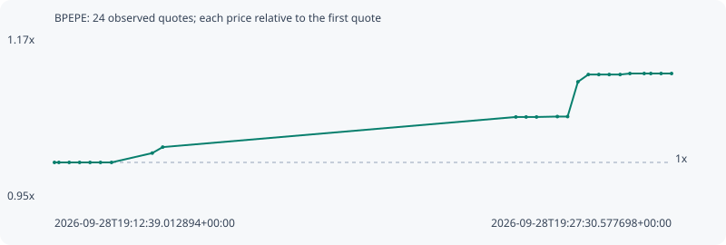

# BPEPE

**robinhood** / `0xbf818efe65aac127ac8f9fec6fec203ee222c851`

[All tokens](README.md) · [Market window](../README.md)

## Native assessments

This contract is in the quote cohort; it has no native model assessment in this window.

## Series 1c6521c290b017955aa9

Pool: `not supplied`

[Complete series](../series/robinhood/1c6521c290b017955aa9.json)

Every dot is a captured quote. Lines connect observations; the curve ends at the last available quote.

| Peak | Final | Return | Maximum drawdown |
| ---: | ---: | ---: | ---: |
| 1.1194x | 1.1194x | +11.94% | 0.00% |

### Complete quote timeline

| Time (UTC) | Price (USD) | Multiple | Evidence |
| --- | ---: | ---: | --- |
| 2026-09-28T19:12:39.012894+00:00 | 0.000384586 | 1.0000x | `capture:fe8ad944-154e-4481-bd56-8ab821bfbfe1:rank:61` |
| 2026-09-28T19:12:45.402569+00:00 | 0.000384586 | 1.0000x | `capture:8deb508c-ea33-4c21-a5c5-f0991dd6dcac:rank:63` |
| 2026-09-28T19:13:00.335966+00:00 | 0.000384586 | 1.0000x | `capture:ee3ee7f8-576f-4c42-a7e0-cd9f917fdb36:rank:71` |
| 2026-09-28T19:13:15.331879+00:00 | 0.000384586 | 1.0000x | `capture:c384257a-4501-4701-8a0c-a6b08fe727d5:rank:75` |
| 2026-09-28T19:13:30.402311+00:00 | 0.000384586 | 1.0000x | `capture:44090e9e-d515-41c4-a78f-893390e6f2b0:rank:71` |
| 2026-09-28T19:13:45.493213+00:00 | 0.000384586 | 1.0000x | `capture:52264519-193b-4508-b560-e9ee4e3e0963:rank:68` |
| 2026-09-28T19:14:01.407289+00:00 | 0.000384586 | 1.0000x | `capture:0a62cce6-2c27-4761-80c1-feb9130a0c83:rank:76` |
| 2026-09-28T19:15:00.325882+00:00 | 0.000389409 | 1.0125x | `capture:663c0420-2b9e-4a94-998b-531fa9202dee:rank:99` |
| 2026-09-28T19:15:15.449577+00:00 | 0.000392503 | 1.0206x | `capture:14452070-ab94-45a0-af6d-e6c54082daec:rank:85` |
| 2026-09-28T19:23:45.643860+00:00 | 0.000408058 | 1.0610x | `capture:0b8bbeb9-cbaa-4cb2-a853-2bb146bd23e5:rank:94` |
| 2026-09-28T19:24:00.467430+00:00 | 0.000408058 | 1.0610x | `capture:4a231962-827e-445d-ab7d-bb974bfc841b:rank:88` |
| 2026-09-28T19:24:15.505143+00:00 | 0.000408058 | 1.0610x | `capture:b7273a78-8f87-4dcc-877e-f47f549e0fe8:rank:92` |
| 2026-09-28T19:24:45.576445+00:00 | 0.000408281 | 1.0616x | `capture:da07dfaa-56d9-4a51-99df-1ad071803eb0:rank:97` |
| 2026-09-28T19:25:00.412700+00:00 | 0.000408281 | 1.0616x | `capture:1dec2f8f-4694-4c32-8be8-eeec3980c853:rank:96` |
| 2026-09-28T19:25:15.316372+00:00 | 0.000426234 | 1.1083x | `capture:52eaf5a3-351e-4c29-b00b-a167107703e3:rank:84` |
| 2026-09-28T19:25:30.354898+00:00 | 0.000430004 | 1.1181x | `capture:d70b1f6a-3ec3-4ec2-8c88-db476beae4f9:rank:74` |
| 2026-09-28T19:25:45.483791+00:00 | 0.000430004 | 1.1181x | `capture:ebb21e05-3dc6-4a8f-a800-fa79ba147200:rank:74` |
| 2026-09-28T19:26:00.522113+00:00 | 0.000430004 | 1.1181x | `capture:a33301e4-8f37-4fb5-af69-629635c54fe6:rank:94` |
| 2026-09-28T19:26:16.279485+00:00 | 0.000430004 | 1.1181x | `capture:085b2ea9-3985-4608-a1cd-1eddc6b16122:rank:94` |
| 2026-09-28T19:26:30.447392+00:00 | 0.000430521 | 1.1194x | `capture:36fd4b46-5420-443d-b1ed-b86b98706671:rank:89` |
| 2026-09-28T19:26:51.039990+00:00 | 0.000430521 | 1.1194x | `capture:653b62fa-7a58-45fd-95e9-3b36912dc139:rank:89` |
| 2026-09-28T19:27:00.598930+00:00 | 0.000430521 | 1.1194x | `capture:8041f6b0-6188-445c-83ef-3a6fb7daf321:rank:91` |
| 2026-09-28T19:27:15.438746+00:00 | 0.000430521 | 1.1194x | `capture:b4c48612-e04d-4782-96a6-e80c2955d3b9:rank:85` |
| 2026-09-28T19:27:30.577698+00:00 | 0.000430521 | 1.1194x | `capture:ff6b3949-9c3c-4cdf-b48c-d4010666c140:rank:86` |

### Exit-policy timeline

Calculated from captured quotes under the window policy. Native assessments are linked separately above.

| Time (UTC) | Action | Price (USD) | Evidence |
| --- | --- | ---: | --- |
| 2026-09-28T19:12:39.012894+00:00 | BUY | 0.000384586 | `capture:fe8ad944-154e-4481-bd56-8ab821bfbfe1:rank:61` |
| 2026-09-28T19:12:45.402569+00:00 | HOLD | 0.000384586 | `capture:8deb508c-ea33-4c21-a5c5-f0991dd6dcac:rank:63` |
| 2026-09-28T19:13:00.335966+00:00 | HOLD | 0.000384586 | `capture:ee3ee7f8-576f-4c42-a7e0-cd9f917fdb36:rank:71` |
| 2026-09-28T19:13:15.331879+00:00 | HOLD | 0.000384586 | `capture:c384257a-4501-4701-8a0c-a6b08fe727d5:rank:75` |
| 2026-09-28T19:13:30.402311+00:00 | HOLD | 0.000384586 | `capture:44090e9e-d515-41c4-a78f-893390e6f2b0:rank:71` |
| 2026-09-28T19:13:45.493213+00:00 | HOLD | 0.000384586 | `capture:52264519-193b-4508-b560-e9ee4e3e0963:rank:68` |
| 2026-09-28T19:14:01.407289+00:00 | HOLD | 0.000384586 | `capture:0a62cce6-2c27-4761-80c1-feb9130a0c83:rank:76` |
| 2026-09-28T19:15:00.325882+00:00 | HOLD | 0.000389409 | `capture:663c0420-2b9e-4a94-998b-531fa9202dee:rank:99` |
| 2026-09-28T19:15:15.449577+00:00 | HOLD | 0.000392503 | `capture:14452070-ab94-45a0-af6d-e6c54082daec:rank:85` |
| 2026-09-28T19:23:45.643860+00:00 | HOLD | 0.000408058 | `capture:0b8bbeb9-cbaa-4cb2-a853-2bb146bd23e5:rank:94` |
| 2026-09-28T19:24:00.467430+00:00 | HOLD | 0.000408058 | `capture:4a231962-827e-445d-ab7d-bb974bfc841b:rank:88` |
| 2026-09-28T19:24:15.505143+00:00 | HOLD | 0.000408058 | `capture:b7273a78-8f87-4dcc-877e-f47f549e0fe8:rank:92` |
| 2026-09-28T19:24:45.576445+00:00 | HOLD | 0.000408281 | `capture:da07dfaa-56d9-4a51-99df-1ad071803eb0:rank:97` |
| 2026-09-28T19:25:00.412700+00:00 | HOLD | 0.000408281 | `capture:1dec2f8f-4694-4c32-8be8-eeec3980c853:rank:96` |
| 2026-09-28T19:25:15.316372+00:00 | HOLD | 0.000426234 | `capture:52eaf5a3-351e-4c29-b00b-a167107703e3:rank:84` |
| 2026-09-28T19:25:30.354898+00:00 | HOLD | 0.000430004 | `capture:d70b1f6a-3ec3-4ec2-8c88-db476beae4f9:rank:74` |
| 2026-09-28T19:25:45.483791+00:00 | HOLD | 0.000430004 | `capture:ebb21e05-3dc6-4a8f-a800-fa79ba147200:rank:74` |
| 2026-09-28T19:26:00.522113+00:00 | HOLD | 0.000430004 | `capture:a33301e4-8f37-4fb5-af69-629635c54fe6:rank:94` |
| 2026-09-28T19:26:16.279485+00:00 | HOLD | 0.000430004 | `capture:085b2ea9-3985-4608-a1cd-1eddc6b16122:rank:94` |
| 2026-09-28T19:26:30.447392+00:00 | HOLD | 0.000430521 | `capture:36fd4b46-5420-443d-b1ed-b86b98706671:rank:89` |
| 2026-09-28T19:26:51.039990+00:00 | HOLD | 0.000430521 | `capture:653b62fa-7a58-45fd-95e9-3b36912dc139:rank:89` |
| 2026-09-28T19:27:00.598930+00:00 | HOLD | 0.000430521 | `capture:8041f6b0-6188-445c-83ef-3a6fb7daf321:rank:91` |
| 2026-09-28T19:27:15.438746+00:00 | HOLD | 0.000430521 | `capture:b4c48612-e04d-4782-96a6-e80c2955d3b9:rank:85` |
| 2026-09-28T19:27:30.577698+00:00 | HOLD | 0.000430521 | `capture:ff6b3949-9c3c-4cdf-b48c-d4010666c140:rank:86` |
