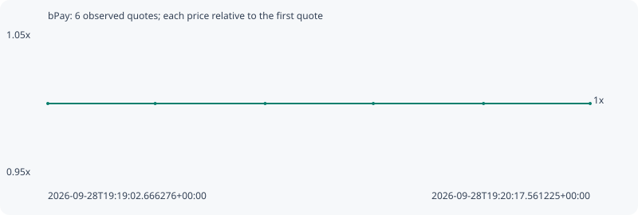

# bPay

**bsc** / `0xb13003bf44de426dd2a3aae3df9c3400de0a7777`

[All tokens](README.md) · [Market window](../README.md)

## Native assessments

This contract is in the quote cohort; it has no native model assessment in this window.

## Series 1016fc048469540ba5d6

Pool: `not supplied`

[Complete series](../series/bsc/1016fc048469540ba5d6.json)

Every dot is a captured quote. Lines connect observations; the curve ends at the last available quote.

| Peak | Final | Return | Maximum drawdown |
| ---: | ---: | ---: | ---: |
| 1.0000x | 1.0000x | +0.00% | 0.00% |

### Complete quote timeline

| Time (UTC) | Price (USD) | Multiple | Evidence |
| --- | ---: | ---: | --- |
| 2026-09-28T19:19:02.666276+00:00 | 5.99447e-05 | 1.0000x | `capture:6fe1da90-a254-48b3-b112-ab24c6060e81:rank:97` |
| 2026-09-28T19:19:17.488471+00:00 | 5.99447e-05 | 1.0000x | `capture:b87f439a-4825-4a6f-b17c-0b78464d9310:rank:97` |
| 2026-09-28T19:19:32.672995+00:00 | 5.99447e-05 | 1.0000x | `capture:ceae4194-4b79-45b3-9a66-758dd19e2a7b:rank:97` |
| 2026-09-28T19:19:47.615151+00:00 | 5.99447e-05 | 1.0000x | `capture:0dedf968-cc48-4422-8bbf-180ff2103dbf:rank:95` |
| 2026-09-28T19:20:02.835112+00:00 | 5.99447e-05 | 1.0000x | `capture:adbb19f8-5a81-4d70-8990-a6ffd414f250:rank:97` |
| 2026-09-28T19:20:17.561225+00:00 | 5.99447e-05 | 1.0000x | `capture:0feecf05-56c0-4db7-a137-f63b427a7830:rank:91` |

### Exit-policy timeline

Calculated from captured quotes under the window policy. Native assessments are linked separately above.

| Time (UTC) | Action | Price (USD) | Evidence |
| --- | --- | ---: | --- |
| 2026-09-28T19:19:02.666276+00:00 | BUY | 5.99447e-05 | `capture:6fe1da90-a254-48b3-b112-ab24c6060e81:rank:97` |
| 2026-09-28T19:19:17.488471+00:00 | HOLD | 5.99447e-05 | `capture:b87f439a-4825-4a6f-b17c-0b78464d9310:rank:97` |
| 2026-09-28T19:19:32.672995+00:00 | HOLD | 5.99447e-05 | `capture:ceae4194-4b79-45b3-9a66-758dd19e2a7b:rank:97` |
| 2026-09-28T19:19:47.615151+00:00 | HOLD | 5.99447e-05 | `capture:0dedf968-cc48-4422-8bbf-180ff2103dbf:rank:95` |
| 2026-09-28T19:20:02.835112+00:00 | HOLD | 5.99447e-05 | `capture:adbb19f8-5a81-4d70-8990-a6ffd414f250:rank:97` |
| 2026-09-28T19:20:17.561225+00:00 | HOLD | 5.99447e-05 | `capture:0feecf05-56c0-4db7-a137-f63b427a7830:rank:91` |
