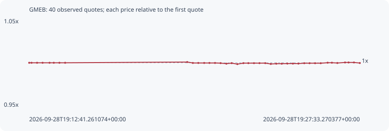

# GMEB

**bsc** / `0x46ceefda28dd7207059ed19b0acdc026955bb15c`

[All tokens](README.md) · [Market window](../README.md)

## Native assessments

This contract is in the quote cohort; it has no native model assessment in this window.

## Series c9ba7db88a1dae6c06ba

Pool: `not supplied`

[Complete series](../series/bsc/c9ba7db88a1dae6c06ba.json)

Every dot is a captured quote. Lines connect observations; the curve ends at the last available quote.

| Peak | Final | Return | Maximum drawdown |
| ---: | ---: | ---: | ---: |
| 1.0009x | 0.9997x | -0.03% | 0.24% |

### Complete quote timeline

| Time (UTC) | Price (USD) | Multiple | Evidence |
| --- | ---: | ---: | --- |
| 2026-09-28T19:12:41.261074+00:00 | 23.9151 | 1.0000x | `capture:795a88f0-804c-4f14-a3e8-ce8d9318f6df:rank:57` |
| 2026-09-28T19:12:47.639745+00:00 | 23.9151 | 1.0000x | `capture:c2d8bd1a-9ed6-4d75-91ae-006bea65a635:rank:55` |
| 2026-09-28T19:13:02.549284+00:00 | 23.9151 | 1.0000x | `capture:0aa38b41-b2e7-48f5-a3ba-8fd4a983fff8:rank:64` |
| 2026-09-28T19:13:17.511052+00:00 | 23.9151 | 1.0000x | `capture:87e92f15-0601-4987-bd47-ae2e9f91de16:rank:77` |
| 2026-09-28T19:13:36.268178+00:00 | 23.9151 | 1.0000x | `capture:577859f6-aadc-4653-b269-a860dbe8c41c:rank:72` |
| 2026-09-28T19:13:47.694462+00:00 | 23.9151 | 1.0000x | `capture:4e60f1a9-1927-46db-ae10-f1b1530de61d:rank:76` |
| 2026-09-28T19:14:02.894344+00:00 | 23.9151 | 1.0000x | `capture:6211f86d-6ba6-4eb3-a4e2-2f80b0dffff7:rank:86` |
| 2026-09-28T19:14:18.283251+00:00 | 23.9151 | 1.0000x | `capture:68440f72-d36c-4c27-867d-03a757db141f:rank:97` |
| 2026-09-28T19:19:47.615151+00:00 | 23.9356 | 1.0009x | `capture:0dedf968-cc48-4422-8bbf-180ff2103dbf:rank:85` |
| 2026-09-28T19:20:02.835112+00:00 | 23.9099 | 0.9998x | `capture:adbb19f8-5a81-4d70-8990-a6ffd414f250:rank:73` |
| 2026-09-28T19:20:17.561225+00:00 | 23.9099 | 0.9998x | `capture:0feecf05-56c0-4db7-a137-f63b427a7830:rank:72` |
| 2026-09-28T19:20:33.351338+00:00 | 23.9099 | 0.9998x | `capture:5752259a-2bcb-4e27-ac90-6ef5a52d1cf7:rank:67` |
| 2026-09-28T19:20:47.599416+00:00 | 23.9099 | 0.9998x | `capture:1ab71e23-e150-479b-a1fa-e2a362332d1e:rank:64` |
| 2026-09-28T19:21:02.616817+00:00 | 23.9099 | 0.9998x | `capture:ec0d171f-d990-484a-94d1-c335d7f6e8fb:rank:65` |
| 2026-09-28T19:21:17.612081+00:00 | 23.9052 | 0.9996x | `capture:cc46cbda-0be4-42ba-bcf4-4a03c9e7e894:rank:56` |
| 2026-09-28T19:21:33.217678+00:00 | 23.89 | 0.9990x | `capture:3a34cabb-e5ee-4ff6-9f92-f0839c39884f:rank:49` |
| 2026-09-28T19:21:47.485842+00:00 | 23.9049 | 0.9996x | `capture:9e0730ff-182b-409c-b854-c06b993be570:rank:47` |
| 2026-09-28T19:22:02.883000+00:00 | 23.878 | 0.9984x | `capture:eb8228cb-dfba-443e-9576-ee214dcd3354:rank:39` |
| 2026-09-28T19:22:19.090071+00:00 | 23.9048 | 0.9996x | `capture:30ef0b61-e0e1-4eba-95c6-de3dc48fe868:rank:39` |
| 2026-09-28T19:22:32.671189+00:00 | 23.9048 | 0.9996x | `capture:5d031323-644d-4272-bacc-8a363d4b77cb:rank:42` |
| 2026-09-28T19:22:47.674643+00:00 | 23.9047 | 0.9996x | `capture:c8838291-6f5a-42d9-9013-9d9421deb79e:rank:37` |
| 2026-09-28T19:23:02.516005+00:00 | 23.9047 | 0.9996x | `capture:f8b60e63-80ce-442a-9ca7-659f2b5ca21d:rank:37` |
| 2026-09-28T19:23:18.123882+00:00 | 23.9047 | 0.9996x | `capture:f689df34-2acf-42e7-a37b-1a7d50808302:rank:36` |
| 2026-09-28T19:23:33.140484+00:00 | 23.8822 | 0.9986x | `capture:ef2304f7-c374-4b90-a3e4-d8976f05c226:rank:37` |
| 2026-09-28T19:23:47.927661+00:00 | 23.8894 | 0.9989x | `capture:51aa913c-158f-4059-8727-ff1ace24834c:rank:37` |
| 2026-09-28T19:24:02.684719+00:00 | 23.8894 | 0.9989x | `capture:77fa5264-b080-4409-8d15-3f5504293a7d:rank:36` |
| 2026-09-28T19:24:17.754261+00:00 | 23.8926 | 0.9991x | `capture:9e642626-a894-4304-aad8-bfad3e85b1e6:rank:35` |
| 2026-09-28T19:24:32.694463+00:00 | 23.8926 | 0.9991x | `capture:2934d705-4adf-40dc-b5ef-2f9f3edbbe61:rank:34` |
| 2026-09-28T19:24:47.591753+00:00 | 23.8926 | 0.9991x | `capture:1cb45dcb-fe83-4fcc-8cfd-c5de8d369858:rank:33` |
| 2026-09-28T19:25:03.394485+00:00 | 23.9032 | 0.9995x | `capture:f1b0620f-7caf-483d-8db4-440b4d786962:rank:33` |
| 2026-09-28T19:25:17.566680+00:00 | 23.9032 | 0.9995x | `capture:89c3d45d-a145-4312-88dc-a4340e727616:rank:35` |
| 2026-09-28T19:25:32.640282+00:00 | 23.9032 | 0.9995x | `capture:a41f01eb-b1b7-4ed5-a604-19b71e522502:rank:36` |
| 2026-09-28T19:25:47.745538+00:00 | 23.9032 | 0.9995x | `capture:b20e5ea5-a03d-4b94-91ce-404a72f5de9b:rank:37` |
| 2026-09-28T19:26:06.431923+00:00 | 23.917 | 1.0001x | `capture:a3278748-b5f3-45be-a966-ab473520d9c2:rank:35` |
| 2026-09-28T19:26:17.917162+00:00 | 23.917 | 1.0001x | `capture:3b80c987-c82b-4a3e-8f0b-d3017a78edcb:rank:35` |
| 2026-09-28T19:26:32.687411+00:00 | 23.9092 | 0.9998x | `capture:d1fef60a-e7ad-4594-a8e8-74ee96c47ae4:rank:35` |
| 2026-09-28T19:26:53.320509+00:00 | 23.9238 | 1.0004x | `capture:5f09420c-1544-46ff-a2e4-39235f8f73a9:rank:39` |
| 2026-09-28T19:27:02.865937+00:00 | 23.9238 | 1.0004x | `capture:bd21661a-974d-4bab-9276-4e2f7e7d279a:rank:42` |
| 2026-09-28T19:27:17.494949+00:00 | 23.9238 | 1.0004x | `capture:c5d9da1a-7d95-4d7f-8cef-ffb660ac56d0:rank:42` |
| 2026-09-28T19:27:33.270377+00:00 | 23.9084 | 0.9997x | `capture:1cb6d037-a95b-477e-be82-4cc75b729c8b:rank:42` |

### Exit-policy timeline

Calculated from captured quotes under the window policy. Native assessments are linked separately above.

| Time (UTC) | Action | Price (USD) | Evidence |
| --- | --- | ---: | --- |
| 2026-09-28T19:12:41.261074+00:00 | BUY | 23.9151 | `capture:795a88f0-804c-4f14-a3e8-ce8d9318f6df:rank:57` |
| 2026-09-28T19:12:47.639745+00:00 | HOLD | 23.9151 | `capture:c2d8bd1a-9ed6-4d75-91ae-006bea65a635:rank:55` |
| 2026-09-28T19:13:02.549284+00:00 | HOLD | 23.9151 | `capture:0aa38b41-b2e7-48f5-a3ba-8fd4a983fff8:rank:64` |
| 2026-09-28T19:13:17.511052+00:00 | HOLD | 23.9151 | `capture:87e92f15-0601-4987-bd47-ae2e9f91de16:rank:77` |
| 2026-09-28T19:13:36.268178+00:00 | HOLD | 23.9151 | `capture:577859f6-aadc-4653-b269-a860dbe8c41c:rank:72` |
| 2026-09-28T19:13:47.694462+00:00 | HOLD | 23.9151 | `capture:4e60f1a9-1927-46db-ae10-f1b1530de61d:rank:76` |
| 2026-09-28T19:14:02.894344+00:00 | HOLD | 23.9151 | `capture:6211f86d-6ba6-4eb3-a4e2-2f80b0dffff7:rank:86` |
| 2026-09-28T19:14:18.283251+00:00 | HOLD | 23.9151 | `capture:68440f72-d36c-4c27-867d-03a757db141f:rank:97` |
| 2026-09-28T19:19:47.615151+00:00 | HOLD | 23.9356 | `capture:0dedf968-cc48-4422-8bbf-180ff2103dbf:rank:85` |
| 2026-09-28T19:20:02.835112+00:00 | HOLD | 23.9099 | `capture:adbb19f8-5a81-4d70-8990-a6ffd414f250:rank:73` |
| 2026-09-28T19:20:17.561225+00:00 | HOLD | 23.9099 | `capture:0feecf05-56c0-4db7-a137-f63b427a7830:rank:72` |
| 2026-09-28T19:20:33.351338+00:00 | HOLD | 23.9099 | `capture:5752259a-2bcb-4e27-ac90-6ef5a52d1cf7:rank:67` |
| 2026-09-28T19:20:47.599416+00:00 | HOLD | 23.9099 | `capture:1ab71e23-e150-479b-a1fa-e2a362332d1e:rank:64` |
| 2026-09-28T19:21:02.616817+00:00 | HOLD | 23.9099 | `capture:ec0d171f-d990-484a-94d1-c335d7f6e8fb:rank:65` |
| 2026-09-28T19:21:17.612081+00:00 | HOLD | 23.9052 | `capture:cc46cbda-0be4-42ba-bcf4-4a03c9e7e894:rank:56` |
| 2026-09-28T19:21:33.217678+00:00 | HOLD | 23.89 | `capture:3a34cabb-e5ee-4ff6-9f92-f0839c39884f:rank:49` |
| 2026-09-28T19:21:47.485842+00:00 | HOLD | 23.9049 | `capture:9e0730ff-182b-409c-b854-c06b993be570:rank:47` |
| 2026-09-28T19:22:02.883000+00:00 | HOLD | 23.878 | `capture:eb8228cb-dfba-443e-9576-ee214dcd3354:rank:39` |
| 2026-09-28T19:22:19.090071+00:00 | HOLD | 23.9048 | `capture:30ef0b61-e0e1-4eba-95c6-de3dc48fe868:rank:39` |
| 2026-09-28T19:22:32.671189+00:00 | HOLD | 23.9048 | `capture:5d031323-644d-4272-bacc-8a363d4b77cb:rank:42` |
| 2026-09-28T19:22:47.674643+00:00 | HOLD | 23.9047 | `capture:c8838291-6f5a-42d9-9013-9d9421deb79e:rank:37` |
| 2026-09-28T19:23:02.516005+00:00 | HOLD | 23.9047 | `capture:f8b60e63-80ce-442a-9ca7-659f2b5ca21d:rank:37` |
| 2026-09-28T19:23:18.123882+00:00 | HOLD | 23.9047 | `capture:f689df34-2acf-42e7-a37b-1a7d50808302:rank:36` |
| 2026-09-28T19:23:33.140484+00:00 | HOLD | 23.8822 | `capture:ef2304f7-c374-4b90-a3e4-d8976f05c226:rank:37` |
| 2026-09-28T19:23:47.927661+00:00 | HOLD | 23.8894 | `capture:51aa913c-158f-4059-8727-ff1ace24834c:rank:37` |
| 2026-09-28T19:24:02.684719+00:00 | HOLD | 23.8894 | `capture:77fa5264-b080-4409-8d15-3f5504293a7d:rank:36` |
| 2026-09-28T19:24:17.754261+00:00 | HOLD | 23.8926 | `capture:9e642626-a894-4304-aad8-bfad3e85b1e6:rank:35` |
| 2026-09-28T19:24:32.694463+00:00 | HOLD | 23.8926 | `capture:2934d705-4adf-40dc-b5ef-2f9f3edbbe61:rank:34` |
| 2026-09-28T19:24:47.591753+00:00 | HOLD | 23.8926 | `capture:1cb45dcb-fe83-4fcc-8cfd-c5de8d369858:rank:33` |
| 2026-09-28T19:25:03.394485+00:00 | HOLD | 23.9032 | `capture:f1b0620f-7caf-483d-8db4-440b4d786962:rank:33` |
| 2026-09-28T19:25:17.566680+00:00 | HOLD | 23.9032 | `capture:89c3d45d-a145-4312-88dc-a4340e727616:rank:35` |
| 2026-09-28T19:25:32.640282+00:00 | HOLD | 23.9032 | `capture:a41f01eb-b1b7-4ed5-a604-19b71e522502:rank:36` |
| 2026-09-28T19:25:47.745538+00:00 | HOLD | 23.9032 | `capture:b20e5ea5-a03d-4b94-91ce-404a72f5de9b:rank:37` |
| 2026-09-28T19:26:06.431923+00:00 | HOLD | 23.917 | `capture:a3278748-b5f3-45be-a966-ab473520d9c2:rank:35` |
| 2026-09-28T19:26:17.917162+00:00 | HOLD | 23.917 | `capture:3b80c987-c82b-4a3e-8f0b-d3017a78edcb:rank:35` |
| 2026-09-28T19:26:32.687411+00:00 | HOLD | 23.9092 | `capture:d1fef60a-e7ad-4594-a8e8-74ee96c47ae4:rank:35` |
| 2026-09-28T19:26:53.320509+00:00 | HOLD | 23.9238 | `capture:5f09420c-1544-46ff-a2e4-39235f8f73a9:rank:39` |
| 2026-09-28T19:27:02.865937+00:00 | HOLD | 23.9238 | `capture:bd21661a-974d-4bab-9276-4e2f7e7d279a:rank:42` |
| 2026-09-28T19:27:17.494949+00:00 | HOLD | 23.9238 | `capture:c5d9da1a-7d95-4d7f-8cef-ffb660ac56d0:rank:42` |
| 2026-09-28T19:27:33.270377+00:00 | HOLD | 23.9084 | `capture:1cb6d037-a95b-477e-be82-4cc75b729c8b:rank:42` |
