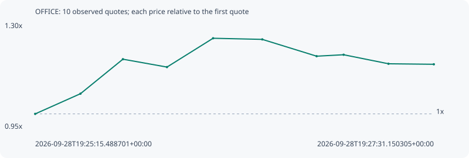

# OFFICE

**solana** / `5boGajrVzMCgKeMQTs8eBpzYyhoayTkjRfKbfdTTpump`

[All tokens](README.md) · [Market window](../README.md)

## Native assessments

This contract is in the quote cohort; it has no native model assessment in this window.

## Series eae1b950253a2209d786

Pool: `not supplied`

[Complete series](../series/solana/eae1b950253a2209d786.json)

Every dot is a captured quote. Lines connect observations; the curve ends at the last available quote.

| Peak | Final | Return | Maximum drawdown |
| ---: | ---: | ---: | ---: |
| 1.2547x | 1.1670x | +16.70% | 6.98% |

### Complete quote timeline

| Time (UTC) | Price (USD) | Multiple | Evidence |
| --- | ---: | ---: | --- |
| 2026-09-28T19:25:15.488701+00:00 | 5.22447e-06 | 1.0000x | `capture:b8fee87c-9981-475c-930b-99c255910a9f:rank:51` |
| 2026-09-28T19:25:30.900173+00:00 | 5.5797e-06 | 1.0680x | `capture:7f757769-25c3-429a-81d0-c6b2ee45ee15:rank:49` |
| 2026-09-28T19:25:45.342895+00:00 | 6.18656e-06 | 1.1842x | `capture:0ca3656d-ce8c-444b-8f77-acf34c08a1f4:rank:48` |
| 2026-09-28T19:26:00.340634+00:00 | 6.04804e-06 | 1.1576x | `capture:5b3728c5-aff9-43f3-bbb5-25b251825caa:rank:49` |
| 2026-09-28T19:26:16.031602+00:00 | 6.55491e-06 | 1.2547x | `capture:bb8d4bfc-85e1-4d55-a2ff-e47193bcce5f:rank:44` |
| 2026-09-28T19:26:32.771713+00:00 | 6.53514e-06 | 1.2509x | `capture:2fed7296-b3d1-4ba6-8398-799ee55f1f2b:rank:43` |
| 2026-09-28T19:26:51.267717+00:00 | 6.23953e-06 | 1.1943x | `capture:4cc162c2-aa4a-403b-a901-4bb5058380d6:rank:42` |
| 2026-09-28T19:27:00.453239+00:00 | 6.265e-06 | 1.1992x | `capture:4273fbb8-5342-4e37-8d61-ced6b88e542d:rank:44` |
| 2026-09-28T19:27:15.715818+00:00 | 6.10617e-06 | 1.1688x | `capture:d04c9116-4617-4b61-8b98-5489321cd1cc:rank:43` |
| 2026-09-28T19:27:31.150305+00:00 | 6.09714e-06 | 1.1670x | `capture:7cad37e8-83d3-4438-8055-245db6707e2e:rank:44` |

### Exit-policy timeline

Calculated from captured quotes under the window policy. Native assessments are linked separately above.

| Time (UTC) | Action | Price (USD) | Evidence |
| --- | --- | ---: | --- |
| 2026-09-28T19:25:15.488701+00:00 | BUY | 5.22447e-06 | `capture:b8fee87c-9981-475c-930b-99c255910a9f:rank:51` |
| 2026-09-28T19:25:30.900173+00:00 | HOLD | 5.5797e-06 | `capture:7f757769-25c3-429a-81d0-c6b2ee45ee15:rank:49` |
| 2026-09-28T19:25:45.342895+00:00 | HOLD | 6.18656e-06 | `capture:0ca3656d-ce8c-444b-8f77-acf34c08a1f4:rank:48` |
| 2026-09-28T19:26:00.340634+00:00 | HOLD | 6.04804e-06 | `capture:5b3728c5-aff9-43f3-bbb5-25b251825caa:rank:49` |
| 2026-09-28T19:26:16.031602+00:00 | PROFIT | 6.55491e-06 | `capture:bb8d4bfc-85e1-4d55-a2ff-e47193bcce5f:rank:44` |
| 2026-09-28T19:26:32.771713+00:00 | HOLD_BAG | 6.53514e-06 | `capture:2fed7296-b3d1-4ba6-8398-799ee55f1f2b:rank:43` |
| 2026-09-28T19:26:51.267717+00:00 | HOLD_BAG | 6.23953e-06 | `capture:4cc162c2-aa4a-403b-a901-4bb5058380d6:rank:42` |
| 2026-09-28T19:27:00.453239+00:00 | HOLD_BAG | 6.265e-06 | `capture:4273fbb8-5342-4e37-8d61-ced6b88e542d:rank:44` |
| 2026-09-28T19:27:15.715818+00:00 | HOLD_BAG | 6.10617e-06 | `capture:d04c9116-4617-4b61-8b98-5489321cd1cc:rank:43` |
| 2026-09-28T19:27:31.150305+00:00 | HOLD_BAG | 6.09714e-06 | `capture:7cad37e8-83d3-4438-8055-245db6707e2e:rank:44` |
