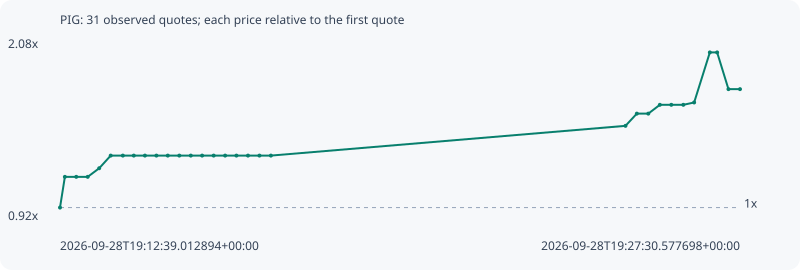

# PIG

**robinhood** / `0xeaa86c0f9ee8a83ad303abe2d3170d223c22c522`

[All tokens](README.md) · [Market window](../README.md)

## Native assessments

This contract is in the quote cohort; it has no native model assessment in this window.

## Series 9cb4bfbe49afd1c8afea

Pool: `not supplied`

[Complete series](../series/robinhood/9cb4bfbe49afd1c8afea.json)

Every dot is a captured quote. Lines connect observations; the curve ends at the last available quote.

| Peak | Final | Return | Maximum drawdown |
| ---: | ---: | ---: | ---: |
| 1.9979x | 1.7617x | +76.17% | 11.82% |

### Complete quote timeline

| Time (UTC) | Price (USD) | Multiple | Evidence |
| --- | ---: | ---: | --- |
| 2026-09-28T19:12:39.012894+00:00 | 8.23117e-06 | 1.0000x | `capture:fe8ad944-154e-4481-bd56-8ab821bfbfe1:rank:36` |
| 2026-09-28T19:12:45.402569+00:00 | 9.85868e-06 | 1.1977x | `capture:8deb508c-ea33-4c21-a5c5-f0991dd6dcac:rank:31` |
| 2026-09-28T19:13:00.335966+00:00 | 9.85868e-06 | 1.1977x | `capture:ee3ee7f8-576f-4c42-a7e0-cd9f917fdb36:rank:30` |
| 2026-09-28T19:13:15.331879+00:00 | 9.85868e-06 | 1.1977x | `capture:c384257a-4501-4701-8a0c-a6b08fe727d5:rank:31` |
| 2026-09-28T19:13:30.402311+00:00 | 1.03139e-05 | 1.2530x | `capture:44090e9e-d515-41c4-a78f-893390e6f2b0:rank:29` |
| 2026-09-28T19:13:45.493213+00:00 | 1.09834e-05 | 1.3344x | `capture:52264519-193b-4508-b560-e9ee4e3e0963:rank:26` |
| 2026-09-28T19:14:01.407289+00:00 | 1.09834e-05 | 1.3344x | `capture:0a62cce6-2c27-4761-80c1-feb9130a0c83:rank:26` |
| 2026-09-28T19:14:15.755233+00:00 | 1.09834e-05 | 1.3344x | `capture:09651124-e158-421c-bcdc-cb2310b48412:rank:26` |
| 2026-09-28T19:14:30.367936+00:00 | 1.09834e-05 | 1.3344x | `capture:7a0b9f45-7248-4af6-b349-4bf6d5ef81be:rank:27` |
| 2026-09-28T19:14:45.422215+00:00 | 1.09834e-05 | 1.3344x | `capture:bf6e34c4-c499-472e-8e2b-ebbb151300e2:rank:31` |
| 2026-09-28T19:15:00.325882+00:00 | 1.09834e-05 | 1.3344x | `capture:663c0420-2b9e-4a94-998b-531fa9202dee:rank:34` |
| 2026-09-28T19:15:15.449577+00:00 | 1.09834e-05 | 1.3344x | `capture:14452070-ab94-45a0-af6d-e6c54082daec:rank:34` |
| 2026-09-28T19:15:30.501058+00:00 | 1.09834e-05 | 1.3344x | `capture:4e680297-1e75-418b-b818-8b2903e8b923:rank:34` |
| 2026-09-28T19:15:45.353664+00:00 | 1.09834e-05 | 1.3344x | `capture:b9051b67-24e1-4469-9f82-bc08bd56807d:rank:34` |
| 2026-09-28T19:16:00.473367+00:00 | 1.09834e-05 | 1.3344x | `capture:cd404827-1073-4901-b09c-82ef1488855b:rank:40` |
| 2026-09-28T19:16:15.518445+00:00 | 1.09834e-05 | 1.3344x | `capture:c193221c-c80a-4a3b-ad88-59f12dcb1689:rank:52` |
| 2026-09-28T19:16:30.344303+00:00 | 1.09834e-05 | 1.3344x | `capture:18d587e7-b24d-4b8d-82f1-0ac2903a3303:rank:60` |
| 2026-09-28T19:16:45.486467+00:00 | 1.09834e-05 | 1.3344x | `capture:4ca26bf7-9d1e-455b-a63e-1b5df831b997:rank:67` |
| 2026-09-28T19:17:00.510014+00:00 | 1.09834e-05 | 1.3344x | `capture:d9309a4d-09d7-45ee-91ce-c4a055e8faac:rank:85` |
| 2026-09-28T19:17:15.523068+00:00 | 1.09834e-05 | 1.3344x | `capture:333d670d-dbd3-4656-95f9-1bc781b271db:rank:87` |
| 2026-09-28T19:25:00.412700+00:00 | 1.2558e-05 | 1.5257x | `capture:1dec2f8f-4694-4c32-8be8-eeec3980c853:rank:99` |
| 2026-09-28T19:25:15.316372+00:00 | 1.32048e-05 | 1.6042x | `capture:52eaf5a3-351e-4c29-b00b-a167107703e3:rank:96` |
| 2026-09-28T19:25:30.354898+00:00 | 1.32048e-05 | 1.6042x | `capture:d70b1f6a-3ec3-4ec2-8c88-db476beae4f9:rank:94` |
| 2026-09-28T19:25:45.483791+00:00 | 1.36713e-05 | 1.6609x | `capture:ebb21e05-3dc6-4a8f-a800-fa79ba147200:rank:88` |
| 2026-09-28T19:26:00.522113+00:00 | 1.36713e-05 | 1.6609x | `capture:a33301e4-8f37-4fb5-af69-629635c54fe6:rank:90` |
| 2026-09-28T19:26:16.279485+00:00 | 1.36713e-05 | 1.6609x | `capture:085b2ea9-3985-4608-a1cd-1eddc6b16122:rank:88` |
| 2026-09-28T19:26:30.447392+00:00 | 1.37944e-05 | 1.6759x | `capture:36fd4b46-5420-443d-b1ed-b86b98706671:rank:82` |
| 2026-09-28T19:26:51.039990+00:00 | 1.64449e-05 | 1.9979x | `capture:653b62fa-7a58-45fd-95e9-3b36912dc139:rank:50` |
| 2026-09-28T19:27:00.598930+00:00 | 1.64449e-05 | 1.9979x | `capture:8041f6b0-6188-445c-83ef-3a6fb7daf321:rank:51` |
| 2026-09-28T19:27:15.438746+00:00 | 1.45006e-05 | 1.7617x | `capture:b4c48612-e04d-4782-96a6-e80c2955d3b9:rank:43` |
| 2026-09-28T19:27:30.577698+00:00 | 1.45006e-05 | 1.7617x | `capture:ff6b3949-9c3c-4cdf-b48c-d4010666c140:rank:43` |

### Exit-policy timeline

Calculated from captured quotes under the window policy. Native assessments are linked separately above.

| Time (UTC) | Action | Price (USD) | Evidence |
| --- | --- | ---: | --- |
| 2026-09-28T19:12:39.012894+00:00 | BUY | 8.23117e-06 | `capture:fe8ad944-154e-4481-bd56-8ab821bfbfe1:rank:36` |
| 2026-09-28T19:12:45.402569+00:00 | HOLD | 9.85868e-06 | `capture:8deb508c-ea33-4c21-a5c5-f0991dd6dcac:rank:31` |
| 2026-09-28T19:13:00.335966+00:00 | HOLD | 9.85868e-06 | `capture:ee3ee7f8-576f-4c42-a7e0-cd9f917fdb36:rank:30` |
| 2026-09-28T19:13:15.331879+00:00 | HOLD | 9.85868e-06 | `capture:c384257a-4501-4701-8a0c-a6b08fe727d5:rank:31` |
| 2026-09-28T19:13:30.402311+00:00 | PROFIT | 1.03139e-05 | `capture:44090e9e-d515-41c4-a78f-893390e6f2b0:rank:29` |
| 2026-09-28T19:13:45.493213+00:00 | HOLD_BAG | 1.09834e-05 | `capture:52264519-193b-4508-b560-e9ee4e3e0963:rank:26` |
| 2026-09-28T19:14:01.407289+00:00 | HOLD_BAG | 1.09834e-05 | `capture:0a62cce6-2c27-4761-80c1-feb9130a0c83:rank:26` |
| 2026-09-28T19:14:15.755233+00:00 | HOLD_BAG | 1.09834e-05 | `capture:09651124-e158-421c-bcdc-cb2310b48412:rank:26` |
| 2026-09-28T19:14:30.367936+00:00 | HOLD_BAG | 1.09834e-05 | `capture:7a0b9f45-7248-4af6-b349-4bf6d5ef81be:rank:27` |
| 2026-09-28T19:14:45.422215+00:00 | HOLD_BAG | 1.09834e-05 | `capture:bf6e34c4-c499-472e-8e2b-ebbb151300e2:rank:31` |
| 2026-09-28T19:15:00.325882+00:00 | HOLD_BAG | 1.09834e-05 | `capture:663c0420-2b9e-4a94-998b-531fa9202dee:rank:34` |
| 2026-09-28T19:15:15.449577+00:00 | HOLD_BAG | 1.09834e-05 | `capture:14452070-ab94-45a0-af6d-e6c54082daec:rank:34` |
| 2026-09-28T19:15:30.501058+00:00 | HOLD_BAG | 1.09834e-05 | `capture:4e680297-1e75-418b-b818-8b2903e8b923:rank:34` |
| 2026-09-28T19:15:45.353664+00:00 | HOLD_BAG | 1.09834e-05 | `capture:b9051b67-24e1-4469-9f82-bc08bd56807d:rank:34` |
| 2026-09-28T19:16:00.473367+00:00 | HOLD_BAG | 1.09834e-05 | `capture:cd404827-1073-4901-b09c-82ef1488855b:rank:40` |
| 2026-09-28T19:16:15.518445+00:00 | HOLD_BAG | 1.09834e-05 | `capture:c193221c-c80a-4a3b-ad88-59f12dcb1689:rank:52` |
| 2026-09-28T19:16:30.344303+00:00 | HOLD_BAG | 1.09834e-05 | `capture:18d587e7-b24d-4b8d-82f1-0ac2903a3303:rank:60` |
| 2026-09-28T19:16:45.486467+00:00 | HOLD_BAG | 1.09834e-05 | `capture:4ca26bf7-9d1e-455b-a63e-1b5df831b997:rank:67` |
| 2026-09-28T19:17:00.510014+00:00 | HOLD_BAG | 1.09834e-05 | `capture:d9309a4d-09d7-45ee-91ce-c4a055e8faac:rank:85` |
| 2026-09-28T19:17:15.523068+00:00 | HOLD_BAG | 1.09834e-05 | `capture:333d670d-dbd3-4656-95f9-1bc781b271db:rank:87` |
| 2026-09-28T19:25:00.412700+00:00 | TP | 1.2558e-05 | `capture:1dec2f8f-4694-4c32-8be8-eeec3980c853:rank:99` |
