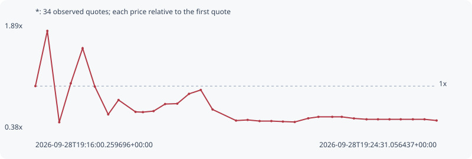

# *

**solana** / `C2DVQKKhR8wccGYSWrnB4fcBoFti4qqMFRZeS4CkQKp5`

[All tokens](README.md) · [Market window](../README.md)

## Native assessments

This contract is in the quote cohort; it has no native model assessment in this window.

## Series 4f120e76b9d2a1ca268c

Pool: `not supplied`

[Complete series](../series/solana/4f120e76b9d2a1ca268c.json)

Every dot is a captured quote. Lines connect observations; the curve ends at the last available quote.

| Peak | Final | Return | Maximum drawdown |
| ---: | ---: | ---: | ---: |
| 1.7869x | 0.5099x | -49.01% | 72.85% |

### Complete quote timeline

| Time (UTC) | Price (USD) | Multiple | Evidence |
| --- | ---: | ---: | --- |
| 2026-09-28T19:16:00.259696+00:00 | 8.57975e-06 | 1.0000x | `capture:4236f8d5-90c4-4c9b-a73e-d6443ae3bf32:rank:87` |
| 2026-09-28T19:16:15.455827+00:00 | 1.5331e-05 | 1.7869x | `capture:acc657c6-9a43-46bf-986e-7b907c831cba:rank:32` |
| 2026-09-28T19:16:30.624202+00:00 | 4.16267e-06 | 0.4852x | `capture:0d391072-ec81-4bb7-9be0-0d6bbb801c70:rank:21` |
| 2026-09-28T19:16:45.311485+00:00 | 8.91832e-06 | 1.0395x | `capture:72cccbac-c3fe-4991-8f62-08c53849b146:rank:19` |
| 2026-09-28T19:17:00.368914+00:00 | 1.32074e-05 | 1.5394x | `capture:1232cf18-7088-40a1-9f55-ad9ae22b44f5:rank:18` |
| 2026-09-28T19:17:15.914647+00:00 | 8.52584e-06 | 0.9937x | `capture:9792e199-c0c2-4272-ac95-24501e4a3f79:rank:14` |
| 2026-09-28T19:17:32.965607+00:00 | 5.12105e-06 | 0.5969x | `capture:0f04cfe5-88a0-4a83-ae8d-85c5cb3cdc89:rank:15` |
| 2026-09-28T19:17:46.087880+00:00 | 6.88457e-06 | 0.8024x | `capture:ee91a1c6-bc99-4c7a-9cdc-bd6cb5478a9b:rank:16` |
| 2026-09-28T19:18:07.749963+00:00 | 5.42914e-06 | 0.6328x | `capture:b0fb1b47-4973-472f-9619-8480bc7d294e:rank:19` |
| 2026-09-28T19:18:17.126008+00:00 | 5.39977e-06 | 0.6294x | `capture:5ed98f51-d1e1-422a-81df-4186a8b0a0a2:rank:19` |
| 2026-09-28T19:18:30.722167+00:00 | 5.52487e-06 | 0.6439x | `capture:9f88d118-9108-4dff-bbfc-246eaed5ce38:rank:20` |
| 2026-09-28T19:18:45.386687+00:00 | 6.38881e-06 | 0.7446x | `capture:f533100a-ce62-4457-9107-42e7601ea5d7:rank:19` |
| 2026-09-28T19:19:00.883835+00:00 | 6.43564e-06 | 0.7501x | `capture:a2495d99-5671-4c7e-b87c-48f48d90f2f2:rank:18` |
| 2026-09-28T19:19:15.826416+00:00 | 7.63404e-06 | 0.8898x | `capture:ba1dc6a3-b8b7-461a-8110-8490f03539a5:rank:16` |
| 2026-09-28T19:19:30.814098+00:00 | 8.11102e-06 | 0.9454x | `capture:b25d90dc-c8db-4388-8a2b-d06541e5320f:rank:16` |
| 2026-09-28T19:19:45.817199+00:00 | 5.72423e-06 | 0.6672x | `capture:722d1b7b-ef4f-4ac5-883c-0557bae2b60b:rank:14` |
| 2026-09-28T19:20:15.699547+00:00 | 4.36726e-06 | 0.5090x | `capture:10a94828-637f-4580-a9f7-2fbd34d8589a:rank:15` |
| 2026-09-28T19:20:30.480194+00:00 | 4.44687e-06 | 0.5183x | `capture:54722132-db1d-4a2b-8c1c-2b0e71d01430:rank:15` |
| 2026-09-28T19:20:45.683165+00:00 | 4.30743e-06 | 0.5020x | `capture:17963a37-fd65-46b6-8e1c-350082721f8c:rank:14` |
| 2026-09-28T19:21:00.690136+00:00 | 4.30743e-06 | 0.5020x | `capture:f2ff842d-38e9-4cbe-a281-98c17d5a5672:rank:14` |
| 2026-09-28T19:21:15.372716+00:00 | 4.24581e-06 | 0.4949x | `capture:a923b968-a768-495e-ae33-6de2042c551f:rank:16` |
| 2026-09-28T19:21:30.402460+00:00 | 4.194e-06 | 0.4888x | `capture:d926629b-2050-4e50-a602-1638c6205870:rank:20` |
| 2026-09-28T19:21:47.649380+00:00 | 4.64304e-06 | 0.5412x | `capture:0799ec6d-0e89-46b5-ae88-5695bf6c5fc3:rank:27` |
| 2026-09-28T19:22:00.569928+00:00 | 4.82286e-06 | 0.5621x | `capture:263cda40-4b31-4b2d-b168-fa4310edb46d:rank:26` |
| 2026-09-28T19:22:18.240717+00:00 | 4.82286e-06 | 0.5621x | `capture:546b2c55-1845-4da7-bc9c-4439cd0ccdba:rank:37` |
| 2026-09-28T19:22:30.371968+00:00 | 4.82286e-06 | 0.5621x | `capture:507d17cb-af67-4a81-a2b2-d5ddfbc40021:rank:40` |
| 2026-09-28T19:22:45.783808+00:00 | 4.63176e-06 | 0.5398x | `capture:9558d322-c429-480b-885f-82f4481c8506:rank:45` |
| 2026-09-28T19:23:01.833252+00:00 | 4.52146e-06 | 0.5270x | `capture:c5462412-2da1-4432-8949-8fcd1492c57f:rank:47` |
| 2026-09-28T19:23:16.460099+00:00 | 4.52146e-06 | 0.5270x | `capture:2d456a2a-6755-4e1d-9a80-b6e3b2d44ec1:rank:52` |
| 2026-09-28T19:23:31.092727+00:00 | 4.52146e-06 | 0.5270x | `capture:0e687519-8b01-4d7e-b48c-e2ec34135d17:rank:60` |
| 2026-09-28T19:23:45.375171+00:00 | 4.52146e-06 | 0.5270x | `capture:1b404fa0-870b-4e7c-bafd-c3ef241c5093:rank:63` |
| 2026-09-28T19:24:00.852400+00:00 | 4.52146e-06 | 0.5270x | `capture:5205c587-4734-452c-b758-46c4814dded1:rank:71` |
| 2026-09-28T19:24:15.655418+00:00 | 4.52146e-06 | 0.5270x | `capture:5b9df0f6-51c0-4dbb-9de7-7df7a46bfee0:rank:80` |
| 2026-09-28T19:24:31.056437+00:00 | 4.37503e-06 | 0.5099x | `capture:971b5dda-397d-4fe7-b49e-94713bb088df:rank:87` |

### Exit-policy timeline

Calculated from captured quotes under the window policy. Native assessments are linked separately above.

| Time (UTC) | Action | Price (USD) | Evidence |
| --- | --- | ---: | --- |
| 2026-09-28T19:16:00.259696+00:00 | BUY | 8.57975e-06 | `capture:4236f8d5-90c4-4c9b-a73e-d6443ae3bf32:rank:87` |
| 2026-09-28T19:16:15.455827+00:00 | TP | 1.5331e-05 | `capture:acc657c6-9a43-46bf-986e-7b907c831cba:rank:32` |
