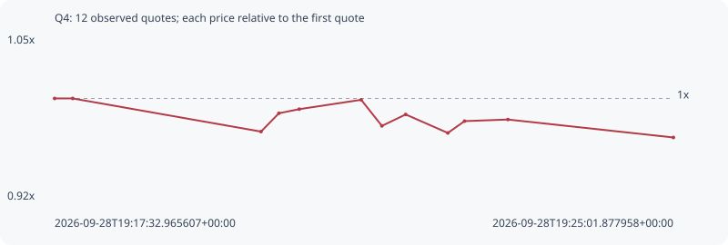

# Q4

**solana** / `F1z5FQdToNDLQYJ72grqePaWJrcrf39HR4gaKA57ySUQ`

[All tokens](README.md) · [Market window](../README.md)

## Native assessments

This contract is in the quote cohort; it has no native model assessment in this window.

## Series 3e7d59eec6bcdd98ce3f

Pool: `not supplied`

[Complete series](../series/solana/3e7d59eec6bcdd98ce3f.json)

Every dot is a captured quote. Lines connect observations; the curve ends at the last available quote.

| Peak | Final | Return | Maximum drawdown |
| ---: | ---: | ---: | ---: |
| 1.0000x | 0.9686x | -3.14% | 3.14% |

### Complete quote timeline

| Time (UTC) | Price (USD) | Multiple | Evidence |
| --- | ---: | ---: | --- |
| 2026-09-28T19:17:32.965607+00:00 | 0.000100668 | 1.0000x | `capture:0f04cfe5-88a0-4a83-ae8d-85c5cb3cdc89:rank:98` |
| 2026-09-28T19:17:46.087880+00:00 | 0.000100668 | 1.0000x | `capture:ee91a1c6-bc99-4c7a-9cdc-bd6cb5478a9b:rank:99` |
| 2026-09-28T19:20:02.715590+00:00 | 9.79837e-05 | 0.9733x | `capture:60ff17d8-3b18-4f61-9bc7-006afd324cf2:rank:95` |
| 2026-09-28T19:20:15.699547+00:00 | 9.94692e-05 | 0.9881x | `capture:10a94828-637f-4580-a9f7-2fbd34d8589a:rank:98` |
| 2026-09-28T19:20:30.480194+00:00 | 9.98015e-05 | 0.9914x | `capture:54722132-db1d-4a2b-8c1c-2b0e71d01430:rank:96` |
| 2026-09-28T19:21:15.372716+00:00 | 0.000100559 | 0.9989x | `capture:a923b968-a768-495e-ae33-6de2042c551f:rank:98` |
| 2026-09-28T19:21:30.402460+00:00 | 9.84458e-05 | 0.9779x | `capture:d926629b-2050-4e50-a602-1638c6205870:rank:91` |
| 2026-09-28T19:21:47.649380+00:00 | 9.93709e-05 | 0.9871x | `capture:0799ec6d-0e89-46b5-ae88-5695bf6c5fc3:rank:98` |
| 2026-09-28T19:22:18.240717+00:00 | 9.78736e-05 | 0.9722x | `capture:546b2c55-1845-4da7-bc9c-4439cd0ccdba:rank:94` |
| 2026-09-28T19:22:30.371968+00:00 | 9.88317e-05 | 0.9818x | `capture:507d17cb-af67-4a81-a2b2-d5ddfbc40021:rank:95` |
| 2026-09-28T19:23:01.833252+00:00 | 9.89611e-05 | 0.9830x | `capture:c5462412-2da1-4432-8949-8fcd1492c57f:rank:99` |
| 2026-09-28T19:25:01.877958+00:00 | 9.75072e-05 | 0.9686x | `capture:fd6d01ae-d246-439e-ac58-27ae75880eb9:rank:95` |

### Exit-policy timeline

Calculated from captured quotes under the window policy. Native assessments are linked separately above.

| Time (UTC) | Action | Price (USD) | Evidence |
| --- | --- | ---: | --- |
| 2026-09-28T19:17:32.965607+00:00 | BUY | 0.000100668 | `capture:0f04cfe5-88a0-4a83-ae8d-85c5cb3cdc89:rank:98` |
| 2026-09-28T19:17:46.087880+00:00 | HOLD | 0.000100668 | `capture:ee91a1c6-bc99-4c7a-9cdc-bd6cb5478a9b:rank:99` |
| 2026-09-28T19:20:02.715590+00:00 | HOLD | 9.79837e-05 | `capture:60ff17d8-3b18-4f61-9bc7-006afd324cf2:rank:95` |
| 2026-09-28T19:20:15.699547+00:00 | HOLD | 9.94692e-05 | `capture:10a94828-637f-4580-a9f7-2fbd34d8589a:rank:98` |
| 2026-09-28T19:20:30.480194+00:00 | HOLD | 9.98015e-05 | `capture:54722132-db1d-4a2b-8c1c-2b0e71d01430:rank:96` |
| 2026-09-28T19:21:15.372716+00:00 | HOLD | 0.000100559 | `capture:a923b968-a768-495e-ae33-6de2042c551f:rank:98` |
| 2026-09-28T19:21:30.402460+00:00 | HOLD | 9.84458e-05 | `capture:d926629b-2050-4e50-a602-1638c6205870:rank:91` |
| 2026-09-28T19:21:47.649380+00:00 | HOLD | 9.93709e-05 | `capture:0799ec6d-0e89-46b5-ae88-5695bf6c5fc3:rank:98` |
| 2026-09-28T19:22:18.240717+00:00 | HOLD | 9.78736e-05 | `capture:546b2c55-1845-4da7-bc9c-4439cd0ccdba:rank:94` |
| 2026-09-28T19:22:30.371968+00:00 | HOLD | 9.88317e-05 | `capture:507d17cb-af67-4a81-a2b2-d5ddfbc40021:rank:95` |
| 2026-09-28T19:23:01.833252+00:00 | HOLD | 9.89611e-05 | `capture:c5462412-2da1-4432-8949-8fcd1492c57f:rank:99` |
| 2026-09-28T19:25:01.877958+00:00 | HOLD | 9.75072e-05 | `capture:fd6d01ae-d246-439e-ac58-27ae75880eb9:rank:95` |
