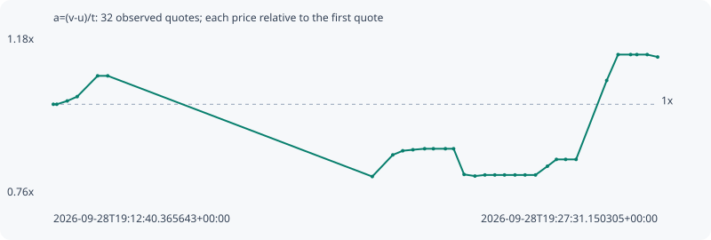

# a=(v-u)/t

**solana** / `HAYYs5Vctf9ibgFRqZdD2nTj9QzjGXZqHJMXoDjNc3Zo`

[All tokens](README.md) · [Market window](../README.md)

## Native assessments

This contract is in the quote cohort; it has no native model assessment in this window.

## Series db0570385a63dca6e5ad

Pool: `not supplied`

[Complete series](../series/solana/db0570385a63dca6e5ad.json)

Every dot is a captured quote. Lines connect observations; the curve ends at the last available quote.

| Peak | Final | Return | Maximum drawdown |
| ---: | ---: | ---: | ---: |
| 1.1307x | 1.1243x | +12.43% | 24.64% |

### Complete quote timeline

| Time (UTC) | Price (USD) | Multiple | Evidence |
| --- | ---: | ---: | --- |
| 2026-09-28T19:12:40.365643+00:00 | 1.61865e-05 | 1.0000x | `capture:3af1faa1-2074-484e-893e-ed2c676e1576:rank:84` |
| 2026-09-28T19:12:45.490977+00:00 | 1.61865e-05 | 1.0000x | `capture:ac0279d6-7dd1-44b6-bf3e-910bf7b8eddf:rank:85` |
| 2026-09-28T19:13:00.884337+00:00 | 1.63284e-05 | 1.0088x | `capture:5867894f-39b4-4bcd-bd87-86394c63aab4:rank:88` |
| 2026-09-28T19:13:15.565374+00:00 | 1.65128e-05 | 1.0202x | `capture:ca31b3d4-ad60-4333-98b3-6d940a196f86:rank:85` |
| 2026-09-28T19:13:45.640151+00:00 | 1.73966e-05 | 1.0748x | `capture:4d31b656-3ffe-4768-bef6-377adf019420:rank:96` |
| 2026-09-28T19:14:00.595194+00:00 | 1.73966e-05 | 1.0748x | `capture:2c78112b-48e7-4f74-8c2e-1cb8642a79dc:rank:98` |
| 2026-09-28T19:20:30.480194+00:00 | 1.31101e-05 | 0.8099x | `capture:54722132-db1d-4a2b-8c1c-2b0e71d01430:rank:99` |
| 2026-09-28T19:21:00.690136+00:00 | 1.4031e-05 | 0.8668x | `capture:f2ff842d-38e9-4cbe-a281-98c17d5a5672:rank:95` |
| 2026-09-28T19:21:15.372716+00:00 | 1.42072e-05 | 0.8777x | `capture:a923b968-a768-495e-ae33-6de2042c551f:rank:89` |
| 2026-09-28T19:21:30.402460+00:00 | 1.42506e-05 | 0.8804x | `capture:d926629b-2050-4e50-a602-1638c6205870:rank:72` |
| 2026-09-28T19:21:47.649380+00:00 | 1.42944e-05 | 0.8831x | `capture:0799ec6d-0e89-46b5-ae88-5695bf6c5fc3:rank:88` |
| 2026-09-28T19:22:00.569928+00:00 | 1.42944e-05 | 0.8831x | `capture:263cda40-4b31-4b2d-b168-fa4310edb46d:rank:91` |
| 2026-09-28T19:22:18.240717+00:00 | 1.42944e-05 | 0.8831x | `capture:546b2c55-1845-4da7-bc9c-4439cd0ccdba:rank:91` |
| 2026-09-28T19:22:30.371968+00:00 | 1.42944e-05 | 0.8831x | `capture:507d17cb-af67-4a81-a2b2-d5ddfbc40021:rank:98` |
| 2026-09-28T19:22:45.783808+00:00 | 1.32002e-05 | 0.8155x | `capture:9558d322-c429-480b-885f-82f4481c8506:rank:91` |
| 2026-09-28T19:23:01.833252+00:00 | 1.31309e-05 | 0.8112x | `capture:c5462412-2da1-4432-8949-8fcd1492c57f:rank:90` |
| 2026-09-28T19:23:16.460099+00:00 | 1.3177e-05 | 0.8141x | `capture:2d456a2a-6755-4e1d-9a80-b6e3b2d44ec1:rank:90` |
| 2026-09-28T19:23:31.092727+00:00 | 1.3177e-05 | 0.8141x | `capture:0e687519-8b01-4d7e-b48c-e2ec34135d17:rank:87` |
| 2026-09-28T19:23:45.375171+00:00 | 1.3177e-05 | 0.8141x | `capture:1b404fa0-870b-4e7c-bafd-c3ef241c5093:rank:87` |
| 2026-09-28T19:24:00.852400+00:00 | 1.3177e-05 | 0.8141x | `capture:5205c587-4734-452c-b758-46c4814dded1:rank:87` |
| 2026-09-28T19:24:15.655418+00:00 | 1.3177e-05 | 0.8141x | `capture:5b9df0f6-51c0-4dbb-9de7-7df7a46bfee0:rank:88` |
| 2026-09-28T19:24:31.056437+00:00 | 1.3177e-05 | 0.8141x | `capture:971b5dda-397d-4fe7-b49e-94713bb088df:rank:84` |
| 2026-09-28T19:24:48.687179+00:00 | 1.35502e-05 | 0.8371x | `capture:feb72cbd-a170-4ba3-8a11-eb1df1686719:rank:83` |
| 2026-09-28T19:25:01.877958+00:00 | 1.38399e-05 | 0.8550x | `capture:fd6d01ae-d246-439e-ac58-27ae75880eb9:rank:83` |
| 2026-09-28T19:25:15.488701+00:00 | 1.38399e-05 | 0.8550x | `capture:b8fee87c-9981-475c-930b-99c255910a9f:rank:90` |
| 2026-09-28T19:25:30.900173+00:00 | 1.38399e-05 | 0.8550x | `capture:7f757769-25c3-429a-81d0-c6b2ee45ee15:rank:96` |
| 2026-09-28T19:26:16.031602+00:00 | 1.72003e-05 | 1.0626x | `capture:bb8d4bfc-85e1-4d55-a2ff-e47193bcce5f:rank:99` |
| 2026-09-28T19:26:32.771713+00:00 | 1.83022e-05 | 1.1307x | `capture:2fed7296-b3d1-4ba6-8398-799ee55f1f2b:rank:78` |
| 2026-09-28T19:26:51.267717+00:00 | 1.83022e-05 | 1.1307x | `capture:4cc162c2-aa4a-403b-a901-4bb5058380d6:rank:87` |
| 2026-09-28T19:27:00.453239+00:00 | 1.83022e-05 | 1.1307x | `capture:4273fbb8-5342-4e37-8d61-ced6b88e542d:rank:91` |
| 2026-09-28T19:27:15.715818+00:00 | 1.83022e-05 | 1.1307x | `capture:d04c9116-4617-4b61-8b98-5489321cd1cc:rank:89` |
| 2026-09-28T19:27:31.150305+00:00 | 1.81988e-05 | 1.1243x | `capture:7cad37e8-83d3-4438-8055-245db6707e2e:rank:89` |

### Exit-policy timeline

Calculated from captured quotes under the window policy. Native assessments are linked separately above.

| Time (UTC) | Action | Price (USD) | Evidence |
| --- | --- | ---: | --- |
| 2026-09-28T19:12:40.365643+00:00 | BUY | 1.61865e-05 | `capture:3af1faa1-2074-484e-893e-ed2c676e1576:rank:84` |
| 2026-09-28T19:12:45.490977+00:00 | HOLD | 1.61865e-05 | `capture:ac0279d6-7dd1-44b6-bf3e-910bf7b8eddf:rank:85` |
| 2026-09-28T19:13:00.884337+00:00 | HOLD | 1.63284e-05 | `capture:5867894f-39b4-4bcd-bd87-86394c63aab4:rank:88` |
| 2026-09-28T19:13:15.565374+00:00 | HOLD | 1.65128e-05 | `capture:ca31b3d4-ad60-4333-98b3-6d940a196f86:rank:85` |
| 2026-09-28T19:13:45.640151+00:00 | HOLD | 1.73966e-05 | `capture:4d31b656-3ffe-4768-bef6-377adf019420:rank:96` |
| 2026-09-28T19:14:00.595194+00:00 | HOLD | 1.73966e-05 | `capture:2c78112b-48e7-4f74-8c2e-1cb8642a79dc:rank:98` |
| 2026-09-28T19:20:30.480194+00:00 | SL | 1.31101e-05 | `capture:54722132-db1d-4a2b-8c1c-2b0e71d01430:rank:99` |
