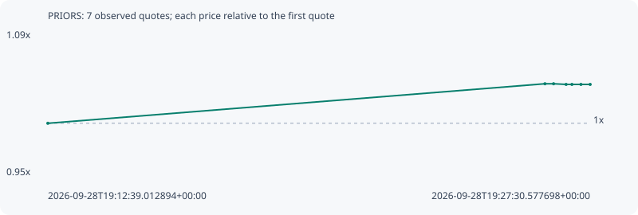

# PRIORS

**robinhood** / `0xedbf91223639800bcd5756815caf908df3b890be`

[All tokens](README.md) · [Market window](../README.md)

## Native assessments

This contract is in the quote cohort; it has no native model assessment in this window.

## Series e6394f28fd320797db46

Pool: `not supplied`

[Complete series](../series/robinhood/e6394f28fd320797db46.json)

Every dot is a captured quote. Lines connect observations; the curve ends at the last available quote.

| Peak | Final | Return | Maximum drawdown |
| ---: | ---: | ---: | ---: |
| 1.0381x | 1.0374x | +3.74% | 0.06% |

### Complete quote timeline

| Time (UTC) | Price (USD) | Multiple | Evidence |
| --- | ---: | ---: | --- |
| 2026-09-28T19:12:39.012894+00:00 | 0.00203158 | 1.0000x | `capture:fe8ad944-154e-4481-bd56-8ab821bfbfe1:rank:99` |
| 2026-09-28T19:26:16.279485+00:00 | 0.00210892 | 1.0381x | `capture:085b2ea9-3985-4608-a1cd-1eddc6b16122:rank:93` |
| 2026-09-28T19:26:30.447392+00:00 | 0.00210892 | 1.0381x | `capture:36fd4b46-5420-443d-b1ed-b86b98706671:rank:96` |
| 2026-09-28T19:26:51.039990+00:00 | 0.00210765 | 1.0374x | `capture:653b62fa-7a58-45fd-95e9-3b36912dc139:rank:88` |
| 2026-09-28T19:27:00.598930+00:00 | 0.00210765 | 1.0374x | `capture:8041f6b0-6188-445c-83ef-3a6fb7daf321:rank:90` |
| 2026-09-28T19:27:15.438746+00:00 | 0.00210765 | 1.0374x | `capture:b4c48612-e04d-4782-96a6-e80c2955d3b9:rank:84` |
| 2026-09-28T19:27:30.577698+00:00 | 0.00210765 | 1.0374x | `capture:ff6b3949-9c3c-4cdf-b48c-d4010666c140:rank:85` |

### Exit-policy timeline

Calculated from captured quotes under the window policy. Native assessments are linked separately above.

| Time (UTC) | Action | Price (USD) | Evidence |
| --- | --- | ---: | --- |
| 2026-09-28T19:12:39.012894+00:00 | BUY | 0.00203158 | `capture:fe8ad944-154e-4481-bd56-8ab821bfbfe1:rank:99` |
| 2026-09-28T19:26:16.279485+00:00 | HOLD | 0.00210892 | `capture:085b2ea9-3985-4608-a1cd-1eddc6b16122:rank:93` |
| 2026-09-28T19:26:30.447392+00:00 | HOLD | 0.00210892 | `capture:36fd4b46-5420-443d-b1ed-b86b98706671:rank:96` |
| 2026-09-28T19:26:51.039990+00:00 | HOLD | 0.00210765 | `capture:653b62fa-7a58-45fd-95e9-3b36912dc139:rank:88` |
| 2026-09-28T19:27:00.598930+00:00 | HOLD | 0.00210765 | `capture:8041f6b0-6188-445c-83ef-3a6fb7daf321:rank:90` |
| 2026-09-28T19:27:15.438746+00:00 | HOLD | 0.00210765 | `capture:b4c48612-e04d-4782-96a6-e80c2955d3b9:rank:84` |
| 2026-09-28T19:27:30.577698+00:00 | HOLD | 0.00210765 | `capture:ff6b3949-9c3c-4cdf-b48c-d4010666c140:rank:85` |
