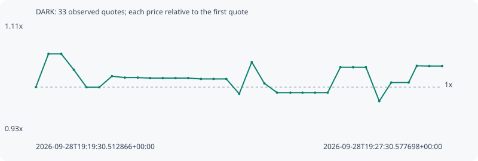

# DARK

**robinhood** / `0xdc45b71d7203c2e8baafc43a19bca0eb993bb54e`

[All tokens](README.md) · [Market window](../README.md)

## Native assessments

This contract is in the quote cohort; it has no native model assessment in this window.

## Series 5fd580c21de1a25cad6c

Pool: `not supplied`

[Complete series](../series/robinhood/5fd580c21de1a25cad6c.json)

Every dot is a captured quote. Lines connect observations; the curve ends at the last available quote.

| Peak | Final | Return | Maximum drawdown |
| ---: | ---: | ---: | ---: |
| 1.0554x | 1.0351x | +3.51% | 7.47% |

### Complete quote timeline

| Time (UTC) | Price (USD) | Multiple | Evidence |
| --- | ---: | ---: | --- |
| 2026-09-28T19:19:30.512866+00:00 | 0.0045977 | 1.0000x | `capture:bb499bdc-159a-4072-a450-312045f32cef:rank:82` |
| 2026-09-28T19:19:45.438706+00:00 | 0.00485258 | 1.0554x | `capture:59b12f7b-2112-42c7-834a-a2eb9bcaee3d:rank:62` |
| 2026-09-28T19:20:00.494705+00:00 | 0.00485258 | 1.0554x | `capture:5b06d6b3-9eca-4487-82fb-6b28820c37d9:rank:61` |
| 2026-09-28T19:20:15.393373+00:00 | 0.00473042 | 1.0289x | `capture:17802da9-7cee-48c3-9f5b-5829781be3f6:rank:53` |
| 2026-09-28T19:20:30.417446+00:00 | 0.00459679 | 0.9998x | `capture:f2fe9ac4-89a0-4ad3-8f15-5a70d7e1d5f7:rank:48` |
| 2026-09-28T19:20:45.464282+00:00 | 0.00459679 | 0.9998x | `capture:26559b75-812f-4386-982b-eba5073faf44:rank:47` |
| 2026-09-28T19:21:00.449260+00:00 | 0.00468156 | 1.0182x | `capture:186445b2-8971-4639-85b9-26b2e8fb9d2c:rank:44` |
| 2026-09-28T19:21:15.606838+00:00 | 0.00467056 | 1.0158x | `capture:c2a8ab31-038e-42f4-8e33-852fee1b9a24:rank:40` |
| 2026-09-28T19:21:30.959683+00:00 | 0.00467056 | 1.0158x | `capture:300e0f35-12d4-46a9-a17e-17adbe8e1059:rank:38` |
| 2026-09-28T19:21:45.420062+00:00 | 0.00466707 | 1.0151x | `capture:ec22b61b-732a-44d2-be85-c577051928eb:rank:39` |
| 2026-09-28T19:22:00.489634+00:00 | 0.00466707 | 1.0151x | `capture:d6c64542-18c5-48a0-a6c9-f0e2a9c54b41:rank:42` |
| 2026-09-28T19:22:15.632268+00:00 | 0.00466707 | 1.0151x | `capture:13e6d33e-e854-4b87-b3da-49aedec6950e:rank:43` |
| 2026-09-28T19:22:30.535979+00:00 | 0.00466707 | 1.0151x | `capture:091fb4d2-10fc-4d5f-9c22-af9f55e90e4a:rank:39` |
| 2026-09-28T19:22:45.520851+00:00 | 0.00466032 | 1.0136x | `capture:128617a9-4055-4a8d-8b04-c8876bad9c70:rank:41` |
| 2026-09-28T19:23:00.594785+00:00 | 0.00466032 | 1.0136x | `capture:b6c633f1-3960-4db3-a2ca-34618f913368:rank:39` |
| 2026-09-28T19:23:15.534636+00:00 | 0.00466032 | 1.0136x | `capture:d5a0d1a4-a366-4985-80da-e34160e2f58c:rank:38` |
| 2026-09-28T19:23:30.815940+00:00 | 0.00454667 | 0.9889x | `capture:c6f23ed9-c47c-4f73-bf08-86a494a11aa2:rank:29` |
| 2026-09-28T19:23:45.643860+00:00 | 0.00478982 | 1.0418x | `capture:0b8bbeb9-cbaa-4cb2-a853-2bb146bd23e5:rank:35` |
| 2026-09-28T19:24:00.467430+00:00 | 0.0046271 | 1.0064x | `capture:4a231962-827e-445d-ab7d-bb974bfc841b:rank:33` |
| 2026-09-28T19:24:15.505143+00:00 | 0.00455543 | 0.9908x | `capture:b7273a78-8f87-4dcc-877e-f47f549e0fe8:rank:32` |
| 2026-09-28T19:24:31.344409+00:00 | 0.00455543 | 0.9908x | `capture:85f4db1c-c852-45c3-99aa-4320f3839031:rank:31` |
| 2026-09-28T19:24:45.576445+00:00 | 0.00455543 | 0.9908x | `capture:da07dfaa-56d9-4a51-99df-1ad071803eb0:rank:42` |
| 2026-09-28T19:25:00.412700+00:00 | 0.00455543 | 0.9908x | `capture:1dec2f8f-4694-4c32-8be8-eeec3980c853:rank:55` |
| 2026-09-28T19:25:15.316372+00:00 | 0.00455543 | 0.9908x | `capture:52eaf5a3-351e-4c29-b00b-a167107703e3:rank:56` |
| 2026-09-28T19:25:30.354898+00:00 | 0.00475011 | 1.0331x | `capture:d70b1f6a-3ec3-4ec2-8c88-db476beae4f9:rank:66` |
| 2026-09-28T19:25:45.483791+00:00 | 0.00475011 | 1.0331x | `capture:ebb21e05-3dc6-4a8f-a800-fa79ba147200:rank:67` |
| 2026-09-28T19:26:00.522113+00:00 | 0.00475011 | 1.0331x | `capture:a33301e4-8f37-4fb5-af69-629635c54fe6:rank:76` |
| 2026-09-28T19:26:16.279485+00:00 | 0.00449003 | 0.9766x | `capture:085b2ea9-3985-4608-a1cd-1eddc6b16122:rank:66` |
| 2026-09-28T19:26:30.447392+00:00 | 0.00463301 | 1.0077x | `capture:36fd4b46-5420-443d-b1ed-b86b98706671:rank:47` |
| 2026-09-28T19:26:51.039990+00:00 | 0.00463322 | 1.0077x | `capture:653b62fa-7a58-45fd-95e9-3b36912dc139:rank:45` |
| 2026-09-28T19:27:00.598930+00:00 | 0.00476094 | 1.0355x | `capture:8041f6b0-6188-445c-83ef-3a6fb7daf321:rank:36` |
| 2026-09-28T19:27:15.438746+00:00 | 0.00475925 | 1.0351x | `capture:b4c48612-e04d-4782-96a6-e80c2955d3b9:rank:34` |
| 2026-09-28T19:27:30.577698+00:00 | 0.00475925 | 1.0351x | `capture:ff6b3949-9c3c-4cdf-b48c-d4010666c140:rank:29` |

### Exit-policy timeline

Calculated from captured quotes under the window policy. Native assessments are linked separately above.

| Time (UTC) | Action | Price (USD) | Evidence |
| --- | --- | ---: | --- |
| 2026-09-28T19:19:30.512866+00:00 | BUY | 0.0045977 | `capture:bb499bdc-159a-4072-a450-312045f32cef:rank:82` |
| 2026-09-28T19:19:45.438706+00:00 | HOLD | 0.00485258 | `capture:59b12f7b-2112-42c7-834a-a2eb9bcaee3d:rank:62` |
| 2026-09-28T19:20:00.494705+00:00 | HOLD | 0.00485258 | `capture:5b06d6b3-9eca-4487-82fb-6b28820c37d9:rank:61` |
| 2026-09-28T19:20:15.393373+00:00 | HOLD | 0.00473042 | `capture:17802da9-7cee-48c3-9f5b-5829781be3f6:rank:53` |
| 2026-09-28T19:20:30.417446+00:00 | HOLD | 0.00459679 | `capture:f2fe9ac4-89a0-4ad3-8f15-5a70d7e1d5f7:rank:48` |
| 2026-09-28T19:20:45.464282+00:00 | HOLD | 0.00459679 | `capture:26559b75-812f-4386-982b-eba5073faf44:rank:47` |
| 2026-09-28T19:21:00.449260+00:00 | HOLD | 0.00468156 | `capture:186445b2-8971-4639-85b9-26b2e8fb9d2c:rank:44` |
| 2026-09-28T19:21:15.606838+00:00 | HOLD | 0.00467056 | `capture:c2a8ab31-038e-42f4-8e33-852fee1b9a24:rank:40` |
| 2026-09-28T19:21:30.959683+00:00 | HOLD | 0.00467056 | `capture:300e0f35-12d4-46a9-a17e-17adbe8e1059:rank:38` |
| 2026-09-28T19:21:45.420062+00:00 | HOLD | 0.00466707 | `capture:ec22b61b-732a-44d2-be85-c577051928eb:rank:39` |
| 2026-09-28T19:22:00.489634+00:00 | HOLD | 0.00466707 | `capture:d6c64542-18c5-48a0-a6c9-f0e2a9c54b41:rank:42` |
| 2026-09-28T19:22:15.632268+00:00 | HOLD | 0.00466707 | `capture:13e6d33e-e854-4b87-b3da-49aedec6950e:rank:43` |
| 2026-09-28T19:22:30.535979+00:00 | HOLD | 0.00466707 | `capture:091fb4d2-10fc-4d5f-9c22-af9f55e90e4a:rank:39` |
| 2026-09-28T19:22:45.520851+00:00 | HOLD | 0.00466032 | `capture:128617a9-4055-4a8d-8b04-c8876bad9c70:rank:41` |
| 2026-09-28T19:23:00.594785+00:00 | HOLD | 0.00466032 | `capture:b6c633f1-3960-4db3-a2ca-34618f913368:rank:39` |
| 2026-09-28T19:23:15.534636+00:00 | HOLD | 0.00466032 | `capture:d5a0d1a4-a366-4985-80da-e34160e2f58c:rank:38` |
| 2026-09-28T19:23:30.815940+00:00 | HOLD | 0.00454667 | `capture:c6f23ed9-c47c-4f73-bf08-86a494a11aa2:rank:29` |
| 2026-09-28T19:23:45.643860+00:00 | HOLD | 0.00478982 | `capture:0b8bbeb9-cbaa-4cb2-a853-2bb146bd23e5:rank:35` |
| 2026-09-28T19:24:00.467430+00:00 | HOLD | 0.0046271 | `capture:4a231962-827e-445d-ab7d-bb974bfc841b:rank:33` |
| 2026-09-28T19:24:15.505143+00:00 | HOLD | 0.00455543 | `capture:b7273a78-8f87-4dcc-877e-f47f549e0fe8:rank:32` |
| 2026-09-28T19:24:31.344409+00:00 | HOLD | 0.00455543 | `capture:85f4db1c-c852-45c3-99aa-4320f3839031:rank:31` |
| 2026-09-28T19:24:45.576445+00:00 | HOLD | 0.00455543 | `capture:da07dfaa-56d9-4a51-99df-1ad071803eb0:rank:42` |
| 2026-09-28T19:25:00.412700+00:00 | HOLD | 0.00455543 | `capture:1dec2f8f-4694-4c32-8be8-eeec3980c853:rank:55` |
| 2026-09-28T19:25:15.316372+00:00 | HOLD | 0.00455543 | `capture:52eaf5a3-351e-4c29-b00b-a167107703e3:rank:56` |
| 2026-09-28T19:25:30.354898+00:00 | HOLD | 0.00475011 | `capture:d70b1f6a-3ec3-4ec2-8c88-db476beae4f9:rank:66` |
| 2026-09-28T19:25:45.483791+00:00 | HOLD | 0.00475011 | `capture:ebb21e05-3dc6-4a8f-a800-fa79ba147200:rank:67` |
| 2026-09-28T19:26:00.522113+00:00 | HOLD | 0.00475011 | `capture:a33301e4-8f37-4fb5-af69-629635c54fe6:rank:76` |
| 2026-09-28T19:26:16.279485+00:00 | HOLD | 0.00449003 | `capture:085b2ea9-3985-4608-a1cd-1eddc6b16122:rank:66` |
| 2026-09-28T19:26:30.447392+00:00 | HOLD | 0.00463301 | `capture:36fd4b46-5420-443d-b1ed-b86b98706671:rank:47` |
| 2026-09-28T19:26:51.039990+00:00 | HOLD | 0.00463322 | `capture:653b62fa-7a58-45fd-95e9-3b36912dc139:rank:45` |
| 2026-09-28T19:27:00.598930+00:00 | HOLD | 0.00476094 | `capture:8041f6b0-6188-445c-83ef-3a6fb7daf321:rank:36` |
| 2026-09-28T19:27:15.438746+00:00 | HOLD | 0.00475925 | `capture:b4c48612-e04d-4782-96a6-e80c2955d3b9:rank:34` |
| 2026-09-28T19:27:30.577698+00:00 | HOLD | 0.00475925 | `capture:ff6b3949-9c3c-4cdf-b48c-d4010666c140:rank:29` |
