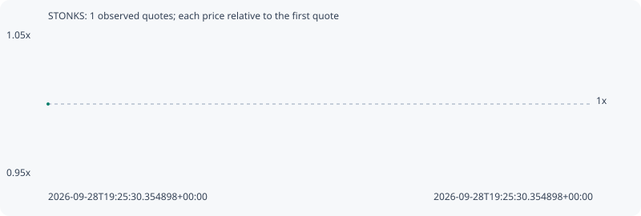

# STONKS

**robinhood** / `0x1ec871553be07dc68ec1661c32eca7e2e46e1e18`

[All tokens](README.md) · [Market window](../README.md)

## Native assessments

This contract is in the quote cohort; it has no native model assessment in this window.

## Series 7df67a0da531c8c7e7d4

Pool: `not supplied`

[Complete series](../series/robinhood/7df67a0da531c8c7e7d4.json)

Every dot is a captured quote. Lines connect observations; the curve ends at the last available quote.

Fewer than two quotes: return and drawdown are not calculated.

### Complete quote timeline

| Time (UTC) | Price (USD) | Multiple | Evidence |
| --- | ---: | ---: | --- |
| 2026-09-28T19:25:30.354898+00:00 | 0.000196066 | 1.0000x | `capture:d70b1f6a-3ec3-4ec2-8c88-db476beae4f9:rank:97` |

### Exit-policy timeline

Calculated from captured quotes under the window policy. Native assessments are linked separately above.

| Time (UTC) | Action | Price (USD) | Evidence |
| --- | --- | ---: | --- |
