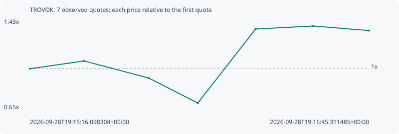

# TROVOK

**solana** / `8ttG1niVUr8uBXo8S4Yd7dSdatV8cQk8dNAZxVyBpump`

[All tokens](README.md) · [Market window](../README.md)

## Native assessments

This contract is in the quote cohort; it has no native model assessment in this window.

## Series 864632a21e54e1e41260

Pool: `not supplied`

[Complete series](../series/solana/864632a21e54e1e41260.json)

Every dot is a captured quote. Lines connect observations; the curve ends at the last available quote.

| Peak | Final | Return | Maximum drawdown |
| ---: | ---: | ---: | ---: |
| 1.3725x | 1.3327x | +33.27% | 34.36% |

### Complete quote timeline

| Time (UTC) | Price (USD) | Multiple | Evidence |
| --- | ---: | ---: | --- |
| 2026-09-28T19:15:16.098308+00:00 | 7.82527e-06 | 1.0000x | `capture:ab2becb9-3f94-4a57-b9e8-472ad0998012:rank:40` |
| 2026-09-28T19:15:30.340579+00:00 | 8.35473e-06 | 1.0677x | `capture:564db5fc-5586-41d3-88fb-a9a955708f1d:rank:35` |
| 2026-09-28T19:15:47.323285+00:00 | 7.19034e-06 | 0.9189x | `capture:65003429-a569-4442-8d4f-b2c93db69061:rank:20` |
| 2026-09-28T19:16:00.259696+00:00 | 5.48427e-06 | 0.7008x | `capture:4236f8d5-90c4-4c9b-a73e-d6443ae3bf32:rank:15` |
| 2026-09-28T19:16:15.455827+00:00 | 1.05352e-05 | 1.3463x | `capture:acc657c6-9a43-46bf-986e-7b907c831cba:rank:12` |
| 2026-09-28T19:16:30.624202+00:00 | 1.07402e-05 | 1.3725x | `capture:0d391072-ec81-4bb7-9be0-0d6bbb801c70:rank:12` |
| 2026-09-28T19:16:45.311485+00:00 | 1.04289e-05 | 1.3327x | `capture:72cccbac-c3fe-4991-8f62-08c53849b146:rank:12` |

### Exit-policy timeline

Calculated from captured quotes under the window policy. Native assessments are linked separately above.

| Time (UTC) | Action | Price (USD) | Evidence |
| --- | --- | ---: | --- |
| 2026-09-28T19:15:16.098308+00:00 | BUY | 7.82527e-06 | `capture:ab2becb9-3f94-4a57-b9e8-472ad0998012:rank:40` |
| 2026-09-28T19:15:30.340579+00:00 | HOLD | 8.35473e-06 | `capture:564db5fc-5586-41d3-88fb-a9a955708f1d:rank:35` |
| 2026-09-28T19:15:47.323285+00:00 | HOLD | 7.19034e-06 | `capture:65003429-a569-4442-8d4f-b2c93db69061:rank:20` |
| 2026-09-28T19:16:00.259696+00:00 | SL | 5.48427e-06 | `capture:4236f8d5-90c4-4c9b-a73e-d6443ae3bf32:rank:15` |
