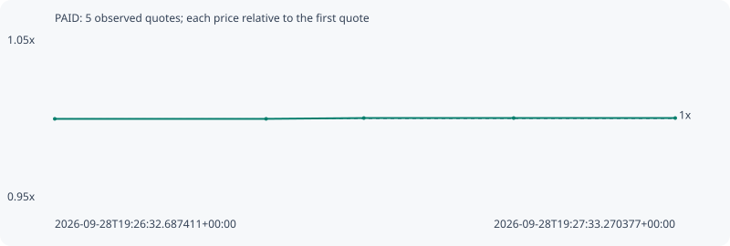

# PAID

**bsc** / `0xc31ae677e52d8c4d3def6b00affc9c3c19577777`

[All tokens](README.md) · [Market window](../README.md)

## Native assessments

This contract is in the quote cohort; it has no native model assessment in this window.

## Series 100d10dff71ed8c86460

Pool: `not supplied`

[Complete series](../series/bsc/100d10dff71ed8c86460.json)

Every dot is a captured quote. Lines connect observations; the curve ends at the last available quote.

| Peak | Final | Return | Maximum drawdown |
| ---: | ---: | ---: | ---: |
| 1.0005x | 1.0005x | +0.05% | 0.00% |

### Complete quote timeline

| Time (UTC) | Price (USD) | Multiple | Evidence |
| --- | ---: | ---: | --- |
| 2026-09-28T19:26:32.687411+00:00 | 0.00013203 | 1.0000x | `capture:d1fef60a-e7ad-4594-a8e8-74ee96c47ae4:rank:95` |
| 2026-09-28T19:26:53.320509+00:00 | 0.00013203 | 1.0000x | `capture:5f09420c-1544-46ff-a2e4-39235f8f73a9:rank:99` |
| 2026-09-28T19:27:02.865937+00:00 | 0.000132095 | 1.0005x | `capture:bd21661a-974d-4bab-9276-4e2f7e7d279a:rank:83` |
| 2026-09-28T19:27:17.494949+00:00 | 0.000132095 | 1.0005x | `capture:c5d9da1a-7d95-4d7f-8cef-ffb660ac56d0:rank:97` |
| 2026-09-28T19:27:33.270377+00:00 | 0.000132095 | 1.0005x | `capture:1cb6d037-a95b-477e-be82-4cc75b729c8b:rank:97` |

### Exit-policy timeline

Calculated from captured quotes under the window policy. Native assessments are linked separately above.

| Time (UTC) | Action | Price (USD) | Evidence |
| --- | --- | ---: | --- |
| 2026-09-28T19:26:32.687411+00:00 | BUY | 0.00013203 | `capture:d1fef60a-e7ad-4594-a8e8-74ee96c47ae4:rank:95` |
| 2026-09-28T19:26:53.320509+00:00 | HOLD | 0.00013203 | `capture:5f09420c-1544-46ff-a2e4-39235f8f73a9:rank:99` |
| 2026-09-28T19:27:02.865937+00:00 | HOLD | 0.000132095 | `capture:bd21661a-974d-4bab-9276-4e2f7e7d279a:rank:83` |
| 2026-09-28T19:27:17.494949+00:00 | HOLD | 0.000132095 | `capture:c5d9da1a-7d95-4d7f-8cef-ffb660ac56d0:rank:97` |
| 2026-09-28T19:27:33.270377+00:00 | HOLD | 0.000132095 | `capture:1cb6d037-a95b-477e-be82-4cc75b729c8b:rank:97` |
