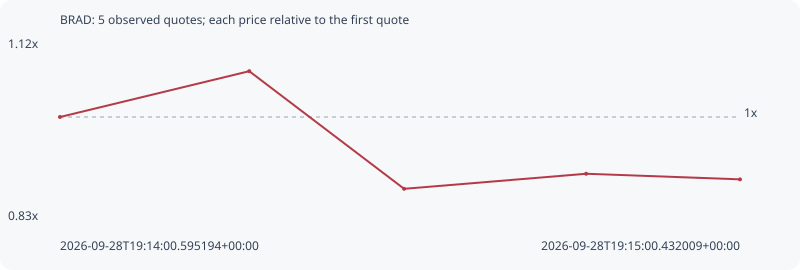

# BRAD

**solana** / `23ZFzrMZiUqiJjFX15Fp39iutz5DJNdgRYjNBEAPJngt`

[All tokens](README.md) · [Market window](../README.md)

## Native assessments

- [2026-09-28T19:14:00.595194Z](../cases/57c047063d927cd3.md): source parameters and model answers.

## Series e25b6d91b4fe55f9ff5f

Pool: `not supplied`

[Complete series](../series/solana/e25b6d91b4fe55f9ff5f.json)

Every dot is a captured quote. Lines connect observations; the curve ends at the last available quote.

| Peak | Final | Return | Maximum drawdown |
| ---: | ---: | ---: | ---: |
| 1.0734x | 0.9000x | -10.00% | 17.57% |

### Complete quote timeline

| Time (UTC) | Price (USD) | Multiple | Evidence |
| --- | ---: | ---: | --- |
| 2026-09-28T19:14:00.595194+00:00 | 6.36434e-06 | 1.0000x | `capture:2c78112b-48e7-4f74-8c2e-1cb8642a79dc:rank:86` |
| 2026-09-28T19:14:17.246316+00:00 | 6.83174e-06 | 1.0734x | `capture:7a923cde-d765-4388-a15c-4f47fde0a3b5:rank:78` |
| 2026-09-28T19:14:30.874732+00:00 | 5.63129e-06 | 0.8848x | `capture:fa585070-b1ae-4f9d-afbd-aa986f487793:rank:70` |
| 2026-09-28T19:14:46.892387+00:00 | 5.78498e-06 | 0.9090x | `capture:7d9e3e65-8bda-4696-b6d1-7a86825bd98c:rank:65` |
| 2026-09-28T19:15:00.432009+00:00 | 5.72782e-06 | 0.9000x | `capture:797f9a41-958a-44ba-ac57-3b9cacf5d06b:rank:63` |

### Exit-policy timeline

Calculated from captured quotes under the window policy. Native assessments are linked separately above.

| Time (UTC) | Action | Price (USD) | Evidence |
| --- | --- | ---: | --- |
| 2026-09-28T19:14:00.595194+00:00 | BUY | 6.36434e-06 | `capture:2c78112b-48e7-4f74-8c2e-1cb8642a79dc:rank:86` |
| 2026-09-28T19:14:17.246316+00:00 | HOLD | 6.83174e-06 | `capture:7a923cde-d765-4388-a15c-4f47fde0a3b5:rank:78` |
| 2026-09-28T19:14:30.874732+00:00 | SL | 5.63129e-06 | `capture:fa585070-b1ae-4f9d-afbd-aa986f487793:rank:70` |
