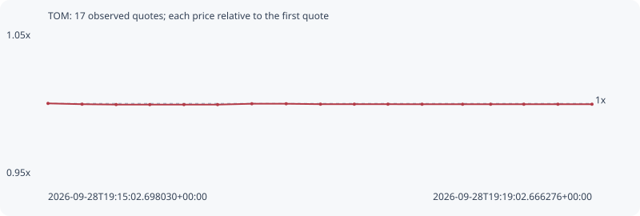

# TOM

**bsc** / `0x7b87829a47b835f7be99a74b62d6c04d57847777`

[All tokens](README.md) · [Market window](../README.md)

## Native assessments

This contract is in the quote cohort; it has no native model assessment in this window.

## Series 0cc5be1f4a50b6c6f27e

Pool: `not supplied`

[Complete series](../series/bsc/0cc5be1f4a50b6c6f27e.json)

Every dot is a captured quote. Lines connect observations; the curve ends at the last available quote.

| Peak | Final | Return | Maximum drawdown |
| ---: | ---: | ---: | ---: |
| 1.0000x | 0.9994x | -0.06% | 0.08% |

### Complete quote timeline

| Time (UTC) | Price (USD) | Multiple | Evidence |
| --- | ---: | ---: | --- |
| 2026-09-28T19:15:02.698030+00:00 | 1.70962e-05 | 1.0000x | `capture:d9b7eccd-b77f-4cc6-8305-4a84d44c62e0:rank:25` |
| 2026-09-28T19:15:17.739331+00:00 | 1.70869e-05 | 0.9995x | `capture:08cc1e53-32bc-48e9-9abe-0b7caf40b440:rank:25` |
| 2026-09-28T19:15:32.749915+00:00 | 1.70824e-05 | 0.9992x | `capture:81e75e19-4c52-4e91-ba7d-af89c6539b19:rank:23` |
| 2026-09-28T19:15:47.591170+00:00 | 1.7082e-05 | 0.9992x | `capture:98b3c66b-c70a-4987-9342-10165ae058ec:rank:23` |
| 2026-09-28T19:16:02.665866+00:00 | 1.7082e-05 | 0.9992x | `capture:831c8e00-640d-4942-9ad6-ae68e842f3cf:rank:24` |
| 2026-09-28T19:16:17.512218+00:00 | 1.7082e-05 | 0.9992x | `capture:a4477278-80c9-4a7a-9a8f-66687623072c:rank:23` |
| 2026-09-28T19:16:32.607943+00:00 | 1.70921e-05 | 0.9998x | `capture:4487eb62-651f-462e-aece-4003e9e61067:rank:21` |
| 2026-09-28T19:16:47.751534+00:00 | 1.70921e-05 | 0.9998x | `capture:39d9c9d0-d8a7-439e-86b7-5fff162807b9:rank:24` |
| 2026-09-28T19:17:02.908604+00:00 | 1.70871e-05 | 0.9995x | `capture:16fde76e-cae4-4138-b96e-57b291931df8:rank:25` |
| 2026-09-28T19:17:17.816055+00:00 | 1.70871e-05 | 0.9995x | `capture:7f9359fa-2f23-4e78-9500-f9df7d85a6b2:rank:25` |
| 2026-09-28T19:17:32.654140+00:00 | 1.70871e-05 | 0.9995x | `capture:4e95b3e2-d20d-4729-ac41-d7699561b97b:rank:27` |
| 2026-09-28T19:17:47.717594+00:00 | 1.70863e-05 | 0.9994x | `capture:2cc72c7e-c2ae-4eb2-929b-e80f3d8c4e15:rank:21` |
| 2026-09-28T19:18:05.582121+00:00 | 1.70863e-05 | 0.9994x | `capture:07127a86-393c-4e05-bde5-d28a70a854fb:rank:20` |
| 2026-09-28T19:18:17.953086+00:00 | 1.70863e-05 | 0.9994x | `capture:ca903b0a-a9a8-4246-873f-5115402fbf9c:rank:20` |
| 2026-09-28T19:18:32.607444+00:00 | 1.70863e-05 | 0.9994x | `capture:86009bbc-85b0-465e-8657-55be8d6c15de:rank:21` |
| 2026-09-28T19:18:47.632598+00:00 | 1.70866e-05 | 0.9994x | `capture:bfa4352f-2279-41ec-a6fd-d3e101a21181:rank:22` |
| 2026-09-28T19:19:02.666276+00:00 | 1.70866e-05 | 0.9994x | `capture:6fe1da90-a254-48b3-b112-ab24c6060e81:rank:32` |

### Exit-policy timeline

Calculated from captured quotes under the window policy. Native assessments are linked separately above.

| Time (UTC) | Action | Price (USD) | Evidence |
| --- | --- | ---: | --- |
| 2026-09-28T19:15:02.698030+00:00 | BUY | 1.70962e-05 | `capture:d9b7eccd-b77f-4cc6-8305-4a84d44c62e0:rank:25` |
| 2026-09-28T19:15:17.739331+00:00 | HOLD | 1.70869e-05 | `capture:08cc1e53-32bc-48e9-9abe-0b7caf40b440:rank:25` |
| 2026-09-28T19:15:32.749915+00:00 | HOLD | 1.70824e-05 | `capture:81e75e19-4c52-4e91-ba7d-af89c6539b19:rank:23` |
| 2026-09-28T19:15:47.591170+00:00 | HOLD | 1.7082e-05 | `capture:98b3c66b-c70a-4987-9342-10165ae058ec:rank:23` |
| 2026-09-28T19:16:02.665866+00:00 | HOLD | 1.7082e-05 | `capture:831c8e00-640d-4942-9ad6-ae68e842f3cf:rank:24` |
| 2026-09-28T19:16:17.512218+00:00 | HOLD | 1.7082e-05 | `capture:a4477278-80c9-4a7a-9a8f-66687623072c:rank:23` |
| 2026-09-28T19:16:32.607943+00:00 | HOLD | 1.70921e-05 | `capture:4487eb62-651f-462e-aece-4003e9e61067:rank:21` |
| 2026-09-28T19:16:47.751534+00:00 | HOLD | 1.70921e-05 | `capture:39d9c9d0-d8a7-439e-86b7-5fff162807b9:rank:24` |
| 2026-09-28T19:17:02.908604+00:00 | HOLD | 1.70871e-05 | `capture:16fde76e-cae4-4138-b96e-57b291931df8:rank:25` |
| 2026-09-28T19:17:17.816055+00:00 | HOLD | 1.70871e-05 | `capture:7f9359fa-2f23-4e78-9500-f9df7d85a6b2:rank:25` |
| 2026-09-28T19:17:32.654140+00:00 | HOLD | 1.70871e-05 | `capture:4e95b3e2-d20d-4729-ac41-d7699561b97b:rank:27` |
| 2026-09-28T19:17:47.717594+00:00 | HOLD | 1.70863e-05 | `capture:2cc72c7e-c2ae-4eb2-929b-e80f3d8c4e15:rank:21` |
| 2026-09-28T19:18:05.582121+00:00 | HOLD | 1.70863e-05 | `capture:07127a86-393c-4e05-bde5-d28a70a854fb:rank:20` |
| 2026-09-28T19:18:17.953086+00:00 | HOLD | 1.70863e-05 | `capture:ca903b0a-a9a8-4246-873f-5115402fbf9c:rank:20` |
| 2026-09-28T19:18:32.607444+00:00 | HOLD | 1.70863e-05 | `capture:86009bbc-85b0-465e-8657-55be8d6c15de:rank:21` |
| 2026-09-28T19:18:47.632598+00:00 | HOLD | 1.70866e-05 | `capture:bfa4352f-2279-41ec-a6fd-d3e101a21181:rank:22` |
| 2026-09-28T19:19:02.666276+00:00 | HOLD | 1.70866e-05 | `capture:6fe1da90-a254-48b3-b112-ab24c6060e81:rank:32` |
