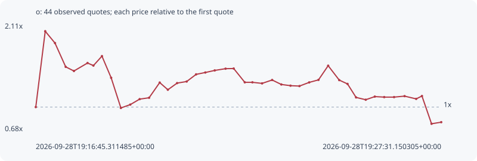

# o

**solana** / `4FRZQ5hBxNrwTmEyarihhufNQSJXzv2NnbXJQbjq4uqz`

[All tokens](README.md) · [Market window](../README.md)

## Native assessments

This contract is in the quote cohort; it has no native model assessment in this window.

## Series 170fb7c7f4f1b66adcd7

Pool: `not supplied`

[Complete series](../series/solana/170fb7c7f4f1b66adcd7.json)

Every dot is a captured quote. Lines connect observations; the curve ends at the last available quote.

| Peak | Final | Return | Maximum drawdown |
| ---: | ---: | ---: | ---: |
| 2.0156x | 0.7977x | -20.23% | 61.49% |

### Complete quote timeline

| Time (UTC) | Price (USD) | Multiple | Evidence |
| --- | ---: | ---: | --- |
| 2026-09-28T19:16:45.311485+00:00 | 7.81933e-06 | 1.0000x | `capture:72cccbac-c3fe-4991-8f62-08c53849b146:rank:79` |
| 2026-09-28T19:17:00.368914+00:00 | 1.57607e-05 | 2.0156x | `capture:1232cf18-7088-40a1-9f55-ad9ae22b44f5:rank:27` |
| 2026-09-28T19:17:15.914647+00:00 | 1.45233e-05 | 1.8574x | `capture:9792e199-c0c2-4272-ac95-24501e4a3f79:rank:20` |
| 2026-09-28T19:17:32.965607+00:00 | 1.2033e-05 | 1.5389x | `capture:0f04cfe5-88a0-4a83-ae8d-85c5cb3cdc89:rank:19` |
| 2026-09-28T19:17:46.087880+00:00 | 1.15983e-05 | 1.4833x | `capture:ee91a1c6-bc99-4c7a-9cdc-bd6cb5478a9b:rank:21` |
| 2026-09-28T19:18:07.749963+00:00 | 1.24342e-05 | 1.5902x | `capture:b0fb1b47-4973-472f-9619-8480bc7d294e:rank:21` |
| 2026-09-28T19:18:17.126008+00:00 | 1.21645e-05 | 1.5557x | `capture:5ed98f51-d1e1-422a-81df-4186a8b0a0a2:rank:21` |
| 2026-09-28T19:18:30.722167+00:00 | 1.3154e-05 | 1.6822x | `capture:9f88d118-9108-4dff-bbfc-246eaed5ce38:rank:23` |
| 2026-09-28T19:18:45.386687+00:00 | 1.08866e-05 | 1.3923x | `capture:f533100a-ce62-4457-9107-42e7601ea5d7:rank:23` |
| 2026-09-28T19:19:00.883835+00:00 | 7.72754e-06 | 0.9883x | `capture:a2495d99-5671-4c7e-b87c-48f48d90f2f2:rank:21` |
| 2026-09-28T19:19:15.826416+00:00 | 8.0781e-06 | 1.0331x | `capture:ba1dc6a3-b8b7-461a-8110-8490f03539a5:rank:20` |
| 2026-09-28T19:19:30.814098+00:00 | 8.65245e-06 | 1.1065x | `capture:b25d90dc-c8db-4388-8a2b-d06541e5320f:rank:18` |
| 2026-09-28T19:19:45.817199+00:00 | 8.79488e-06 | 1.1248x | `capture:722d1b7b-ef4f-4ac5-883c-0557bae2b60b:rank:19` |
| 2026-09-28T19:20:02.715590+00:00 | 1.03871e-05 | 1.3284x | `capture:60ff17d8-3b18-4f61-9bc7-006afd324cf2:rank:15` |
| 2026-09-28T19:20:15.699547+00:00 | 9.63522e-06 | 1.2322x | `capture:10a94828-637f-4580-a9f7-2fbd34d8589a:rank:17` |
| 2026-09-28T19:20:30.480194+00:00 | 1.0331e-05 | 1.3212x | `capture:54722132-db1d-4a2b-8c1c-2b0e71d01430:rank:16` |
| 2026-09-28T19:20:45.683165+00:00 | 1.04959e-05 | 1.3423x | `capture:17963a37-fd65-46b6-8e1c-350082721f8c:rank:16` |
| 2026-09-28T19:21:00.690136+00:00 | 1.12455e-05 | 1.4382x | `capture:f2ff842d-38e9-4cbe-a281-98c17d5a5672:rank:15` |
| 2026-09-28T19:21:15.372716+00:00 | 1.14401e-05 | 1.4631x | `capture:a923b968-a768-495e-ae33-6de2042c551f:rank:13` |
| 2026-09-28T19:21:30.402460+00:00 | 1.16593e-05 | 1.4911x | `capture:d926629b-2050-4e50-a602-1638c6205870:rank:14` |
| 2026-09-28T19:21:47.649380+00:00 | 1.18409e-05 | 1.5143x | `capture:0799ec6d-0e89-46b5-ae88-5695bf6c5fc3:rank:17` |
| 2026-09-28T19:22:00.569928+00:00 | 1.18572e-05 | 1.5164x | `capture:263cda40-4b31-4b2d-b168-fa4310edb46d:rank:16` |
| 2026-09-28T19:22:18.240717+00:00 | 1.04131e-05 | 1.3317x | `capture:546b2c55-1845-4da7-bc9c-4439cd0ccdba:rank:29` |
| 2026-09-28T19:22:30.371968+00:00 | 1.04131e-05 | 1.3317x | `capture:507d17cb-af67-4a81-a2b2-d5ddfbc40021:rank:29` |
| 2026-09-28T19:22:45.783808+00:00 | 1.03e-05 | 1.3172x | `capture:9558d322-c429-480b-885f-82f4481c8506:rank:37` |
| 2026-09-28T19:23:01.833252+00:00 | 1.06561e-05 | 1.3628x | `capture:c5462412-2da1-4432-8949-8fcd1492c57f:rank:43` |
| 2026-09-28T19:23:16.460099+00:00 | 1.01871e-05 | 1.3028x | `capture:2d456a2a-6755-4e1d-9a80-b6e3b2d44ec1:rank:45` |
| 2026-09-28T19:23:31.092727+00:00 | 1.00608e-05 | 1.2867x | `capture:0e687519-8b01-4d7e-b48c-e2ec34135d17:rank:47` |
| 2026-09-28T19:23:45.375171+00:00 | 1.00201e-05 | 1.2815x | `capture:1b404fa0-870b-4e7c-bafd-c3ef241c5093:rank:47` |
| 2026-09-28T19:24:00.852400+00:00 | 1.04051e-05 | 1.3307x | `capture:5205c587-4734-452c-b758-46c4814dded1:rank:50` |
| 2026-09-28T19:24:15.655418+00:00 | 1.06692e-05 | 1.3645x | `capture:5b9df0f6-51c0-4dbb-9de7-7df7a46bfee0:rank:67` |
| 2026-09-28T19:24:31.056437+00:00 | 1.21531e-05 | 1.5542x | `capture:971b5dda-397d-4fe7-b49e-94713bb088df:rank:68` |
| 2026-09-28T19:24:48.687179+00:00 | 1.06448e-05 | 1.3613x | `capture:feb72cbd-a170-4ba3-8a11-eb1df1686719:rank:62` |
| 2026-09-28T19:25:01.877958+00:00 | 1.02446e-05 | 1.3102x | `capture:fd6d01ae-d246-439e-ac58-27ae75880eb9:rank:60` |
| 2026-09-28T19:25:15.488701+00:00 | 8.83139e-06 | 1.1294x | `capture:b8fee87c-9981-475c-930b-99c255910a9f:rank:58` |
| 2026-09-28T19:25:30.900173+00:00 | 8.58905e-06 | 1.0984x | `capture:7f757769-25c3-429a-81d0-c6b2ee45ee15:rank:60` |
| 2026-09-28T19:25:45.342895+00:00 | 8.91698e-06 | 1.1404x | `capture:0ca3656d-ce8c-444b-8f77-acf34c08a1f4:rank:61` |
| 2026-09-28T19:26:00.340634+00:00 | 8.86287e-06 | 1.1335x | `capture:5b3728c5-aff9-43f3-bbb5-25b251825caa:rank:61` |
| 2026-09-28T19:26:16.031602+00:00 | 8.86287e-06 | 1.1335x | `capture:bb8d4bfc-85e1-4d55-a2ff-e47193bcce5f:rank:62` |
| 2026-09-28T19:26:32.771713+00:00 | 8.96591e-06 | 1.1466x | `capture:2fed7296-b3d1-4ba6-8398-799ee55f1f2b:rank:64` |
| 2026-09-28T19:26:51.267717+00:00 | 8.67657e-06 | 1.1096x | `capture:4cc162c2-aa4a-403b-a901-4bb5058380d6:rank:62` |
| 2026-09-28T19:27:00.453239+00:00 | 8.97748e-06 | 1.1481x | `capture:4273fbb8-5342-4e37-8d61-ced6b88e542d:rank:65` |
| 2026-09-28T19:27:15.715818+00:00 | 6.06938e-06 | 0.7762x | `capture:d04c9116-4617-4b61-8b98-5489321cd1cc:rank:60` |
| 2026-09-28T19:27:31.150305+00:00 | 6.23769e-06 | 0.7977x | `capture:7cad37e8-83d3-4438-8055-245db6707e2e:rank:57` |

### Exit-policy timeline

Calculated from captured quotes under the window policy. Native assessments are linked separately above.

| Time (UTC) | Action | Price (USD) | Evidence |
| --- | --- | ---: | --- |
| 2026-09-28T19:16:45.311485+00:00 | BUY | 7.81933e-06 | `capture:72cccbac-c3fe-4991-8f62-08c53849b146:rank:79` |
| 2026-09-28T19:17:00.368914+00:00 | TP | 1.57607e-05 | `capture:1232cf18-7088-40a1-9f55-ad9ae22b44f5:rank:27` |
