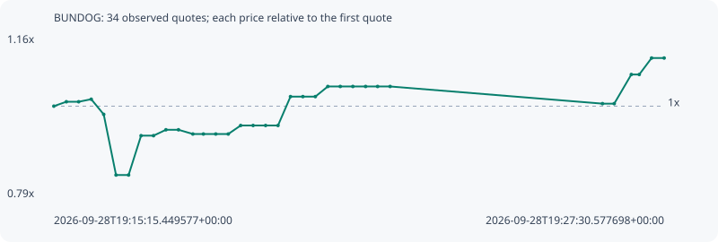

# BUNDOG

**robinhood** / `0xd68f57b08cd9732e4ddd1a04ba4d26629dc44b8e`

[All tokens](README.md) · [Market window](../README.md)

## Native assessments

This contract is in the quote cohort; it has no native model assessment in this window.

## Series e9023d436170cfea7d4d

Pool: `not supplied`

[Complete series](../series/robinhood/e9023d436170cfea7d4d.json)

Every dot is a captured quote. Lines connect observations; the curve ends at the last available quote.

| Peak | Final | Return | Maximum drawdown |
| ---: | ---: | ---: | ---: |
| 1.1085x | 1.1085x | +10.85% | 16.82% |

### Complete quote timeline

| Time (UTC) | Price (USD) | Multiple | Evidence |
| --- | ---: | ---: | --- |
| 2026-09-28T19:15:15.449577+00:00 | 0.000111148 | 1.0000x | `capture:14452070-ab94-45a0-af6d-e6c54082daec:rank:25` |
| 2026-09-28T19:15:30.501058+00:00 | 0.000112252 | 1.0099x | `capture:4e680297-1e75-418b-b818-8b2903e8b923:rank:22` |
| 2026-09-28T19:15:45.353664+00:00 | 0.000112252 | 1.0099x | `capture:b9051b67-24e1-4469-9f82-bc08bd56807d:rank:23` |
| 2026-09-28T19:16:00.473367+00:00 | 0.000112885 | 1.0156x | `capture:cd404827-1073-4901-b09c-82ef1488855b:rank:24` |
| 2026-09-28T19:16:15.518445+00:00 | 0.000109088 | 0.9815x | `capture:c193221c-c80a-4a3b-ad88-59f12dcb1689:rank:23` |
| 2026-09-28T19:16:30.344303+00:00 | 9.38961e-05 | 0.8448x | `capture:18d587e7-b24d-4b8d-82f1-0ac2903a3303:rank:21` |
| 2026-09-28T19:16:45.486467+00:00 | 9.38961e-05 | 0.8448x | `capture:4ca26bf7-9d1e-455b-a63e-1b5df831b997:rank:20` |
| 2026-09-28T19:17:00.510014+00:00 | 0.000103755 | 0.9335x | `capture:d9309a4d-09d7-45ee-91ce-c4a055e8faac:rank:16` |
| 2026-09-28T19:17:15.523068+00:00 | 0.000103755 | 0.9335x | `capture:333d670d-dbd3-4656-95f9-1bc781b271db:rank:18` |
| 2026-09-28T19:17:30.451540+00:00 | 0.00010523 | 0.9468x | `capture:e161007c-0751-46e4-acc9-c8e28cd7190a:rank:19` |
| 2026-09-28T19:17:45.582227+00:00 | 0.00010523 | 0.9468x | `capture:a3f98285-516a-4bd4-b2c4-63596c968a6b:rank:18` |
| 2026-09-28T19:18:02.849542+00:00 | 0.000104171 | 0.9372x | `capture:53a348cd-74d6-4031-ba2b-02d70c63e42b:rank:15` |
| 2026-09-28T19:18:15.585380+00:00 | 0.000104171 | 0.9372x | `capture:ea19027f-d2c1-43cc-973f-0d8eb46ed64e:rank:17` |
| 2026-09-28T19:18:30.489414+00:00 | 0.000104171 | 0.9372x | `capture:c5cd70df-4ca4-4388-b3c5-f977fa86f8a2:rank:17` |
| 2026-09-28T19:18:45.550203+00:00 | 0.000104171 | 0.9372x | `capture:728d4974-5fe3-40a8-8e99-2139c59da3e3:rank:17` |
| 2026-09-28T19:19:00.487408+00:00 | 0.000106307 | 0.9564x | `capture:297e4fae-3bb5-49eb-b490-a4f34898851c:rank:17` |
| 2026-09-28T19:19:15.451095+00:00 | 0.000106307 | 0.9564x | `capture:0bcc0576-3637-4b2c-b0e4-f9e05871b187:rank:21` |
| 2026-09-28T19:19:30.512866+00:00 | 0.000106307 | 0.9564x | `capture:bb499bdc-159a-4072-a450-312045f32cef:rank:21` |
| 2026-09-28T19:19:45.438706+00:00 | 0.000106307 | 0.9564x | `capture:59b12f7b-2112-42c7-834a-a2eb9bcaee3d:rank:20` |
| 2026-09-28T19:20:00.494705+00:00 | 0.000113545 | 1.0216x | `capture:5b06d6b3-9eca-4487-82fb-6b28820c37d9:rank:20` |
| 2026-09-28T19:20:15.393373+00:00 | 0.000113545 | 1.0216x | `capture:17802da9-7cee-48c3-9f5b-5829781be3f6:rank:20` |
| 2026-09-28T19:20:30.417446+00:00 | 0.000113545 | 1.0216x | `capture:f2fe9ac4-89a0-4ad3-8f15-5a70d7e1d5f7:rank:44` |
| 2026-09-28T19:20:45.464282+00:00 | 0.000116081 | 1.0444x | `capture:26559b75-812f-4386-982b-eba5073faf44:rank:43` |
| 2026-09-28T19:21:00.449260+00:00 | 0.000116081 | 1.0444x | `capture:186445b2-8971-4639-85b9-26b2e8fb9d2c:rank:40` |
| 2026-09-28T19:21:15.606838+00:00 | 0.000116081 | 1.0444x | `capture:c2a8ab31-038e-42f4-8e33-852fee1b9a24:rank:42` |
| 2026-09-28T19:21:30.959683+00:00 | 0.000116081 | 1.0444x | `capture:300e0f35-12d4-46a9-a17e-17adbe8e1059:rank:47` |
| 2026-09-28T19:21:45.420062+00:00 | 0.000116081 | 1.0444x | `capture:ec22b61b-732a-44d2-be85-c577051928eb:rank:54` |
| 2026-09-28T19:22:00.489634+00:00 | 0.000116081 | 1.0444x | `capture:d6c64542-18c5-48a0-a6c9-f0e2a9c54b41:rank:51` |
| 2026-09-28T19:26:16.279485+00:00 | 0.000111778 | 1.0057x | `capture:085b2ea9-3985-4608-a1cd-1eddc6b16122:rank:58` |
| 2026-09-28T19:26:30.447392+00:00 | 0.000111778 | 1.0057x | `capture:36fd4b46-5420-443d-b1ed-b86b98706671:rank:58` |
| 2026-09-28T19:26:51.039990+00:00 | 0.000119085 | 1.0714x | `capture:653b62fa-7a58-45fd-95e9-3b36912dc139:rank:26` |
| 2026-09-28T19:27:00.598930+00:00 | 0.000119085 | 1.0714x | `capture:8041f6b0-6188-445c-83ef-3a6fb7daf321:rank:27` |
| 2026-09-28T19:27:15.438746+00:00 | 0.000123208 | 1.1085x | `capture:b4c48612-e04d-4782-96a6-e80c2955d3b9:rank:24` |
| 2026-09-28T19:27:30.577698+00:00 | 0.000123208 | 1.1085x | `capture:ff6b3949-9c3c-4cdf-b48c-d4010666c140:rank:24` |

### Exit-policy timeline

Calculated from captured quotes under the window policy. Native assessments are linked separately above.

| Time (UTC) | Action | Price (USD) | Evidence |
| --- | --- | ---: | --- |
| 2026-09-28T19:15:15.449577+00:00 | BUY | 0.000111148 | `capture:14452070-ab94-45a0-af6d-e6c54082daec:rank:25` |
| 2026-09-28T19:15:30.501058+00:00 | HOLD | 0.000112252 | `capture:4e680297-1e75-418b-b818-8b2903e8b923:rank:22` |
| 2026-09-28T19:15:45.353664+00:00 | HOLD | 0.000112252 | `capture:b9051b67-24e1-4469-9f82-bc08bd56807d:rank:23` |
| 2026-09-28T19:16:00.473367+00:00 | HOLD | 0.000112885 | `capture:cd404827-1073-4901-b09c-82ef1488855b:rank:24` |
| 2026-09-28T19:16:15.518445+00:00 | HOLD | 0.000109088 | `capture:c193221c-c80a-4a3b-ad88-59f12dcb1689:rank:23` |
| 2026-09-28T19:16:30.344303+00:00 | SL | 9.38961e-05 | `capture:18d587e7-b24d-4b8d-82f1-0ac2903a3303:rank:21` |
