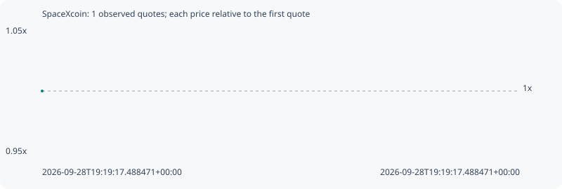

# SpaceXcoin

**bsc** / `0xf225e70162837a811c77dc2bb413a5c06e97ffff`

[All tokens](README.md) · [Market window](../README.md)

## Native assessments

This contract is in the quote cohort; it has no native model assessment in this window.

## Series 46ebf7708cf2cfbde61a

Pool: `not supplied`

[Complete series](../series/bsc/46ebf7708cf2cfbde61a.json)

Every dot is a captured quote. Lines connect observations; the curve ends at the last available quote.

Fewer than two quotes: return and drawdown are not calculated.

### Complete quote timeline

| Time (UTC) | Price (USD) | Multiple | Evidence |
| --- | ---: | ---: | --- |
| 2026-09-28T19:19:17.488471+00:00 | 3.80434e-05 | 1.0000x | `capture:b87f439a-4825-4a6f-b17c-0b78464d9310:rank:45` |

### Exit-policy timeline

Calculated from captured quotes under the window policy. Native assessments are linked separately above.

| Time (UTC) | Action | Price (USD) | Evidence |
| --- | --- | ---: | --- |
