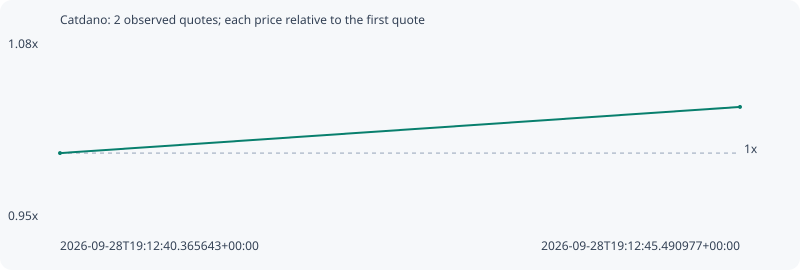

# Catdano

**solana** / `5oGmZzTm683RPZ4MLn5wXwFU78vx1ixYWJxAqDVxtnet`

[All tokens](README.md) · [Market window](../README.md)

## Native assessments

This contract is in the quote cohort; it has no native model assessment in this window.

## Series ed3118807aaaa4c5ee34

Pool: `not supplied`

[Complete series](../series/solana/ed3118807aaaa4c5ee34.json)

Every dot is a captured quote. Lines connect observations; the curve ends at the last available quote.

| Peak | Final | Return | Maximum drawdown |
| ---: | ---: | ---: | ---: |
| 1.0345x | 1.0345x | +3.45% | 0.00% |

### Complete quote timeline

| Time (UTC) | Price (USD) | Multiple | Evidence |
| --- | ---: | ---: | --- |
| 2026-09-28T19:12:40.365643+00:00 | 5.06285e-06 | 1.0000x | `capture:3af1faa1-2074-484e-893e-ed2c676e1576:rank:85` |
| 2026-09-28T19:12:45.490977+00:00 | 5.23744e-06 | 1.0345x | `capture:ac0279d6-7dd1-44b6-bf3e-910bf7b8eddf:rank:83` |

### Exit-policy timeline

Calculated from captured quotes under the window policy. Native assessments are linked separately above.

| Time (UTC) | Action | Price (USD) | Evidence |
| --- | --- | ---: | --- |
| 2026-09-28T19:12:40.365643+00:00 | BUY | 5.06285e-06 | `capture:3af1faa1-2074-484e-893e-ed2c676e1576:rank:85` |
| 2026-09-28T19:12:45.490977+00:00 | HOLD | 5.23744e-06 | `capture:ac0279d6-7dd1-44b6-bf3e-910bf7b8eddf:rank:83` |
