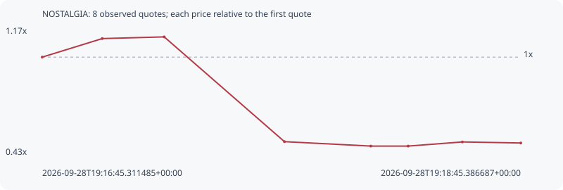

# NOSTALGIA

**solana** / `BJobPnEeiGwQXW4kfFtUAmQf4YeZPuii8pLdTBVsfxdJ`

[All tokens](README.md) · [Market window](../README.md)

## Native assessments

- [2026-09-28T19:16:31.761139Z](../cases/c8c83ddbfbe0cb1c.md): source parameters and model answers.

## Series b5913c57cf03e117a9ac

Pool: `not supplied`

[Complete series](../series/solana/b5913c57cf03e117a9ac.json)

Every dot is a captured quote. Lines connect observations; the curve ends at the last available quote.

| Peak | Final | Return | Maximum drawdown |
| ---: | ---: | ---: | ---: |
| 1.1174x | 0.5014x | -49.86% | 56.73% |

### Complete quote timeline

| Time (UTC) | Price (USD) | Multiple | Evidence |
| --- | ---: | ---: | --- |
| 2026-09-28T19:16:45.311485+00:00 | 8.43713e-06 | 1.0000x | `capture:72cccbac-c3fe-4991-8f62-08c53849b146:rank:59` |
| 2026-09-28T19:17:00.368914+00:00 | 9.34513e-06 | 1.1076x | `capture:1232cf18-7088-40a1-9f55-ad9ae22b44f5:rank:45` |
| 2026-09-28T19:17:15.914647+00:00 | 9.42794e-06 | 1.1174x | `capture:9792e199-c0c2-4272-ac95-24501e4a3f79:rank:38` |
| 2026-09-28T19:17:46.087880+00:00 | 4.29578e-06 | 0.5092x | `capture:ee91a1c6-bc99-4c7a-9cdc-bd6cb5478a9b:rank:29` |
| 2026-09-28T19:18:07.749963+00:00 | 4.07901e-06 | 0.4835x | `capture:b0fb1b47-4973-472f-9619-8480bc7d294e:rank:31` |
| 2026-09-28T19:18:17.126008+00:00 | 4.07901e-06 | 0.4835x | `capture:5ed98f51-d1e1-422a-81df-4186a8b0a0a2:rank:31` |
| 2026-09-28T19:18:30.722167+00:00 | 4.28194e-06 | 0.5075x | `capture:9f88d118-9108-4dff-bbfc-246eaed5ce38:rank:31` |
| 2026-09-28T19:18:45.386687+00:00 | 4.23014e-06 | 0.5014x | `capture:f533100a-ce62-4457-9107-42e7601ea5d7:rank:31` |

### Exit-policy timeline

Calculated from captured quotes under the window policy. Native assessments are linked separately above.

| Time (UTC) | Action | Price (USD) | Evidence |
| --- | --- | ---: | --- |
| 2026-09-28T19:16:45.311485+00:00 | BUY | 8.43713e-06 | `capture:72cccbac-c3fe-4991-8f62-08c53849b146:rank:59` |
| 2026-09-28T19:17:00.368914+00:00 | HOLD | 9.34513e-06 | `capture:1232cf18-7088-40a1-9f55-ad9ae22b44f5:rank:45` |
| 2026-09-28T19:17:15.914647+00:00 | HOLD | 9.42794e-06 | `capture:9792e199-c0c2-4272-ac95-24501e4a3f79:rank:38` |
| 2026-09-28T19:17:46.087880+00:00 | SL | 4.29578e-06 | `capture:ee91a1c6-bc99-4c7a-9cdc-bd6cb5478a9b:rank:29` |

## Series c299953f37229b877ad4

Pool: `GzoWtqXN924xc7QTMZUWCAvszaQNyiBQS4y4XAwgiVc9`

[Complete series](../series/solana/c299953f37229b877ad4.json)

Fewer than two quotes: return and drawdown are not calculated.

### Complete quote timeline

| Time (UTC) | Price (USD) | Multiple | Evidence |
| --- | ---: | ---: | --- |

### Exit-policy timeline

Calculated from captured quotes under the window policy. Native assessments are linked separately above.

| Time (UTC) | Action | Price (USD) | Evidence |
| --- | --- | ---: | --- |
