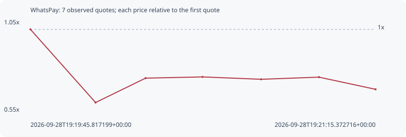

# WhatsPay

**solana** / `AjZ2d8n2bHH818a8ugFy4q4ipgzqzhCn3qSzsHAspump`

[All tokens](README.md) · [Market window](../README.md)

## Native assessments

This contract is in the quote cohort; it has no native model assessment in this window.

## Series fb4c988302fce479109c

Pool: `not supplied`

[Complete series](../series/solana/fb4c988302fce479109c.json)

Every dot is a captured quote. Lines connect observations; the curve ends at the last available quote.

| Peak | Final | Return | Maximum drawdown |
| ---: | ---: | ---: | ---: |
| 1.0000x | 0.6706x | -32.94% | 40.20% |

### Complete quote timeline

| Time (UTC) | Price (USD) | Multiple | Evidence |
| --- | ---: | ---: | --- |
| 2026-09-28T19:19:45.817199+00:00 | 1.03602e-05 | 1.0000x | `capture:722d1b7b-ef4f-4ac5-883c-0557bae2b60b:rank:69` |
| 2026-09-28T19:20:02.715590+00:00 | 6.1951e-06 | 0.5980x | `capture:60ff17d8-3b18-4f61-9bc7-006afd324cf2:rank:55` |
| 2026-09-28T19:20:15.699547+00:00 | 7.5846e-06 | 0.7321x | `capture:10a94828-637f-4580-a9f7-2fbd34d8589a:rank:50` |
| 2026-09-28T19:20:30.480194+00:00 | 7.6537e-06 | 0.7388x | `capture:54722132-db1d-4a2b-8c1c-2b0e71d01430:rank:47` |
| 2026-09-28T19:20:45.683165+00:00 | 7.51934e-06 | 0.7258x | `capture:17963a37-fd65-46b6-8e1c-350082721f8c:rank:46` |
| 2026-09-28T19:21:00.690136+00:00 | 7.64087e-06 | 0.7375x | `capture:f2ff842d-38e9-4cbe-a281-98c17d5a5672:rank:41` |
| 2026-09-28T19:21:15.372716+00:00 | 6.94743e-06 | 0.6706x | `capture:a923b968-a768-495e-ae33-6de2042c551f:rank:38` |

### Exit-policy timeline

Calculated from captured quotes under the window policy. Native assessments are linked separately above.

| Time (UTC) | Action | Price (USD) | Evidence |
| --- | --- | ---: | --- |
| 2026-09-28T19:19:45.817199+00:00 | BUY | 1.03602e-05 | `capture:722d1b7b-ef4f-4ac5-883c-0557bae2b60b:rank:69` |
| 2026-09-28T19:20:02.715590+00:00 | SL | 6.1951e-06 | `capture:60ff17d8-3b18-4f61-9bc7-006afd324cf2:rank:55` |
