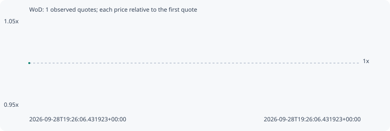

# WoD

**bsc** / `0xb994882a1b9bd98a71dd6ea5f61577c42848b0e8`

[All tokens](README.md) · [Market window](../README.md)

## Native assessments

This contract is in the quote cohort; it has no native model assessment in this window.

## Series d54dcfb0298c0ef45f96

Pool: `not supplied`

[Complete series](../series/bsc/d54dcfb0298c0ef45f96.json)

Every dot is a captured quote. Lines connect observations; the curve ends at the last available quote.

Fewer than two quotes: return and drawdown are not calculated.

### Complete quote timeline

| Time (UTC) | Price (USD) | Multiple | Evidence |
| --- | ---: | ---: | --- |
| 2026-09-28T19:26:06.431923+00:00 | 0.00543954 | 1.0000x | `capture:a3278748-b5f3-45be-a966-ab473520d9c2:rank:99` |

### Exit-policy timeline

Calculated from captured quotes under the window policy. Native assessments are linked separately above.

| Time (UTC) | Action | Price (USD) | Evidence |
| --- | --- | ---: | --- |
