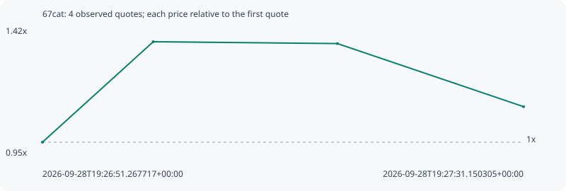

# 67cat

**solana** / `CXfx1nC8en7QHf7gc7UXo6jjQ6ynrB43pp1DT6Bypump`

[All tokens](README.md) · [Market window](../README.md)

## Native assessments

This contract is in the quote cohort; it has no native model assessment in this window.

## Series 202a89647bcd7c771c80

Pool: `not supplied`

[Complete series](../series/solana/202a89647bcd7c771c80.json)

Every dot is a captured quote. Lines connect observations; the curve ends at the last available quote.

| Peak | Final | Return | Maximum drawdown |
| ---: | ---: | ---: | ---: |
| 1.3738x | 1.1322x | +13.22% | 17.59% |

### Complete quote timeline

| Time (UTC) | Price (USD) | Multiple | Evidence |
| --- | ---: | ---: | --- |
| 2026-09-28T19:26:51.267717+00:00 | 4.65553e-06 | 1.0000x | `capture:4cc162c2-aa4a-403b-a901-4bb5058380d6:rank:59` |
| 2026-09-28T19:27:00.453239+00:00 | 6.39572e-06 | 1.3738x | `capture:4273fbb8-5342-4e37-8d61-ced6b88e542d:rank:54` |
| 2026-09-28T19:27:15.715818+00:00 | 6.36403e-06 | 1.3670x | `capture:d04c9116-4617-4b61-8b98-5489321cd1cc:rank:52` |
| 2026-09-28T19:27:31.150305+00:00 | 5.2709e-06 | 1.1322x | `capture:7cad37e8-83d3-4438-8055-245db6707e2e:rank:52` |

### Exit-policy timeline

Calculated from captured quotes under the window policy. Native assessments are linked separately above.

| Time (UTC) | Action | Price (USD) | Evidence |
| --- | --- | ---: | --- |
| 2026-09-28T19:26:51.267717+00:00 | BUY | 4.65553e-06 | `capture:4cc162c2-aa4a-403b-a901-4bb5058380d6:rank:59` |
| 2026-09-28T19:27:00.453239+00:00 | PROFIT | 6.39572e-06 | `capture:4273fbb8-5342-4e37-8d61-ced6b88e542d:rank:54` |
| 2026-09-28T19:27:15.715818+00:00 | HOLD_BAG | 6.36403e-06 | `capture:d04c9116-4617-4b61-8b98-5489321cd1cc:rank:52` |
| 2026-09-28T19:27:31.150305+00:00 | HOLD_BAG | 5.2709e-06 | `capture:7cad37e8-83d3-4438-8055-245db6707e2e:rank:52` |
