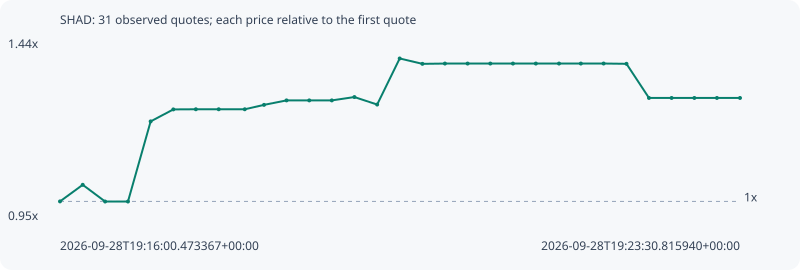

# SHAD

**robinhood** / `0x95cc69fa3fbb35955a921876f60631c606e54a17`

[All tokens](README.md) · [Market window](../README.md)

## Native assessments

- [2026-09-28T19:16:00.473367Z](../cases/645d4bb44afdec9b.md): source parameters and model answers.

## Series 05cb6edcaa28584ddbc6

Pool: `not supplied`

[Complete series](../series/robinhood/05cb6edcaa28584ddbc6.json)

Every dot is a captured quote. Lines connect observations; the curve ends at the last available quote.

| Peak | Final | Return | Maximum drawdown |
| ---: | ---: | ---: | ---: |
| 1.3868x | 1.2800x | +28.00% | 7.71% |

### Complete quote timeline

| Time (UTC) | Price (USD) | Multiple | Evidence |
| --- | ---: | ---: | --- |
| 2026-09-28T19:16:00.473367+00:00 | 1.37808e-05 | 1.0000x | `capture:cd404827-1073-4901-b09c-82ef1488855b:rank:21` |
| 2026-09-28T19:16:15.518445+00:00 | 1.44002e-05 | 1.0449x | `capture:c193221c-c80a-4a3b-ad88-59f12dcb1689:rank:22` |
| 2026-09-28T19:16:30.344303+00:00 | 1.37766e-05 | 0.9997x | `capture:18d587e7-b24d-4b8d-82f1-0ac2903a3303:rank:17` |
| 2026-09-28T19:16:45.486467+00:00 | 1.37766e-05 | 0.9997x | `capture:4ca26bf7-9d1e-455b-a63e-1b5df831b997:rank:18` |
| 2026-09-28T19:17:00.510014+00:00 | 1.67652e-05 | 1.2166x | `capture:d9309a4d-09d7-45ee-91ce-c4a055e8faac:rank:18` |
| 2026-09-28T19:17:15.523068+00:00 | 1.72122e-05 | 1.2490x | `capture:333d670d-dbd3-4656-95f9-1bc781b271db:rank:17` |
| 2026-09-28T19:17:30.451540+00:00 | 1.72176e-05 | 1.2494x | `capture:e161007c-0751-46e4-acc9-c8e28cd7190a:rank:18` |
| 2026-09-28T19:17:45.582227+00:00 | 1.72176e-05 | 1.2494x | `capture:a3f98285-516a-4bd4-b2c4-63596c968a6b:rank:17` |
| 2026-09-28T19:18:02.849542+00:00 | 1.72176e-05 | 1.2494x | `capture:53a348cd-74d6-4031-ba2b-02d70c63e42b:rank:17` |
| 2026-09-28T19:18:15.585380+00:00 | 1.73813e-05 | 1.2613x | `capture:ea19027f-d2c1-43cc-973f-0d8eb46ed64e:rank:16` |
| 2026-09-28T19:18:30.489414+00:00 | 1.75478e-05 | 1.2734x | `capture:c5cd70df-4ca4-4388-b3c5-f977fa86f8a2:rank:15` |
| 2026-09-28T19:18:45.550203+00:00 | 1.75478e-05 | 1.2734x | `capture:728d4974-5fe3-40a8-8e99-2139c59da3e3:rank:16` |
| 2026-09-28T19:19:00.487408+00:00 | 1.75478e-05 | 1.2734x | `capture:297e4fae-3bb5-49eb-b490-a4f34898851c:rank:16` |
| 2026-09-28T19:19:15.451095+00:00 | 1.7673e-05 | 1.2824x | `capture:0bcc0576-3637-4b2c-b0e4-f9e05871b187:rank:19` |
| 2026-09-28T19:19:30.512866+00:00 | 1.7393e-05 | 1.2621x | `capture:bb499bdc-159a-4072-a450-312045f32cef:rank:18` |
| 2026-09-28T19:19:45.438706+00:00 | 1.91116e-05 | 1.3868x | `capture:59b12f7b-2112-42c7-834a-a2eb9bcaee3d:rank:18` |
| 2026-09-28T19:20:00.494705+00:00 | 1.89113e-05 | 1.3723x | `capture:5b06d6b3-9eca-4487-82fb-6b28820c37d9:rank:18` |
| 2026-09-28T19:20:15.393373+00:00 | 1.89219e-05 | 1.3731x | `capture:17802da9-7cee-48c3-9f5b-5829781be3f6:rank:18` |
| 2026-09-28T19:20:30.417446+00:00 | 1.89219e-05 | 1.3731x | `capture:f2fe9ac4-89a0-4ad3-8f15-5a70d7e1d5f7:rank:18` |
| 2026-09-28T19:20:45.464282+00:00 | 1.89219e-05 | 1.3731x | `capture:26559b75-812f-4386-982b-eba5073faf44:rank:17` |
| 2026-09-28T19:21:00.449260+00:00 | 1.89219e-05 | 1.3731x | `capture:186445b2-8971-4639-85b9-26b2e8fb9d2c:rank:18` |
| 2026-09-28T19:21:15.606838+00:00 | 1.89219e-05 | 1.3731x | `capture:c2a8ab31-038e-42f4-8e33-852fee1b9a24:rank:38` |
| 2026-09-28T19:21:30.959683+00:00 | 1.89219e-05 | 1.3731x | `capture:300e0f35-12d4-46a9-a17e-17adbe8e1059:rank:40` |
| 2026-09-28T19:21:45.420062+00:00 | 1.89219e-05 | 1.3731x | `capture:ec22b61b-732a-44d2-be85-c577051928eb:rank:53` |
| 2026-09-28T19:22:00.489634+00:00 | 1.89233e-05 | 1.3732x | `capture:d6c64542-18c5-48a0-a6c9-f0e2a9c54b41:rank:47` |
| 2026-09-28T19:22:15.632268+00:00 | 1.89127e-05 | 1.3724x | `capture:13e6d33e-e854-4b87-b3da-49aedec6950e:rank:60` |
| 2026-09-28T19:22:30.535979+00:00 | 1.76388e-05 | 1.2800x | `capture:091fb4d2-10fc-4d5f-9c22-af9f55e90e4a:rank:51` |
| 2026-09-28T19:22:45.520851+00:00 | 1.76388e-05 | 1.2800x | `capture:128617a9-4055-4a8d-8b04-c8876bad9c70:rank:53` |
| 2026-09-28T19:23:00.594785+00:00 | 1.76388e-05 | 1.2800x | `capture:b6c633f1-3960-4db3-a2ca-34618f913368:rank:54` |
| 2026-09-28T19:23:15.534636+00:00 | 1.76388e-05 | 1.2800x | `capture:d5a0d1a4-a366-4985-80da-e34160e2f58c:rank:54` |
| 2026-09-28T19:23:30.815940+00:00 | 1.76388e-05 | 1.2800x | `capture:c6f23ed9-c47c-4f73-bf08-86a494a11aa2:rank:54` |

### Exit-policy timeline

Calculated from captured quotes under the window policy. Native assessments are linked separately above.

| Time (UTC) | Action | Price (USD) | Evidence |
| --- | --- | ---: | --- |
| 2026-09-28T19:16:00.473367+00:00 | BUY | 1.37808e-05 | `capture:cd404827-1073-4901-b09c-82ef1488855b:rank:21` |
| 2026-09-28T19:16:15.518445+00:00 | HOLD | 1.44002e-05 | `capture:c193221c-c80a-4a3b-ad88-59f12dcb1689:rank:22` |
| 2026-09-28T19:16:30.344303+00:00 | HOLD | 1.37766e-05 | `capture:18d587e7-b24d-4b8d-82f1-0ac2903a3303:rank:17` |
| 2026-09-28T19:16:45.486467+00:00 | HOLD | 1.37766e-05 | `capture:4ca26bf7-9d1e-455b-a63e-1b5df831b997:rank:18` |
| 2026-09-28T19:17:00.510014+00:00 | HOLD | 1.67652e-05 | `capture:d9309a4d-09d7-45ee-91ce-c4a055e8faac:rank:18` |
| 2026-09-28T19:17:15.523068+00:00 | HOLD | 1.72122e-05 | `capture:333d670d-dbd3-4656-95f9-1bc781b271db:rank:17` |
| 2026-09-28T19:17:30.451540+00:00 | HOLD | 1.72176e-05 | `capture:e161007c-0751-46e4-acc9-c8e28cd7190a:rank:18` |
| 2026-09-28T19:17:45.582227+00:00 | HOLD | 1.72176e-05 | `capture:a3f98285-516a-4bd4-b2c4-63596c968a6b:rank:17` |
| 2026-09-28T19:18:02.849542+00:00 | HOLD | 1.72176e-05 | `capture:53a348cd-74d6-4031-ba2b-02d70c63e42b:rank:17` |
| 2026-09-28T19:18:15.585380+00:00 | PROFIT | 1.73813e-05 | `capture:ea19027f-d2c1-43cc-973f-0d8eb46ed64e:rank:16` |
| 2026-09-28T19:18:30.489414+00:00 | HOLD_BAG | 1.75478e-05 | `capture:c5cd70df-4ca4-4388-b3c5-f977fa86f8a2:rank:15` |
| 2026-09-28T19:18:45.550203+00:00 | HOLD_BAG | 1.75478e-05 | `capture:728d4974-5fe3-40a8-8e99-2139c59da3e3:rank:16` |
| 2026-09-28T19:19:00.487408+00:00 | HOLD_BAG | 1.75478e-05 | `capture:297e4fae-3bb5-49eb-b490-a4f34898851c:rank:16` |
| 2026-09-28T19:19:15.451095+00:00 | HOLD_BAG | 1.7673e-05 | `capture:0bcc0576-3637-4b2c-b0e4-f9e05871b187:rank:19` |
| 2026-09-28T19:19:30.512866+00:00 | HOLD_BAG | 1.7393e-05 | `capture:bb499bdc-159a-4072-a450-312045f32cef:rank:18` |
| 2026-09-28T19:19:45.438706+00:00 | HOLD_BAG | 1.91116e-05 | `capture:59b12f7b-2112-42c7-834a-a2eb9bcaee3d:rank:18` |
| 2026-09-28T19:20:00.494705+00:00 | HOLD_BAG | 1.89113e-05 | `capture:5b06d6b3-9eca-4487-82fb-6b28820c37d9:rank:18` |
| 2026-09-28T19:20:15.393373+00:00 | HOLD_BAG | 1.89219e-05 | `capture:17802da9-7cee-48c3-9f5b-5829781be3f6:rank:18` |
| 2026-09-28T19:20:30.417446+00:00 | HOLD_BAG | 1.89219e-05 | `capture:f2fe9ac4-89a0-4ad3-8f15-5a70d7e1d5f7:rank:18` |
| 2026-09-28T19:20:45.464282+00:00 | HOLD_BAG | 1.89219e-05 | `capture:26559b75-812f-4386-982b-eba5073faf44:rank:17` |
| 2026-09-28T19:21:00.449260+00:00 | HOLD_BAG | 1.89219e-05 | `capture:186445b2-8971-4639-85b9-26b2e8fb9d2c:rank:18` |
| 2026-09-28T19:21:15.606838+00:00 | HOLD_BAG | 1.89219e-05 | `capture:c2a8ab31-038e-42f4-8e33-852fee1b9a24:rank:38` |
| 2026-09-28T19:21:30.959683+00:00 | HOLD_BAG | 1.89219e-05 | `capture:300e0f35-12d4-46a9-a17e-17adbe8e1059:rank:40` |
| 2026-09-28T19:21:45.420062+00:00 | HOLD_BAG | 1.89219e-05 | `capture:ec22b61b-732a-44d2-be85-c577051928eb:rank:53` |
| 2026-09-28T19:22:00.489634+00:00 | HOLD_BAG | 1.89233e-05 | `capture:d6c64542-18c5-48a0-a6c9-f0e2a9c54b41:rank:47` |
| 2026-09-28T19:22:15.632268+00:00 | HOLD_BAG | 1.89127e-05 | `capture:13e6d33e-e854-4b87-b3da-49aedec6950e:rank:60` |
| 2026-09-28T19:22:30.535979+00:00 | HOLD_BAG | 1.76388e-05 | `capture:091fb4d2-10fc-4d5f-9c22-af9f55e90e4a:rank:51` |
| 2026-09-28T19:22:45.520851+00:00 | HOLD_BAG | 1.76388e-05 | `capture:128617a9-4055-4a8d-8b04-c8876bad9c70:rank:53` |
| 2026-09-28T19:23:00.594785+00:00 | HOLD_BAG | 1.76388e-05 | `capture:b6c633f1-3960-4db3-a2ca-34618f913368:rank:54` |
| 2026-09-28T19:23:15.534636+00:00 | HOLD_BAG | 1.76388e-05 | `capture:d5a0d1a4-a366-4985-80da-e34160e2f58c:rank:54` |
| 2026-09-28T19:23:30.815940+00:00 | HOLD_BAG | 1.76388e-05 | `capture:c6f23ed9-c47c-4f73-bf08-86a494a11aa2:rank:54` |
