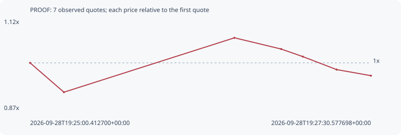

# PROOF

**robinhood** / `0x4841bc1d0727b857dbc2ef58f68a8edd0a3705d9`

[All tokens](README.md) · [Market window](../README.md)

## Native assessments

This contract is in the quote cohort; it has no native model assessment in this window.

## Series 7f2ab5c4335ea5787d55

Pool: `not supplied`

[Complete series](../series/robinhood/7f2ab5c4335ea5787d55.json)

Every dot is a captured quote. Lines connect observations; the curve ends at the last available quote.

| Peak | Final | Return | Maximum drawdown |
| ---: | ---: | ---: | ---: |
| 1.0704x | 0.9640x | -3.60% | 9.93% |

### Complete quote timeline

| Time (UTC) | Price (USD) | Multiple | Evidence |
| --- | ---: | ---: | --- |
| 2026-09-28T19:25:00.412700+00:00 | 1.01772e-05 | 1.0000x | `capture:1dec2f8f-4694-4c32-8be8-eeec3980c853:rank:18` |
| 2026-09-28T19:25:15.316372+00:00 | 9.33919e-06 | 0.9177x | `capture:52eaf5a3-351e-4c29-b00b-a167107703e3:rank:18` |
| 2026-09-28T19:26:30.447392+00:00 | 1.08932e-05 | 1.0704x | `capture:36fd4b46-5420-443d-b1ed-b86b98706671:rank:13` |
| 2026-09-28T19:26:51.039990+00:00 | 1.05721e-05 | 1.0388x | `capture:653b62fa-7a58-45fd-95e9-3b36912dc139:rank:11` |
| 2026-09-28T19:27:00.598930+00:00 | 1.0355e-05 | 1.0175x | `capture:8041f6b0-6188-445c-83ef-3a6fb7daf321:rank:12` |
| 2026-09-28T19:27:15.438746+00:00 | 9.98548e-06 | 0.9812x | `capture:b4c48612-e04d-4782-96a6-e80c2955d3b9:rank:12` |
| 2026-09-28T19:27:30.577698+00:00 | 9.81118e-06 | 0.9640x | `capture:ff6b3949-9c3c-4cdf-b48c-d4010666c140:rank:11` |

### Exit-policy timeline

Calculated from captured quotes under the window policy. Native assessments are linked separately above.

| Time (UTC) | Action | Price (USD) | Evidence |
| --- | --- | ---: | --- |
| 2026-09-28T19:25:00.412700+00:00 | BUY | 1.01772e-05 | `capture:1dec2f8f-4694-4c32-8be8-eeec3980c853:rank:18` |
| 2026-09-28T19:25:15.316372+00:00 | HOLD | 9.33919e-06 | `capture:52eaf5a3-351e-4c29-b00b-a167107703e3:rank:18` |
| 2026-09-28T19:26:30.447392+00:00 | HOLD | 1.08932e-05 | `capture:36fd4b46-5420-443d-b1ed-b86b98706671:rank:13` |
| 2026-09-28T19:26:51.039990+00:00 | HOLD | 1.05721e-05 | `capture:653b62fa-7a58-45fd-95e9-3b36912dc139:rank:11` |
| 2026-09-28T19:27:00.598930+00:00 | HOLD | 1.0355e-05 | `capture:8041f6b0-6188-445c-83ef-3a6fb7daf321:rank:12` |
| 2026-09-28T19:27:15.438746+00:00 | HOLD | 9.98548e-06 | `capture:b4c48612-e04d-4782-96a6-e80c2955d3b9:rank:12` |
| 2026-09-28T19:27:30.577698+00:00 | HOLD | 9.81118e-06 | `capture:ff6b3949-9c3c-4cdf-b48c-d4010666c140:rank:11` |
