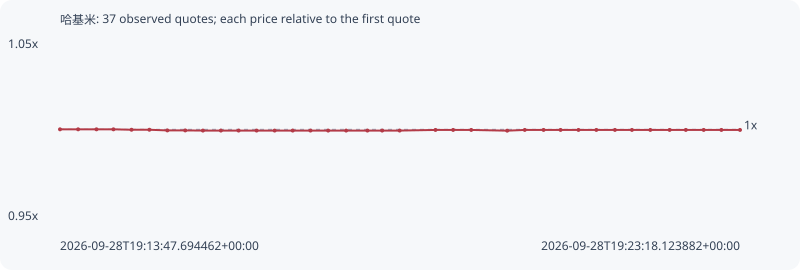

# 哈基米

**bsc** / `0x82ec31d69b3c289e541b50e30681fd1acad24444`

[All tokens](README.md) · [Market window](../README.md)

## Native assessments

This contract is in the quote cohort; it has no native model assessment in this window.

## Series f7b10e6aa71d3a79b83c

Pool: `not supplied`

[Complete series](../series/bsc/f7b10e6aa71d3a79b83c.json)

Every dot is a captured quote. Lines connect observations; the curve ends at the last available quote.

| Peak | Final | Return | Maximum drawdown |
| ---: | ---: | ---: | ---: |
| 1.0000x | 0.9997x | -0.03% | 0.08% |

### Complete quote timeline

| Time (UTC) | Price (USD) | Multiple | Evidence |
| --- | ---: | ---: | --- |
| 2026-09-28T19:13:47.694462+00:00 | 0.0336006 | 1.0000x | `capture:4e60f1a9-1927-46db-ae10-f1b1530de61d:rank:87` |
| 2026-09-28T19:14:02.894344+00:00 | 0.0336006 | 1.0000x | `capture:6211f86d-6ba6-4eb3-a4e2-2f80b0dffff7:rank:90` |
| 2026-09-28T19:14:18.283251+00:00 | 0.0336006 | 1.0000x | `capture:68440f72-d36c-4c27-867d-03a757db141f:rank:90` |
| 2026-09-28T19:14:32.527710+00:00 | 0.0336006 | 1.0000x | `capture:4f6a3c72-f6f0-49d7-97fe-a760f1872e88:rank:90` |
| 2026-09-28T19:14:47.684789+00:00 | 0.0335925 | 0.9998x | `capture:abe58c43-9edf-4da1-b6d9-c4db72f14d79:rank:84` |
| 2026-09-28T19:15:02.698030+00:00 | 0.0335925 | 0.9998x | `capture:d9b7eccd-b77f-4cc6-8305-4a84d44c62e0:rank:87` |
| 2026-09-28T19:15:17.739331+00:00 | 0.03358 | 0.9994x | `capture:08cc1e53-32bc-48e9-9abe-0b7caf40b440:rank:78` |
| 2026-09-28T19:15:32.749915+00:00 | 0.03358 | 0.9994x | `capture:81e75e19-4c52-4e91-ba7d-af89c6539b19:rank:78` |
| 2026-09-28T19:15:47.591170+00:00 | 0.0335771 | 0.9993x | `capture:98b3c66b-c70a-4987-9342-10165ae058ec:rank:74` |
| 2026-09-28T19:16:02.665866+00:00 | 0.0335771 | 0.9993x | `capture:831c8e00-640d-4942-9ad6-ae68e842f3cf:rank:74` |
| 2026-09-28T19:16:17.512218+00:00 | 0.0335771 | 0.9993x | `capture:a4477278-80c9-4a7a-9a8f-66687623072c:rank:77` |
| 2026-09-28T19:16:32.607943+00:00 | 0.0335771 | 0.9993x | `capture:4487eb62-651f-462e-aece-4003e9e61067:rank:78` |
| 2026-09-28T19:16:47.751534+00:00 | 0.0335771 | 0.9993x | `capture:39d9c9d0-d8a7-439e-86b7-5fff162807b9:rank:79` |
| 2026-09-28T19:17:02.908604+00:00 | 0.0335771 | 0.9993x | `capture:16fde76e-cae4-4138-b96e-57b291931df8:rank:80` |
| 2026-09-28T19:17:17.816055+00:00 | 0.0335771 | 0.9993x | `capture:7f9359fa-2f23-4e78-9500-f9df7d85a6b2:rank:76` |
| 2026-09-28T19:17:32.654140+00:00 | 0.0335771 | 0.9993x | `capture:4e95b3e2-d20d-4729-ac41-d7699561b97b:rank:75` |
| 2026-09-28T19:17:47.717594+00:00 | 0.0335771 | 0.9993x | `capture:2cc72c7e-c2ae-4eb2-929b-e80f3d8c4e15:rank:75` |
| 2026-09-28T19:18:05.582121+00:00 | 0.0335771 | 0.9993x | `capture:07127a86-393c-4e05-bde5-d28a70a854fb:rank:74` |
| 2026-09-28T19:18:17.953086+00:00 | 0.0335771 | 0.9993x | `capture:ca903b0a-a9a8-4246-873f-5115402fbf9c:rank:74` |
| 2026-09-28T19:18:32.607444+00:00 | 0.0335771 | 0.9993x | `capture:86009bbc-85b0-465e-8657-55be8d6c15de:rank:83` |
| 2026-09-28T19:19:02.666276+00:00 | 0.033589 | 0.9997x | `capture:6fe1da90-a254-48b3-b112-ab24c6060e81:rank:93` |
| 2026-09-28T19:19:17.488471+00:00 | 0.033589 | 0.9997x | `capture:b87f439a-4825-4a6f-b17c-0b78464d9310:rank:92` |
| 2026-09-28T19:19:32.672995+00:00 | 0.033589 | 0.9997x | `capture:ceae4194-4b79-45b3-9a66-758dd19e2a7b:rank:92` |
| 2026-09-28T19:20:02.835112+00:00 | 0.0335752 | 0.9992x | `capture:adbb19f8-5a81-4d70-8990-a6ffd414f250:rank:90` |
| 2026-09-28T19:20:17.561225+00:00 | 0.0335891 | 0.9997x | `capture:0feecf05-56c0-4db7-a137-f63b427a7830:rank:86` |
| 2026-09-28T19:20:33.351338+00:00 | 0.0335891 | 0.9997x | `capture:5752259a-2bcb-4e27-ac90-6ef5a52d1cf7:rank:77` |
| 2026-09-28T19:20:47.599416+00:00 | 0.0335891 | 0.9997x | `capture:1ab71e23-e150-479b-a1fa-e2a362332d1e:rank:87` |
| 2026-09-28T19:21:02.616817+00:00 | 0.0335891 | 0.9997x | `capture:ec0d171f-d990-484a-94d1-c335d7f6e8fb:rank:89` |
| 2026-09-28T19:21:17.612081+00:00 | 0.0335891 | 0.9997x | `capture:cc46cbda-0be4-42ba-bcf4-4a03c9e7e894:rank:93` |
| 2026-09-28T19:21:33.217678+00:00 | 0.0335891 | 0.9997x | `capture:3a34cabb-e5ee-4ff6-9f92-f0839c39884f:rank:92` |
| 2026-09-28T19:21:47.485842+00:00 | 0.0335891 | 0.9997x | `capture:9e0730ff-182b-409c-b854-c06b993be570:rank:92` |
| 2026-09-28T19:22:02.883000+00:00 | 0.0335891 | 0.9997x | `capture:eb8228cb-dfba-443e-9576-ee214dcd3354:rank:94` |
| 2026-09-28T19:22:19.090071+00:00 | 0.0335891 | 0.9997x | `capture:30ef0b61-e0e1-4eba-95c6-de3dc48fe868:rank:93` |
| 2026-09-28T19:22:32.671189+00:00 | 0.0335891 | 0.9997x | `capture:5d031323-644d-4272-bacc-8a363d4b77cb:rank:97` |
| 2026-09-28T19:22:47.674643+00:00 | 0.0335891 | 0.9997x | `capture:c8838291-6f5a-42d9-9013-9d9421deb79e:rank:93` |
| 2026-09-28T19:23:02.516005+00:00 | 0.0335891 | 0.9997x | `capture:f8b60e63-80ce-442a-9ca7-659f2b5ca21d:rank:97` |
| 2026-09-28T19:23:18.123882+00:00 | 0.0335891 | 0.9997x | `capture:f689df34-2acf-42e7-a37b-1a7d50808302:rank:99` |

### Exit-policy timeline

Calculated from captured quotes under the window policy. Native assessments are linked separately above.

| Time (UTC) | Action | Price (USD) | Evidence |
| --- | --- | ---: | --- |
| 2026-09-28T19:13:47.694462+00:00 | BUY | 0.0336006 | `capture:4e60f1a9-1927-46db-ae10-f1b1530de61d:rank:87` |
| 2026-09-28T19:14:02.894344+00:00 | HOLD | 0.0336006 | `capture:6211f86d-6ba6-4eb3-a4e2-2f80b0dffff7:rank:90` |
| 2026-09-28T19:14:18.283251+00:00 | HOLD | 0.0336006 | `capture:68440f72-d36c-4c27-867d-03a757db141f:rank:90` |
| 2026-09-28T19:14:32.527710+00:00 | HOLD | 0.0336006 | `capture:4f6a3c72-f6f0-49d7-97fe-a760f1872e88:rank:90` |
| 2026-09-28T19:14:47.684789+00:00 | HOLD | 0.0335925 | `capture:abe58c43-9edf-4da1-b6d9-c4db72f14d79:rank:84` |
| 2026-09-28T19:15:02.698030+00:00 | HOLD | 0.0335925 | `capture:d9b7eccd-b77f-4cc6-8305-4a84d44c62e0:rank:87` |
| 2026-09-28T19:15:17.739331+00:00 | HOLD | 0.03358 | `capture:08cc1e53-32bc-48e9-9abe-0b7caf40b440:rank:78` |
| 2026-09-28T19:15:32.749915+00:00 | HOLD | 0.03358 | `capture:81e75e19-4c52-4e91-ba7d-af89c6539b19:rank:78` |
| 2026-09-28T19:15:47.591170+00:00 | HOLD | 0.0335771 | `capture:98b3c66b-c70a-4987-9342-10165ae058ec:rank:74` |
| 2026-09-28T19:16:02.665866+00:00 | HOLD | 0.0335771 | `capture:831c8e00-640d-4942-9ad6-ae68e842f3cf:rank:74` |
| 2026-09-28T19:16:17.512218+00:00 | HOLD | 0.0335771 | `capture:a4477278-80c9-4a7a-9a8f-66687623072c:rank:77` |
| 2026-09-28T19:16:32.607943+00:00 | HOLD | 0.0335771 | `capture:4487eb62-651f-462e-aece-4003e9e61067:rank:78` |
| 2026-09-28T19:16:47.751534+00:00 | HOLD | 0.0335771 | `capture:39d9c9d0-d8a7-439e-86b7-5fff162807b9:rank:79` |
| 2026-09-28T19:17:02.908604+00:00 | HOLD | 0.0335771 | `capture:16fde76e-cae4-4138-b96e-57b291931df8:rank:80` |
| 2026-09-28T19:17:17.816055+00:00 | HOLD | 0.0335771 | `capture:7f9359fa-2f23-4e78-9500-f9df7d85a6b2:rank:76` |
| 2026-09-28T19:17:32.654140+00:00 | HOLD | 0.0335771 | `capture:4e95b3e2-d20d-4729-ac41-d7699561b97b:rank:75` |
| 2026-09-28T19:17:47.717594+00:00 | HOLD | 0.0335771 | `capture:2cc72c7e-c2ae-4eb2-929b-e80f3d8c4e15:rank:75` |
| 2026-09-28T19:18:05.582121+00:00 | HOLD | 0.0335771 | `capture:07127a86-393c-4e05-bde5-d28a70a854fb:rank:74` |
| 2026-09-28T19:18:17.953086+00:00 | HOLD | 0.0335771 | `capture:ca903b0a-a9a8-4246-873f-5115402fbf9c:rank:74` |
| 2026-09-28T19:18:32.607444+00:00 | HOLD | 0.0335771 | `capture:86009bbc-85b0-465e-8657-55be8d6c15de:rank:83` |
| 2026-09-28T19:19:02.666276+00:00 | HOLD | 0.033589 | `capture:6fe1da90-a254-48b3-b112-ab24c6060e81:rank:93` |
| 2026-09-28T19:19:17.488471+00:00 | HOLD | 0.033589 | `capture:b87f439a-4825-4a6f-b17c-0b78464d9310:rank:92` |
| 2026-09-28T19:19:32.672995+00:00 | HOLD | 0.033589 | `capture:ceae4194-4b79-45b3-9a66-758dd19e2a7b:rank:92` |
| 2026-09-28T19:20:02.835112+00:00 | HOLD | 0.0335752 | `capture:adbb19f8-5a81-4d70-8990-a6ffd414f250:rank:90` |
| 2026-09-28T19:20:17.561225+00:00 | HOLD | 0.0335891 | `capture:0feecf05-56c0-4db7-a137-f63b427a7830:rank:86` |
| 2026-09-28T19:20:33.351338+00:00 | HOLD | 0.0335891 | `capture:5752259a-2bcb-4e27-ac90-6ef5a52d1cf7:rank:77` |
| 2026-09-28T19:20:47.599416+00:00 | HOLD | 0.0335891 | `capture:1ab71e23-e150-479b-a1fa-e2a362332d1e:rank:87` |
| 2026-09-28T19:21:02.616817+00:00 | HOLD | 0.0335891 | `capture:ec0d171f-d990-484a-94d1-c335d7f6e8fb:rank:89` |
| 2026-09-28T19:21:17.612081+00:00 | HOLD | 0.0335891 | `capture:cc46cbda-0be4-42ba-bcf4-4a03c9e7e894:rank:93` |
| 2026-09-28T19:21:33.217678+00:00 | HOLD | 0.0335891 | `capture:3a34cabb-e5ee-4ff6-9f92-f0839c39884f:rank:92` |
| 2026-09-28T19:21:47.485842+00:00 | HOLD | 0.0335891 | `capture:9e0730ff-182b-409c-b854-c06b993be570:rank:92` |
| 2026-09-28T19:22:02.883000+00:00 | HOLD | 0.0335891 | `capture:eb8228cb-dfba-443e-9576-ee214dcd3354:rank:94` |
| 2026-09-28T19:22:19.090071+00:00 | HOLD | 0.0335891 | `capture:30ef0b61-e0e1-4eba-95c6-de3dc48fe868:rank:93` |
| 2026-09-28T19:22:32.671189+00:00 | HOLD | 0.0335891 | `capture:5d031323-644d-4272-bacc-8a363d4b77cb:rank:97` |
| 2026-09-28T19:22:47.674643+00:00 | HOLD | 0.0335891 | `capture:c8838291-6f5a-42d9-9013-9d9421deb79e:rank:93` |
| 2026-09-28T19:23:02.516005+00:00 | HOLD | 0.0335891 | `capture:f8b60e63-80ce-442a-9ca7-659f2b5ca21d:rank:97` |
| 2026-09-28T19:23:18.123882+00:00 | HOLD | 0.0335891 | `capture:f689df34-2acf-42e7-a37b-1a7d50808302:rank:99` |
