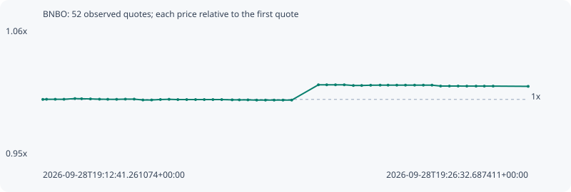

# BNBO

**bsc** / `0x7fb4758cb0c617c0bab1baf80525fab958637777`

[All tokens](README.md) · [Market window](../README.md)

## Native assessments

This contract is in the quote cohort; it has no native model assessment in this window.

## Series 1e0b272eadda9442618e

Pool: `not supplied`

[Complete series](../series/bsc/1e0b272eadda9442618e.json)

Every dot is a captured quote. Lines connect observations; the curve ends at the last available quote.

| Peak | Final | Return | Maximum drawdown |
| ---: | ---: | ---: | ---: |
| 1.0130x | 1.0116x | +1.16% | 0.14% |

### Complete quote timeline

| Time (UTC) | Price (USD) | Multiple | Evidence |
| --- | ---: | ---: | --- |
| 2026-09-28T19:12:41.261074+00:00 | 0.000410245 | 1.0000x | `capture:795a88f0-804c-4f14-a3e8-ce8d9318f6df:rank:24` |
| 2026-09-28T19:12:47.639745+00:00 | 0.000410298 | 1.0001x | `capture:c2d8bd1a-9ed6-4d75-91ae-006bea65a635:rank:23` |
| 2026-09-28T19:13:02.549284+00:00 | 0.000410298 | 1.0001x | `capture:0aa38b41-b2e7-48f5-a3ba-8fd4a983fff8:rank:27` |
| 2026-09-28T19:13:17.511052+00:00 | 0.000410298 | 1.0001x | `capture:87e92f15-0601-4987-bd47-ae2e9f91de16:rank:37` |
| 2026-09-28T19:13:36.268178+00:00 | 0.000410541 | 1.0007x | `capture:577859f6-aadc-4653-b269-a860dbe8c41c:rank:52` |
| 2026-09-28T19:13:47.694462+00:00 | 0.000410479 | 1.0006x | `capture:4e60f1a9-1927-46db-ae10-f1b1530de61d:rank:52` |
| 2026-09-28T19:14:02.894344+00:00 | 0.000410425 | 1.0004x | `capture:6211f86d-6ba6-4eb3-a4e2-2f80b0dffff7:rank:51` |
| 2026-09-28T19:14:18.283251+00:00 | 0.000410328 | 1.0002x | `capture:68440f72-d36c-4c27-867d-03a757db141f:rank:49` |
| 2026-09-28T19:14:32.527710+00:00 | 0.000410287 | 1.0001x | `capture:4f6a3c72-f6f0-49d7-97fe-a760f1872e88:rank:48` |
| 2026-09-28T19:14:47.684789+00:00 | 0.000410274 | 1.0001x | `capture:abe58c43-9edf-4da1-b6d9-c4db72f14d79:rank:44` |
| 2026-09-28T19:15:02.698030+00:00 | 0.000410344 | 1.0002x | `capture:d9b7eccd-b77f-4cc6-8305-4a84d44c62e0:rank:51` |
| 2026-09-28T19:15:17.739331+00:00 | 0.000410344 | 1.0002x | `capture:08cc1e53-32bc-48e9-9abe-0b7caf40b440:rank:48` |
| 2026-09-28T19:15:32.749915+00:00 | 0.000410043 | 0.9995x | `capture:81e75e19-4c52-4e91-ba7d-af89c6539b19:rank:45` |
| 2026-09-28T19:15:47.591170+00:00 | 0.000410043 | 0.9995x | `capture:98b3c66b-c70a-4987-9342-10165ae058ec:rank:49` |
| 2026-09-28T19:16:02.665866+00:00 | 0.000410205 | 0.9999x | `capture:831c8e00-640d-4942-9ad6-ae68e842f3cf:rank:48` |
| 2026-09-28T19:16:17.512218+00:00 | 0.000410283 | 1.0001x | `capture:a4477278-80c9-4a7a-9a8f-66687623072c:rank:47` |
| 2026-09-28T19:16:32.607943+00:00 | 0.000410186 | 0.9999x | `capture:4487eb62-651f-462e-aece-4003e9e61067:rank:52` |
| 2026-09-28T19:16:47.751534+00:00 | 0.000410186 | 0.9999x | `capture:39d9c9d0-d8a7-439e-86b7-5fff162807b9:rank:53` |
| 2026-09-28T19:17:02.908604+00:00 | 0.000410186 | 0.9999x | `capture:16fde76e-cae4-4138-b96e-57b291931df8:rank:56` |
| 2026-09-28T19:17:17.816055+00:00 | 0.000410186 | 0.9999x | `capture:7f9359fa-2f23-4e78-9500-f9df7d85a6b2:rank:56` |
| 2026-09-28T19:17:32.654140+00:00 | 0.000410186 | 0.9999x | `capture:4e95b3e2-d20d-4729-ac41-d7699561b97b:rank:56` |
| 2026-09-28T19:17:47.717594+00:00 | 0.000410186 | 0.9999x | `capture:2cc72c7e-c2ae-4eb2-929b-e80f3d8c4e15:rank:58` |
| 2026-09-28T19:18:05.582121+00:00 | 0.000410094 | 0.9996x | `capture:07127a86-393c-4e05-bde5-d28a70a854fb:rank:55` |
| 2026-09-28T19:18:17.953086+00:00 | 0.000410077 | 0.9996x | `capture:ca903b0a-a9a8-4246-873f-5115402fbf9c:rank:54` |
| 2026-09-28T19:18:32.607444+00:00 | 0.000410077 | 0.9996x | `capture:86009bbc-85b0-465e-8657-55be8d6c15de:rank:55` |
| 2026-09-28T19:18:47.632598+00:00 | 0.000409996 | 0.9994x | `capture:bfa4352f-2279-41ec-a6fd-d3e101a21181:rank:53` |
| 2026-09-28T19:19:02.666276+00:00 | 0.000409996 | 0.9994x | `capture:6fe1da90-a254-48b3-b112-ab24c6060e81:rank:60` |
| 2026-09-28T19:19:17.488471+00:00 | 0.000409996 | 0.9994x | `capture:b87f439a-4825-4a6f-b17c-0b78464d9310:rank:58` |
| 2026-09-28T19:19:32.672995+00:00 | 0.000409996 | 0.9994x | `capture:ceae4194-4b79-45b3-9a66-758dd19e2a7b:rank:63` |
| 2026-09-28T19:19:47.615151+00:00 | 0.000409996 | 0.9994x | `capture:0dedf968-cc48-4422-8bbf-180ff2103dbf:rank:66` |
| 2026-09-28T19:20:33.351338+00:00 | 0.000415565 | 1.0130x | `capture:5752259a-2bcb-4e27-ac90-6ef5a52d1cf7:rank:58` |
| 2026-09-28T19:20:47.599416+00:00 | 0.000415565 | 1.0130x | `capture:1ab71e23-e150-479b-a1fa-e2a362332d1e:rank:57` |
| 2026-09-28T19:21:02.616817+00:00 | 0.000415565 | 1.0130x | `capture:ec0d171f-d990-484a-94d1-c335d7f6e8fb:rank:58` |
| 2026-09-28T19:21:17.612081+00:00 | 0.000415565 | 1.0130x | `capture:cc46cbda-0be4-42ba-bcf4-4a03c9e7e894:rank:66` |
| 2026-09-28T19:21:33.217678+00:00 | 0.00041531 | 1.0123x | `capture:3a34cabb-e5ee-4ff6-9f92-f0839c39884f:rank:62` |
| 2026-09-28T19:21:47.485842+00:00 | 0.00041532 | 1.0124x | `capture:9e0730ff-182b-409c-b854-c06b993be570:rank:54` |
| 2026-09-28T19:22:02.883000+00:00 | 0.000415406 | 1.0126x | `capture:eb8228cb-dfba-443e-9576-ee214dcd3354:rank:51` |
| 2026-09-28T19:22:19.090071+00:00 | 0.00041544 | 1.0127x | `capture:30ef0b61-e0e1-4eba-95c6-de3dc48fe868:rank:50` |
| 2026-09-28T19:22:32.671189+00:00 | 0.00041544 | 1.0127x | `capture:5d031323-644d-4272-bacc-8a363d4b77cb:rank:52` |
| 2026-09-28T19:22:47.674643+00:00 | 0.00041544 | 1.0127x | `capture:c8838291-6f5a-42d9-9013-9d9421deb79e:rank:49` |
| 2026-09-28T19:23:02.516005+00:00 | 0.00041544 | 1.0127x | `capture:f8b60e63-80ce-442a-9ca7-659f2b5ca21d:rank:53` |
| 2026-09-28T19:23:18.123882+00:00 | 0.00041544 | 1.0127x | `capture:f689df34-2acf-42e7-a37b-1a7d50808302:rank:59` |
| 2026-09-28T19:23:33.140484+00:00 | 0.00041544 | 1.0127x | `capture:ef2304f7-c374-4b90-a3e4-d8976f05c226:rank:58` |
| 2026-09-28T19:23:47.927661+00:00 | 0.00041544 | 1.0127x | `capture:51aa913c-158f-4059-8727-ff1ace24834c:rank:63` |
| 2026-09-28T19:24:02.684719+00:00 | 0.000415109 | 1.0119x | `capture:77fa5264-b080-4409-8d15-3f5504293a7d:rank:58` |
| 2026-09-28T19:24:17.754261+00:00 | 0.000415109 | 1.0119x | `capture:9e642626-a894-4304-aad8-bfad3e85b1e6:rank:58` |
| 2026-09-28T19:24:32.694463+00:00 | 0.000415109 | 1.0119x | `capture:2934d705-4adf-40dc-b5ef-2f9f3edbbe61:rank:59` |
| 2026-09-28T19:24:47.591753+00:00 | 0.000415087 | 1.0118x | `capture:1cb45dcb-fe83-4fcc-8cfd-c5de8d369858:rank:55` |
| 2026-09-28T19:25:03.394485+00:00 | 0.000415085 | 1.0118x | `capture:f1b0620f-7caf-483d-8db4-440b4d786962:rank:49` |
| 2026-09-28T19:25:17.566680+00:00 | 0.000415085 | 1.0118x | `capture:89c3d45d-a145-4312-88dc-a4340e727616:rank:48` |
| 2026-09-28T19:25:32.640282+00:00 | 0.000415085 | 1.0118x | `capture:a41f01eb-b1b7-4ed5-a604-19b71e522502:rank:60` |
| 2026-09-28T19:26:32.687411+00:00 | 0.000414999 | 1.0116x | `capture:d1fef60a-e7ad-4594-a8e8-74ee96c47ae4:rank:59` |

### Exit-policy timeline

Calculated from captured quotes under the window policy. Native assessments are linked separately above.

| Time (UTC) | Action | Price (USD) | Evidence |
| --- | --- | ---: | --- |
| 2026-09-28T19:12:41.261074+00:00 | BUY | 0.000410245 | `capture:795a88f0-804c-4f14-a3e8-ce8d9318f6df:rank:24` |
| 2026-09-28T19:12:47.639745+00:00 | HOLD | 0.000410298 | `capture:c2d8bd1a-9ed6-4d75-91ae-006bea65a635:rank:23` |
| 2026-09-28T19:13:02.549284+00:00 | HOLD | 0.000410298 | `capture:0aa38b41-b2e7-48f5-a3ba-8fd4a983fff8:rank:27` |
| 2026-09-28T19:13:17.511052+00:00 | HOLD | 0.000410298 | `capture:87e92f15-0601-4987-bd47-ae2e9f91de16:rank:37` |
| 2026-09-28T19:13:36.268178+00:00 | HOLD | 0.000410541 | `capture:577859f6-aadc-4653-b269-a860dbe8c41c:rank:52` |
| 2026-09-28T19:13:47.694462+00:00 | HOLD | 0.000410479 | `capture:4e60f1a9-1927-46db-ae10-f1b1530de61d:rank:52` |
| 2026-09-28T19:14:02.894344+00:00 | HOLD | 0.000410425 | `capture:6211f86d-6ba6-4eb3-a4e2-2f80b0dffff7:rank:51` |
| 2026-09-28T19:14:18.283251+00:00 | HOLD | 0.000410328 | `capture:68440f72-d36c-4c27-867d-03a757db141f:rank:49` |
| 2026-09-28T19:14:32.527710+00:00 | HOLD | 0.000410287 | `capture:4f6a3c72-f6f0-49d7-97fe-a760f1872e88:rank:48` |
| 2026-09-28T19:14:47.684789+00:00 | HOLD | 0.000410274 | `capture:abe58c43-9edf-4da1-b6d9-c4db72f14d79:rank:44` |
| 2026-09-28T19:15:02.698030+00:00 | HOLD | 0.000410344 | `capture:d9b7eccd-b77f-4cc6-8305-4a84d44c62e0:rank:51` |
| 2026-09-28T19:15:17.739331+00:00 | HOLD | 0.000410344 | `capture:08cc1e53-32bc-48e9-9abe-0b7caf40b440:rank:48` |
| 2026-09-28T19:15:32.749915+00:00 | HOLD | 0.000410043 | `capture:81e75e19-4c52-4e91-ba7d-af89c6539b19:rank:45` |
| 2026-09-28T19:15:47.591170+00:00 | HOLD | 0.000410043 | `capture:98b3c66b-c70a-4987-9342-10165ae058ec:rank:49` |
| 2026-09-28T19:16:02.665866+00:00 | HOLD | 0.000410205 | `capture:831c8e00-640d-4942-9ad6-ae68e842f3cf:rank:48` |
| 2026-09-28T19:16:17.512218+00:00 | HOLD | 0.000410283 | `capture:a4477278-80c9-4a7a-9a8f-66687623072c:rank:47` |
| 2026-09-28T19:16:32.607943+00:00 | HOLD | 0.000410186 | `capture:4487eb62-651f-462e-aece-4003e9e61067:rank:52` |
| 2026-09-28T19:16:47.751534+00:00 | HOLD | 0.000410186 | `capture:39d9c9d0-d8a7-439e-86b7-5fff162807b9:rank:53` |
| 2026-09-28T19:17:02.908604+00:00 | HOLD | 0.000410186 | `capture:16fde76e-cae4-4138-b96e-57b291931df8:rank:56` |
| 2026-09-28T19:17:17.816055+00:00 | HOLD | 0.000410186 | `capture:7f9359fa-2f23-4e78-9500-f9df7d85a6b2:rank:56` |
| 2026-09-28T19:17:32.654140+00:00 | HOLD | 0.000410186 | `capture:4e95b3e2-d20d-4729-ac41-d7699561b97b:rank:56` |
| 2026-09-28T19:17:47.717594+00:00 | HOLD | 0.000410186 | `capture:2cc72c7e-c2ae-4eb2-929b-e80f3d8c4e15:rank:58` |
| 2026-09-28T19:18:05.582121+00:00 | HOLD | 0.000410094 | `capture:07127a86-393c-4e05-bde5-d28a70a854fb:rank:55` |
| 2026-09-28T19:18:17.953086+00:00 | HOLD | 0.000410077 | `capture:ca903b0a-a9a8-4246-873f-5115402fbf9c:rank:54` |
| 2026-09-28T19:18:32.607444+00:00 | HOLD | 0.000410077 | `capture:86009bbc-85b0-465e-8657-55be8d6c15de:rank:55` |
| 2026-09-28T19:18:47.632598+00:00 | HOLD | 0.000409996 | `capture:bfa4352f-2279-41ec-a6fd-d3e101a21181:rank:53` |
| 2026-09-28T19:19:02.666276+00:00 | HOLD | 0.000409996 | `capture:6fe1da90-a254-48b3-b112-ab24c6060e81:rank:60` |
| 2026-09-28T19:19:17.488471+00:00 | HOLD | 0.000409996 | `capture:b87f439a-4825-4a6f-b17c-0b78464d9310:rank:58` |
| 2026-09-28T19:19:32.672995+00:00 | HOLD | 0.000409996 | `capture:ceae4194-4b79-45b3-9a66-758dd19e2a7b:rank:63` |
| 2026-09-28T19:19:47.615151+00:00 | HOLD | 0.000409996 | `capture:0dedf968-cc48-4422-8bbf-180ff2103dbf:rank:66` |
| 2026-09-28T19:20:33.351338+00:00 | HOLD | 0.000415565 | `capture:5752259a-2bcb-4e27-ac90-6ef5a52d1cf7:rank:58` |
| 2026-09-28T19:20:47.599416+00:00 | HOLD | 0.000415565 | `capture:1ab71e23-e150-479b-a1fa-e2a362332d1e:rank:57` |
| 2026-09-28T19:21:02.616817+00:00 | HOLD | 0.000415565 | `capture:ec0d171f-d990-484a-94d1-c335d7f6e8fb:rank:58` |
| 2026-09-28T19:21:17.612081+00:00 | HOLD | 0.000415565 | `capture:cc46cbda-0be4-42ba-bcf4-4a03c9e7e894:rank:66` |
| 2026-09-28T19:21:33.217678+00:00 | HOLD | 0.00041531 | `capture:3a34cabb-e5ee-4ff6-9f92-f0839c39884f:rank:62` |
| 2026-09-28T19:21:47.485842+00:00 | HOLD | 0.00041532 | `capture:9e0730ff-182b-409c-b854-c06b993be570:rank:54` |
| 2026-09-28T19:22:02.883000+00:00 | HOLD | 0.000415406 | `capture:eb8228cb-dfba-443e-9576-ee214dcd3354:rank:51` |
| 2026-09-28T19:22:19.090071+00:00 | HOLD | 0.00041544 | `capture:30ef0b61-e0e1-4eba-95c6-de3dc48fe868:rank:50` |
| 2026-09-28T19:22:32.671189+00:00 | HOLD | 0.00041544 | `capture:5d031323-644d-4272-bacc-8a363d4b77cb:rank:52` |
| 2026-09-28T19:22:47.674643+00:00 | HOLD | 0.00041544 | `capture:c8838291-6f5a-42d9-9013-9d9421deb79e:rank:49` |
| 2026-09-28T19:23:02.516005+00:00 | HOLD | 0.00041544 | `capture:f8b60e63-80ce-442a-9ca7-659f2b5ca21d:rank:53` |
| 2026-09-28T19:23:18.123882+00:00 | HOLD | 0.00041544 | `capture:f689df34-2acf-42e7-a37b-1a7d50808302:rank:59` |
| 2026-09-28T19:23:33.140484+00:00 | HOLD | 0.00041544 | `capture:ef2304f7-c374-4b90-a3e4-d8976f05c226:rank:58` |
| 2026-09-28T19:23:47.927661+00:00 | HOLD | 0.00041544 | `capture:51aa913c-158f-4059-8727-ff1ace24834c:rank:63` |
| 2026-09-28T19:24:02.684719+00:00 | HOLD | 0.000415109 | `capture:77fa5264-b080-4409-8d15-3f5504293a7d:rank:58` |
| 2026-09-28T19:24:17.754261+00:00 | HOLD | 0.000415109 | `capture:9e642626-a894-4304-aad8-bfad3e85b1e6:rank:58` |
| 2026-09-28T19:24:32.694463+00:00 | HOLD | 0.000415109 | `capture:2934d705-4adf-40dc-b5ef-2f9f3edbbe61:rank:59` |
| 2026-09-28T19:24:47.591753+00:00 | HOLD | 0.000415087 | `capture:1cb45dcb-fe83-4fcc-8cfd-c5de8d369858:rank:55` |
| 2026-09-28T19:25:03.394485+00:00 | HOLD | 0.000415085 | `capture:f1b0620f-7caf-483d-8db4-440b4d786962:rank:49` |
| 2026-09-28T19:25:17.566680+00:00 | HOLD | 0.000415085 | `capture:89c3d45d-a145-4312-88dc-a4340e727616:rank:48` |
| 2026-09-28T19:25:32.640282+00:00 | HOLD | 0.000415085 | `capture:a41f01eb-b1b7-4ed5-a604-19b71e522502:rank:60` |
| 2026-09-28T19:26:32.687411+00:00 | HOLD | 0.000414999 | `capture:d1fef60a-e7ad-4594-a8e8-74ee96c47ae4:rank:59` |
