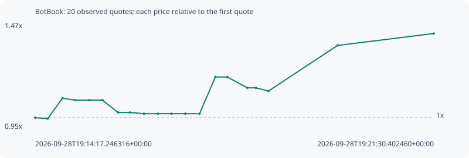

# BotBook

**solana** / `7n7dS5Dk7YjaKKDzb5e9gPK3Md6mziTLsBA3mJYu6gnV`

[All tokens](README.md) · [Market window](../README.md)

## Native assessments

This contract is in the quote cohort; it has no native model assessment in this window.

## Series e10f12dad6a72e48d33c

Pool: `not supplied`

[Complete series](../series/solana/e10f12dad6a72e48d33c.json)

Every dot is a captured quote. Lines connect observations; the curve ends at the last available quote.

| Peak | Final | Return | Maximum drawdown |
| ---: | ---: | ---: | ---: |
| 1.4169x | 1.4169x | +41.69% | 6.99% |

### Complete quote timeline

| Time (UTC) | Price (USD) | Multiple | Evidence |
| --- | ---: | ---: | --- |
| 2026-09-28T19:14:17.246316+00:00 | 4.1926e-05 | 1.0000x | `capture:7a923cde-d765-4388-a15c-4f47fde0a3b5:rank:94` |
| 2026-09-28T19:14:30.874732+00:00 | 4.17246e-05 | 0.9952x | `capture:fa585070-b1ae-4f9d-afbd-aa986f487793:rank:94` |
| 2026-09-28T19:14:46.892387+00:00 | 4.59721e-05 | 1.0965x | `capture:7d9e3e65-8bda-4696-b6d1-7a86825bd98c:rank:90` |
| 2026-09-28T19:15:00.432009+00:00 | 4.55656e-05 | 1.0868x | `capture:797f9a41-958a-44ba-ac57-3b9cacf5d06b:rank:85` |
| 2026-09-28T19:15:16.098308+00:00 | 4.55656e-05 | 1.0868x | `capture:ab2becb9-3f94-4a57-b9e8-472ad0998012:rank:85` |
| 2026-09-28T19:15:30.340579+00:00 | 4.55656e-05 | 1.0868x | `capture:564db5fc-5586-41d3-88fb-a9a955708f1d:rank:85` |
| 2026-09-28T19:15:47.323285+00:00 | 4.30094e-05 | 1.0258x | `capture:65003429-a569-4442-8d4f-b2c93db69061:rank:78` |
| 2026-09-28T19:16:00.259696+00:00 | 4.30094e-05 | 1.0258x | `capture:4236f8d5-90c4-4c9b-a73e-d6443ae3bf32:rank:82` |
| 2026-09-28T19:16:15.455827+00:00 | 4.27597e-05 | 1.0199x | `capture:acc657c6-9a43-46bf-986e-7b907c831cba:rank:91` |
| 2026-09-28T19:16:30.624202+00:00 | 4.27597e-05 | 1.0199x | `capture:0d391072-ec81-4bb7-9be0-0d6bbb801c70:rank:88` |
| 2026-09-28T19:16:45.311485+00:00 | 4.27597e-05 | 1.0199x | `capture:72cccbac-c3fe-4991-8f62-08c53849b146:rank:89` |
| 2026-09-28T19:17:00.368914+00:00 | 4.27597e-05 | 1.0199x | `capture:1232cf18-7088-40a1-9f55-ad9ae22b44f5:rank:92` |
| 2026-09-28T19:17:15.914647+00:00 | 4.27597e-05 | 1.0199x | `capture:9792e199-c0c2-4272-ac95-24501e4a3f79:rank:93` |
| 2026-09-28T19:17:32.965607+00:00 | 5.03584e-05 | 1.2011x | `capture:0f04cfe5-88a0-4a83-ae8d-85c5cb3cdc89:rank:86` |
| 2026-09-28T19:17:46.087880+00:00 | 5.03584e-05 | 1.2011x | `capture:ee91a1c6-bc99-4c7a-9cdc-bd6cb5478a9b:rank:86` |
| 2026-09-28T19:18:07.749963+00:00 | 4.81181e-05 | 1.1477x | `capture:b0fb1b47-4973-472f-9619-8480bc7d294e:rank:91` |
| 2026-09-28T19:18:17.126008+00:00 | 4.81181e-05 | 1.1477x | `capture:5ed98f51-d1e1-422a-81df-4186a8b0a0a2:rank:87` |
| 2026-09-28T19:18:30.722167+00:00 | 4.74532e-05 | 1.1318x | `capture:9f88d118-9108-4dff-bbfc-246eaed5ce38:rank:97` |
| 2026-09-28T19:19:45.817199+00:00 | 5.6929e-05 | 1.3578x | `capture:722d1b7b-ef4f-4ac5-883c-0557bae2b60b:rank:96` |
| 2026-09-28T19:21:30.402460+00:00 | 5.94042e-05 | 1.4169x | `capture:d926629b-2050-4e50-a602-1638c6205870:rank:98` |

### Exit-policy timeline

Calculated from captured quotes under the window policy. Native assessments are linked separately above.

| Time (UTC) | Action | Price (USD) | Evidence |
| --- | --- | ---: | --- |
| 2026-09-28T19:14:17.246316+00:00 | BUY | 4.1926e-05 | `capture:7a923cde-d765-4388-a15c-4f47fde0a3b5:rank:94` |
| 2026-09-28T19:14:30.874732+00:00 | HOLD | 4.17246e-05 | `capture:fa585070-b1ae-4f9d-afbd-aa986f487793:rank:94` |
| 2026-09-28T19:14:46.892387+00:00 | HOLD | 4.59721e-05 | `capture:7d9e3e65-8bda-4696-b6d1-7a86825bd98c:rank:90` |
| 2026-09-28T19:15:00.432009+00:00 | HOLD | 4.55656e-05 | `capture:797f9a41-958a-44ba-ac57-3b9cacf5d06b:rank:85` |
| 2026-09-28T19:15:16.098308+00:00 | HOLD | 4.55656e-05 | `capture:ab2becb9-3f94-4a57-b9e8-472ad0998012:rank:85` |
| 2026-09-28T19:15:30.340579+00:00 | HOLD | 4.55656e-05 | `capture:564db5fc-5586-41d3-88fb-a9a955708f1d:rank:85` |
| 2026-09-28T19:15:47.323285+00:00 | HOLD | 4.30094e-05 | `capture:65003429-a569-4442-8d4f-b2c93db69061:rank:78` |
| 2026-09-28T19:16:00.259696+00:00 | HOLD | 4.30094e-05 | `capture:4236f8d5-90c4-4c9b-a73e-d6443ae3bf32:rank:82` |
| 2026-09-28T19:16:15.455827+00:00 | HOLD | 4.27597e-05 | `capture:acc657c6-9a43-46bf-986e-7b907c831cba:rank:91` |
| 2026-09-28T19:16:30.624202+00:00 | HOLD | 4.27597e-05 | `capture:0d391072-ec81-4bb7-9be0-0d6bbb801c70:rank:88` |
| 2026-09-28T19:16:45.311485+00:00 | HOLD | 4.27597e-05 | `capture:72cccbac-c3fe-4991-8f62-08c53849b146:rank:89` |
| 2026-09-28T19:17:00.368914+00:00 | HOLD | 4.27597e-05 | `capture:1232cf18-7088-40a1-9f55-ad9ae22b44f5:rank:92` |
| 2026-09-28T19:17:15.914647+00:00 | HOLD | 4.27597e-05 | `capture:9792e199-c0c2-4272-ac95-24501e4a3f79:rank:93` |
| 2026-09-28T19:17:32.965607+00:00 | HOLD | 5.03584e-05 | `capture:0f04cfe5-88a0-4a83-ae8d-85c5cb3cdc89:rank:86` |
| 2026-09-28T19:17:46.087880+00:00 | HOLD | 5.03584e-05 | `capture:ee91a1c6-bc99-4c7a-9cdc-bd6cb5478a9b:rank:86` |
| 2026-09-28T19:18:07.749963+00:00 | HOLD | 4.81181e-05 | `capture:b0fb1b47-4973-472f-9619-8480bc7d294e:rank:91` |
| 2026-09-28T19:18:17.126008+00:00 | HOLD | 4.81181e-05 | `capture:5ed98f51-d1e1-422a-81df-4186a8b0a0a2:rank:87` |
| 2026-09-28T19:18:30.722167+00:00 | HOLD | 4.74532e-05 | `capture:9f88d118-9108-4dff-bbfc-246eaed5ce38:rank:97` |
| 2026-09-28T19:19:45.817199+00:00 | PROFIT | 5.6929e-05 | `capture:722d1b7b-ef4f-4ac5-883c-0557bae2b60b:rank:96` |
| 2026-09-28T19:21:30.402460+00:00 | HOLD_BAG | 5.94042e-05 | `capture:d926629b-2050-4e50-a602-1638c6205870:rank:98` |
