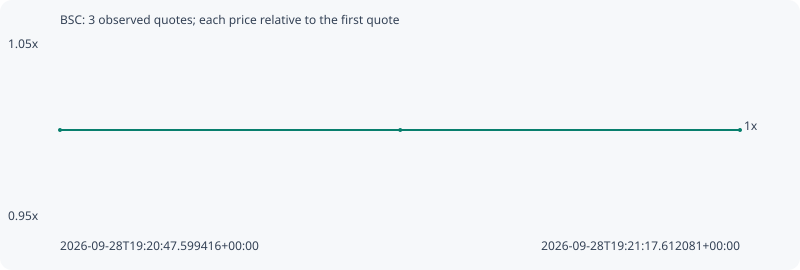

# BSC

**bsc** / `0xddb4c1ad32a29135e73997571e6a447335ed7777`

[All tokens](README.md) · [Market window](../README.md)

## Native assessments

This contract is in the quote cohort; it has no native model assessment in this window.

## Series 0967f6e24ecbb2c444c7

Pool: `not supplied`

[Complete series](../series/bsc/0967f6e24ecbb2c444c7.json)

Every dot is a captured quote. Lines connect observations; the curve ends at the last available quote.

| Peak | Final | Return | Maximum drawdown |
| ---: | ---: | ---: | ---: |
| 1.0000x | 1.0000x | +0.00% | 0.00% |

### Complete quote timeline

| Time (UTC) | Price (USD) | Multiple | Evidence |
| --- | ---: | ---: | --- |
| 2026-09-28T19:20:47.599416+00:00 | 1.02972e-05 | 1.0000x | `capture:1ab71e23-e150-479b-a1fa-e2a362332d1e:rank:92` |
| 2026-09-28T19:21:02.616817+00:00 | 1.02972e-05 | 1.0000x | `capture:ec0d171f-d990-484a-94d1-c335d7f6e8fb:rank:95` |
| 2026-09-28T19:21:17.612081+00:00 | 1.02972e-05 | 1.0000x | `capture:cc46cbda-0be4-42ba-bcf4-4a03c9e7e894:rank:98` |

### Exit-policy timeline

Calculated from captured quotes under the window policy. Native assessments are linked separately above.

| Time (UTC) | Action | Price (USD) | Evidence |
| --- | --- | ---: | --- |
| 2026-09-28T19:20:47.599416+00:00 | BUY | 1.02972e-05 | `capture:1ab71e23-e150-479b-a1fa-e2a362332d1e:rank:92` |
| 2026-09-28T19:21:02.616817+00:00 | HOLD | 1.02972e-05 | `capture:ec0d171f-d990-484a-94d1-c335d7f6e8fb:rank:95` |
| 2026-09-28T19:21:17.612081+00:00 | HOLD | 1.02972e-05 | `capture:cc46cbda-0be4-42ba-bcf4-4a03c9e7e894:rank:98` |
