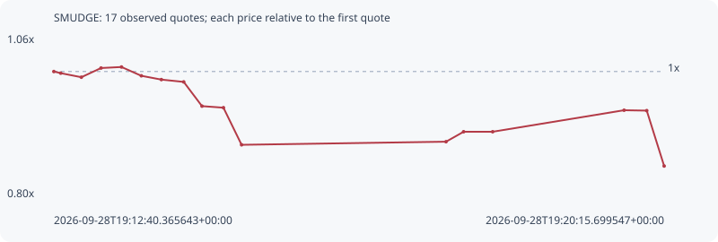

# SMUDGE

**solana** / `Af22pLvYvP5Tt8RyqdevgYefVujAa9eLNsa4rpDupump`

[All tokens](README.md) · [Market window](../README.md)

## Native assessments

This contract is in the quote cohort; it has no native model assessment in this window.

## Series 0a55386ff5a314dcf923

Pool: `not supplied`

[Complete series](../series/solana/0a55386ff5a314dcf923.json)

Every dot is a captured quote. Lines connect observations; the curve ends at the last available quote.

| Peak | Final | Return | Maximum drawdown |
| ---: | ---: | ---: | ---: |
| 1.0073x | 0.8483x | -15.17% | 15.78% |

### Complete quote timeline

| Time (UTC) | Price (USD) | Multiple | Evidence |
| --- | ---: | ---: | --- |
| 2026-09-28T19:12:40.365643+00:00 | 8.59102e-06 | 1.0000x | `capture:3af1faa1-2074-484e-893e-ed2c676e1576:rank:29` |
| 2026-09-28T19:12:45.490977+00:00 | 8.56873e-06 | 0.9974x | `capture:ac0279d6-7dd1-44b6-bf3e-910bf7b8eddf:rank:30` |
| 2026-09-28T19:13:00.884337+00:00 | 8.51274e-06 | 0.9909x | `capture:5867894f-39b4-4bcd-bd87-86394c63aab4:rank:33` |
| 2026-09-28T19:13:15.565374+00:00 | 8.63923e-06 | 1.0056x | `capture:ca31b3d4-ad60-4333-98b3-6d940a196f86:rank:36` |
| 2026-09-28T19:13:30.833894+00:00 | 8.65343e-06 | 1.0073x | `capture:2beb38a4-bfac-4502-bbc3-8c8c0f943007:rank:38` |
| 2026-09-28T19:13:45.640151+00:00 | 8.53215e-06 | 0.9931x | `capture:4d31b656-3ffe-4768-bef6-377adf019420:rank:40` |
| 2026-09-28T19:14:00.595194+00:00 | 8.4798e-06 | 0.9871x | `capture:2c78112b-48e7-4f74-8c2e-1cb8642a79dc:rank:40` |
| 2026-09-28T19:14:17.246316+00:00 | 8.44808e-06 | 0.9834x | `capture:7a923cde-d765-4388-a15c-4f47fde0a3b5:rank:41` |
| 2026-09-28T19:14:30.874732+00:00 | 8.11405e-06 | 0.9445x | `capture:fa585070-b1ae-4f9d-afbd-aa986f487793:rank:45` |
| 2026-09-28T19:14:46.892387+00:00 | 8.09261e-06 | 0.9420x | `capture:7d9e3e65-8bda-4696-b6d1-7a86825bd98c:rank:44` |
| 2026-09-28T19:15:00.432009+00:00 | 7.58069e-06 | 0.8824x | `capture:797f9a41-958a-44ba-ac57-3b9cacf5d06b:rank:45` |
| 2026-09-28T19:17:32.965607+00:00 | 7.6236e-06 | 0.8874x | `capture:0f04cfe5-88a0-4a83-ae8d-85c5cb3cdc89:rank:72` |
| 2026-09-28T19:17:46.087880+00:00 | 7.76097e-06 | 0.9034x | `capture:ee91a1c6-bc99-4c7a-9cdc-bd6cb5478a9b:rank:71` |
| 2026-09-28T19:18:07.749963+00:00 | 7.76097e-06 | 0.9034x | `capture:b0fb1b47-4973-472f-9619-8480bc7d294e:rank:80` |
| 2026-09-28T19:19:45.817199+00:00 | 8.05753e-06 | 0.9379x | `capture:722d1b7b-ef4f-4ac5-883c-0557bae2b60b:rank:92` |
| 2026-09-28T19:20:02.715590+00:00 | 8.05202e-06 | 0.9373x | `capture:60ff17d8-3b18-4f61-9bc7-006afd324cf2:rank:92` |
| 2026-09-28T19:20:15.699547+00:00 | 7.28806e-06 | 0.8483x | `capture:10a94828-637f-4580-a9f7-2fbd34d8589a:rank:95` |

### Exit-policy timeline

Calculated from captured quotes under the window policy. Native assessments are linked separately above.

| Time (UTC) | Action | Price (USD) | Evidence |
| --- | --- | ---: | --- |
| 2026-09-28T19:12:40.365643+00:00 | BUY | 8.59102e-06 | `capture:3af1faa1-2074-484e-893e-ed2c676e1576:rank:29` |
| 2026-09-28T19:12:45.490977+00:00 | HOLD | 8.56873e-06 | `capture:ac0279d6-7dd1-44b6-bf3e-910bf7b8eddf:rank:30` |
| 2026-09-28T19:13:00.884337+00:00 | HOLD | 8.51274e-06 | `capture:5867894f-39b4-4bcd-bd87-86394c63aab4:rank:33` |
| 2026-09-28T19:13:15.565374+00:00 | HOLD | 8.63923e-06 | `capture:ca31b3d4-ad60-4333-98b3-6d940a196f86:rank:36` |
| 2026-09-28T19:13:30.833894+00:00 | HOLD | 8.65343e-06 | `capture:2beb38a4-bfac-4502-bbc3-8c8c0f943007:rank:38` |
| 2026-09-28T19:13:45.640151+00:00 | HOLD | 8.53215e-06 | `capture:4d31b656-3ffe-4768-bef6-377adf019420:rank:40` |
| 2026-09-28T19:14:00.595194+00:00 | HOLD | 8.4798e-06 | `capture:2c78112b-48e7-4f74-8c2e-1cb8642a79dc:rank:40` |
| 2026-09-28T19:14:17.246316+00:00 | HOLD | 8.44808e-06 | `capture:7a923cde-d765-4388-a15c-4f47fde0a3b5:rank:41` |
| 2026-09-28T19:14:30.874732+00:00 | HOLD | 8.11405e-06 | `capture:fa585070-b1ae-4f9d-afbd-aa986f487793:rank:45` |
| 2026-09-28T19:14:46.892387+00:00 | HOLD | 8.09261e-06 | `capture:7d9e3e65-8bda-4696-b6d1-7a86825bd98c:rank:44` |
| 2026-09-28T19:15:00.432009+00:00 | SL | 7.58069e-06 | `capture:797f9a41-958a-44ba-ac57-3b9cacf5d06b:rank:45` |
