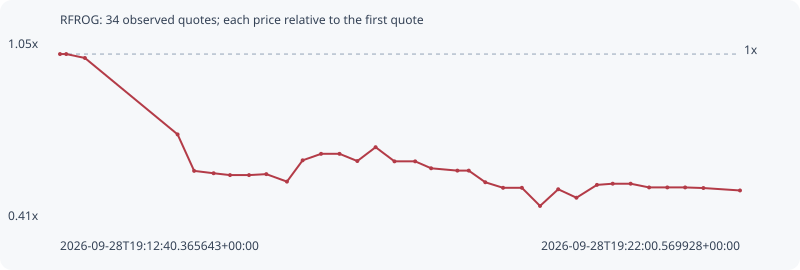

# RFROG

**solana** / `CStde7WQL1a9XEo5n6SZJpaYuiovaHWGNELDyUKhViBs`

[All tokens](README.md) · [Market window](../README.md)

## Native assessments

This contract is in the quote cohort; it has no native model assessment in this window.

## Series 09f5abf94036f2348130

Pool: `not supplied`

[Complete series](../series/solana/09f5abf94036f2348130.json)

Every dot is a captured quote. Lines connect observations; the curve ends at the last available quote.

| Peak | Final | Return | Maximum drawdown |
| ---: | ---: | ---: | ---: |
| 1.0000x | 0.5147x | -48.53% | 54.03% |

### Complete quote timeline

| Time (UTC) | Price (USD) | Multiple | Evidence |
| --- | ---: | ---: | --- |
| 2026-09-28T19:12:40.365643+00:00 | 1.38143e-05 | 1.0000x | `capture:3af1faa1-2074-484e-893e-ed2c676e1576:rank:95` |
| 2026-09-28T19:12:45.490977+00:00 | 1.38143e-05 | 1.0000x | `capture:ac0279d6-7dd1-44b6-bf3e-910bf7b8eddf:rank:94` |
| 2026-09-28T19:13:00.884337+00:00 | 1.36206e-05 | 0.9860x | `capture:5867894f-39b4-4bcd-bd87-86394c63aab4:rank:97` |
| 2026-09-28T19:14:17.246316+00:00 | 9.86493e-06 | 0.7141x | `capture:7a923cde-d765-4388-a15c-4f47fde0a3b5:rank:86` |
| 2026-09-28T19:14:30.874732+00:00 | 8.07333e-06 | 0.5844x | `capture:fa585070-b1ae-4f9d-afbd-aa986f487793:rank:80` |
| 2026-09-28T19:14:46.892387+00:00 | 7.9567e-06 | 0.5760x | `capture:7d9e3e65-8bda-4696-b6d1-7a86825bd98c:rank:83` |
| 2026-09-28T19:15:00.432009+00:00 | 7.86584e-06 | 0.5694x | `capture:797f9a41-958a-44ba-ac57-3b9cacf5d06b:rank:80` |
| 2026-09-28T19:15:16.098308+00:00 | 7.86584e-06 | 0.5694x | `capture:ab2becb9-3f94-4a57-b9e8-472ad0998012:rank:78` |
| 2026-09-28T19:15:30.340579+00:00 | 7.9133e-06 | 0.5728x | `capture:564db5fc-5586-41d3-88fb-a9a955708f1d:rank:79` |
| 2026-09-28T19:15:47.323285+00:00 | 7.54506e-06 | 0.5462x | `capture:65003429-a569-4442-8d4f-b2c93db69061:rank:80` |
| 2026-09-28T19:16:00.259696+00:00 | 8.59189e-06 | 0.6220x | `capture:4236f8d5-90c4-4c9b-a73e-d6443ae3bf32:rank:77` |
| 2026-09-28T19:16:15.455827+00:00 | 8.91092e-06 | 0.6451x | `capture:acc657c6-9a43-46bf-986e-7b907c831cba:rank:78` |
| 2026-09-28T19:16:30.624202+00:00 | 8.91092e-06 | 0.6451x | `capture:0d391072-ec81-4bb7-9be0-0d6bbb801c70:rank:77` |
| 2026-09-28T19:16:45.311485+00:00 | 8.55589e-06 | 0.6194x | `capture:72cccbac-c3fe-4991-8f62-08c53849b146:rank:75` |
| 2026-09-28T19:17:00.368914+00:00 | 9.23707e-06 | 0.6687x | `capture:1232cf18-7088-40a1-9f55-ad9ae22b44f5:rank:76` |
| 2026-09-28T19:17:15.914647+00:00 | 8.54095e-06 | 0.6183x | `capture:9792e199-c0c2-4272-ac95-24501e4a3f79:rank:72` |
| 2026-09-28T19:17:32.965607+00:00 | 8.54095e-06 | 0.6183x | `capture:0f04cfe5-88a0-4a83-ae8d-85c5cb3cdc89:rank:73` |
| 2026-09-28T19:17:46.087880+00:00 | 8.2005e-06 | 0.5936x | `capture:ee91a1c6-bc99-4c7a-9cdc-bd6cb5478a9b:rank:74` |
| 2026-09-28T19:18:07.749963+00:00 | 8.08576e-06 | 0.5853x | `capture:b0fb1b47-4973-472f-9619-8480bc7d294e:rank:73` |
| 2026-09-28T19:18:17.126008+00:00 | 8.08576e-06 | 0.5853x | `capture:5ed98f51-d1e1-422a-81df-4186a8b0a0a2:rank:73` |
| 2026-09-28T19:18:30.722167+00:00 | 7.514e-06 | 0.5439x | `capture:9f88d118-9108-4dff-bbfc-246eaed5ce38:rank:76` |
| 2026-09-28T19:18:45.386687+00:00 | 7.24138e-06 | 0.5242x | `capture:f533100a-ce62-4457-9107-42e7601ea5d7:rank:78` |
| 2026-09-28T19:19:00.883835+00:00 | 7.24138e-06 | 0.5242x | `capture:a2495d99-5671-4c7e-b87c-48f48d90f2f2:rank:81` |
| 2026-09-28T19:19:15.826416+00:00 | 6.34981e-06 | 0.4597x | `capture:ba1dc6a3-b8b7-461a-8110-8490f03539a5:rank:82` |
| 2026-09-28T19:19:30.814098+00:00 | 7.17016e-06 | 0.5190x | `capture:b25d90dc-c8db-4388-8a2b-d06541e5320f:rank:84` |
| 2026-09-28T19:19:45.817199+00:00 | 6.75354e-06 | 0.4889x | `capture:722d1b7b-ef4f-4ac5-883c-0557bae2b60b:rank:89` |
| 2026-09-28T19:20:02.715590+00:00 | 7.38447e-06 | 0.5346x | `capture:60ff17d8-3b18-4f61-9bc7-006afd324cf2:rank:89` |
| 2026-09-28T19:20:15.699547+00:00 | 7.44278e-06 | 0.5388x | `capture:10a94828-637f-4580-a9f7-2fbd34d8589a:rank:90` |
| 2026-09-28T19:20:30.480194+00:00 | 7.44278e-06 | 0.5388x | `capture:54722132-db1d-4a2b-8c1c-2b0e71d01430:rank:89` |
| 2026-09-28T19:20:45.683165+00:00 | 7.25965e-06 | 0.5255x | `capture:17963a37-fd65-46b6-8e1c-350082721f8c:rank:92` |
| 2026-09-28T19:21:00.690136+00:00 | 7.25965e-06 | 0.5255x | `capture:f2ff842d-38e9-4cbe-a281-98c17d5a5672:rank:91` |
| 2026-09-28T19:21:15.372716+00:00 | 7.25965e-06 | 0.5255x | `capture:a923b968-a768-495e-ae33-6de2042c551f:rank:95` |
| 2026-09-28T19:21:30.402460+00:00 | 7.23016e-06 | 0.5234x | `capture:d926629b-2050-4e50-a602-1638c6205870:rank:87` |
| 2026-09-28T19:22:00.569928+00:00 | 7.11084e-06 | 0.5147x | `capture:263cda40-4b31-4b2d-b168-fa4310edb46d:rank:98` |

### Exit-policy timeline

Calculated from captured quotes under the window policy. Native assessments are linked separately above.

| Time (UTC) | Action | Price (USD) | Evidence |
| --- | --- | ---: | --- |
| 2026-09-28T19:12:40.365643+00:00 | BUY | 1.38143e-05 | `capture:3af1faa1-2074-484e-893e-ed2c676e1576:rank:95` |
| 2026-09-28T19:12:45.490977+00:00 | HOLD | 1.38143e-05 | `capture:ac0279d6-7dd1-44b6-bf3e-910bf7b8eddf:rank:94` |
| 2026-09-28T19:13:00.884337+00:00 | HOLD | 1.36206e-05 | `capture:5867894f-39b4-4bcd-bd87-86394c63aab4:rank:97` |
| 2026-09-28T19:14:17.246316+00:00 | SL | 9.86493e-06 | `capture:7a923cde-d765-4388-a15c-4f47fde0a3b5:rank:86` |
