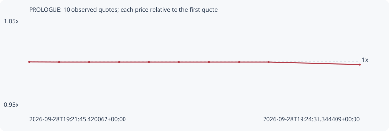

# PROLOGUE

**robinhood** / `0xb9972ca7188e511174947e3936a5315ac7073277`

[All tokens](README.md) · [Market window](../README.md)

## Native assessments

This contract is in the quote cohort; it has no native model assessment in this window.

## Series d74fb4d6a23c69f02aae

Pool: `not supplied`

[Complete series](../series/robinhood/d74fb4d6a23c69f02aae.json)

Every dot is a captured quote. Lines connect observations; the curve ends at the last available quote.

| Peak | Final | Return | Maximum drawdown |
| ---: | ---: | ---: | ---: |
| 1.0000x | 0.9969x | -0.31% | 0.31% |

### Complete quote timeline

| Time (UTC) | Price (USD) | Multiple | Evidence |
| --- | ---: | ---: | --- |
| 2026-09-28T19:21:45.420062+00:00 | 0.00810412 | 1.0000x | `capture:ec22b61b-732a-44d2-be85-c577051928eb:rank:99` |
| 2026-09-28T19:22:00.489634+00:00 | 0.00810264 | 0.9998x | `capture:d6c64542-18c5-48a0-a6c9-f0e2a9c54b41:rank:87` |
| 2026-09-28T19:22:15.632268+00:00 | 0.00810264 | 0.9998x | `capture:13e6d33e-e854-4b87-b3da-49aedec6950e:rank:84` |
| 2026-09-28T19:22:30.535979+00:00 | 0.00810264 | 0.9998x | `capture:091fb4d2-10fc-4d5f-9c22-af9f55e90e4a:rank:91` |
| 2026-09-28T19:22:45.520851+00:00 | 0.00810264 | 0.9998x | `capture:128617a9-4055-4a8d-8b04-c8876bad9c70:rank:90` |
| 2026-09-28T19:23:00.594785+00:00 | 0.00810264 | 0.9998x | `capture:b6c633f1-3960-4db3-a2ca-34618f913368:rank:95` |
| 2026-09-28T19:23:15.534636+00:00 | 0.00810264 | 0.9998x | `capture:d5a0d1a4-a366-4985-80da-e34160e2f58c:rank:92` |
| 2026-09-28T19:23:30.815940+00:00 | 0.00810264 | 0.9998x | `capture:c6f23ed9-c47c-4f73-bf08-86a494a11aa2:rank:95` |
| 2026-09-28T19:23:45.643860+00:00 | 0.00810264 | 0.9998x | `capture:0b8bbeb9-cbaa-4cb2-a853-2bb146bd23e5:rank:96` |
| 2026-09-28T19:24:31.344409+00:00 | 0.00807875 | 0.9969x | `capture:85f4db1c-c852-45c3-99aa-4320f3839031:rank:94` |

### Exit-policy timeline

Calculated from captured quotes under the window policy. Native assessments are linked separately above.

| Time (UTC) | Action | Price (USD) | Evidence |
| --- | --- | ---: | --- |
| 2026-09-28T19:21:45.420062+00:00 | BUY | 0.00810412 | `capture:ec22b61b-732a-44d2-be85-c577051928eb:rank:99` |
| 2026-09-28T19:22:00.489634+00:00 | HOLD | 0.00810264 | `capture:d6c64542-18c5-48a0-a6c9-f0e2a9c54b41:rank:87` |
| 2026-09-28T19:22:15.632268+00:00 | HOLD | 0.00810264 | `capture:13e6d33e-e854-4b87-b3da-49aedec6950e:rank:84` |
| 2026-09-28T19:22:30.535979+00:00 | HOLD | 0.00810264 | `capture:091fb4d2-10fc-4d5f-9c22-af9f55e90e4a:rank:91` |
| 2026-09-28T19:22:45.520851+00:00 | HOLD | 0.00810264 | `capture:128617a9-4055-4a8d-8b04-c8876bad9c70:rank:90` |
| 2026-09-28T19:23:00.594785+00:00 | HOLD | 0.00810264 | `capture:b6c633f1-3960-4db3-a2ca-34618f913368:rank:95` |
| 2026-09-28T19:23:15.534636+00:00 | HOLD | 0.00810264 | `capture:d5a0d1a4-a366-4985-80da-e34160e2f58c:rank:92` |
| 2026-09-28T19:23:30.815940+00:00 | HOLD | 0.00810264 | `capture:c6f23ed9-c47c-4f73-bf08-86a494a11aa2:rank:95` |
| 2026-09-28T19:23:45.643860+00:00 | HOLD | 0.00810264 | `capture:0b8bbeb9-cbaa-4cb2-a853-2bb146bd23e5:rank:96` |
| 2026-09-28T19:24:31.344409+00:00 | HOLD | 0.00807875 | `capture:85f4db1c-c852-45c3-99aa-4320f3839031:rank:94` |
