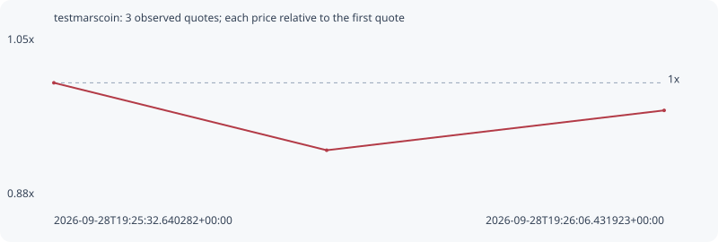

# testmarscoin

**bsc** / `0xfce886d0e0bb01b3611c94dee215bfd280037777`

[All tokens](README.md) · [Market window](../README.md)

## Native assessments

This contract is in the quote cohort; it has no native model assessment in this window.

## Series a277905d0e0b50b0e42f

Pool: `not supplied`

[Complete series](../series/bsc/a277905d0e0b50b0e42f.json)

Every dot is a captured quote. Lines connect observations; the curve ends at the last available quote.

| Peak | Final | Return | Maximum drawdown |
| ---: | ---: | ---: | ---: |
| 1.0000x | 0.9706x | -2.94% | 7.18% |

### Complete quote timeline

| Time (UTC) | Price (USD) | Multiple | Evidence |
| --- | ---: | ---: | --- |
| 2026-09-28T19:25:32.640282+00:00 | 9.50024e-06 | 1.0000x | `capture:a41f01eb-b1b7-4ed5-a604-19b71e522502:rank:35` |
| 2026-09-28T19:25:47.745538+00:00 | 8.81816e-06 | 0.9282x | `capture:b20e5ea5-a03d-4b94-91ce-404a72f5de9b:rank:32` |
| 2026-09-28T19:26:06.431923+00:00 | 9.22118e-06 | 0.9706x | `capture:a3278748-b5f3-45be-a966-ab473520d9c2:rank:32` |

### Exit-policy timeline

Calculated from captured quotes under the window policy. Native assessments are linked separately above.

| Time (UTC) | Action | Price (USD) | Evidence |
| --- | --- | ---: | --- |
| 2026-09-28T19:25:32.640282+00:00 | BUY | 9.50024e-06 | `capture:a41f01eb-b1b7-4ed5-a604-19b71e522502:rank:35` |
| 2026-09-28T19:25:47.745538+00:00 | HOLD | 8.81816e-06 | `capture:b20e5ea5-a03d-4b94-91ce-404a72f5de9b:rank:32` |
| 2026-09-28T19:26:06.431923+00:00 | HOLD | 9.22118e-06 | `capture:a3278748-b5f3-45be-a966-ab473520d9c2:rank:32` |
