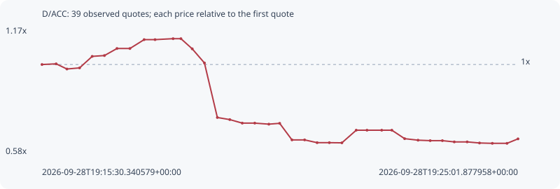

# D/ACC

**solana** / `BcQ7PJS4sswSewssiEr1MoYWRj4AELCywZdmcT83gbkg`

[All tokens](README.md) · [Market window](../README.md)

## Native assessments

This contract is in the quote cohort; it has no native model assessment in this window.

## Series 0be1f6447c6e4e1b22ef

Pool: `not supplied`

[Complete series](../series/solana/0be1f6447c6e4e1b22ef.json)

Every dot is a captured quote. Lines connect observations; the curve ends at the last available quote.

| Peak | Final | Return | Maximum drawdown |
| ---: | ---: | ---: | ---: |
| 1.1212x | 0.6514x | -34.86% | 43.77% |

### Complete quote timeline

| Time (UTC) | Price (USD) | Multiple | Evidence |
| --- | ---: | ---: | --- |
| 2026-09-28T19:15:30.340579+00:00 | 1.50413e-05 | 1.0000x | `capture:564db5fc-5586-41d3-88fb-a9a955708f1d:rank:97` |
| 2026-09-28T19:15:47.323285+00:00 | 1.50881e-05 | 1.0031x | `capture:65003429-a569-4442-8d4f-b2c93db69061:rank:94` |
| 2026-09-28T19:16:00.259696+00:00 | 1.47247e-05 | 0.9790x | `capture:4236f8d5-90c4-4c9b-a73e-d6443ae3bf32:rank:95` |
| 2026-09-28T19:16:15.455827+00:00 | 1.48023e-05 | 0.9841x | `capture:acc657c6-9a43-46bf-986e-7b907c831cba:rank:94` |
| 2026-09-28T19:16:30.624202+00:00 | 1.56158e-05 | 1.0382x | `capture:0d391072-ec81-4bb7-9be0-0d6bbb801c70:rank:83` |
| 2026-09-28T19:16:45.311485+00:00 | 1.56739e-05 | 1.0421x | `capture:72cccbac-c3fe-4991-8f62-08c53849b146:rank:86` |
| 2026-09-28T19:17:00.368914+00:00 | 1.61705e-05 | 1.0751x | `capture:1232cf18-7088-40a1-9f55-ad9ae22b44f5:rank:85` |
| 2026-09-28T19:17:15.914647+00:00 | 1.61705e-05 | 1.0751x | `capture:9792e199-c0c2-4272-ac95-24501e4a3f79:rank:86` |
| 2026-09-28T19:17:32.965607+00:00 | 1.67956e-05 | 1.1166x | `capture:0f04cfe5-88a0-4a83-ae8d-85c5cb3cdc89:rank:84` |
| 2026-09-28T19:17:46.087880+00:00 | 1.67956e-05 | 1.1166x | `capture:ee91a1c6-bc99-4c7a-9cdc-bd6cb5478a9b:rank:84` |
| 2026-09-28T19:18:07.749963+00:00 | 1.68636e-05 | 1.1212x | `capture:b0fb1b47-4973-472f-9619-8480bc7d294e:rank:92` |
| 2026-09-28T19:18:17.126008+00:00 | 1.68636e-05 | 1.1212x | `capture:5ed98f51-d1e1-422a-81df-4186a8b0a0a2:rank:88` |
| 2026-09-28T19:18:30.722167+00:00 | 1.61468e-05 | 1.0735x | `capture:9f88d118-9108-4dff-bbfc-246eaed5ce38:rank:88` |
| 2026-09-28T19:18:45.386687+00:00 | 1.51491e-05 | 1.0072x | `capture:f533100a-ce62-4457-9107-42e7601ea5d7:rank:87` |
| 2026-09-28T19:19:00.883835+00:00 | 1.13048e-05 | 0.7516x | `capture:a2495d99-5671-4c7e-b87c-48f48d90f2f2:rank:77` |
| 2026-09-28T19:19:15.826416+00:00 | 1.11567e-05 | 0.7417x | `capture:ba1dc6a3-b8b7-461a-8110-8490f03539a5:rank:85` |
| 2026-09-28T19:19:30.814098+00:00 | 1.09078e-05 | 0.7252x | `capture:b25d90dc-c8db-4388-8a2b-d06541e5320f:rank:83` |
| 2026-09-28T19:19:45.817199+00:00 | 1.09078e-05 | 0.7252x | `capture:722d1b7b-ef4f-4ac5-883c-0557bae2b60b:rank:81` |
| 2026-09-28T19:20:02.715590+00:00 | 1.08351e-05 | 0.7204x | `capture:60ff17d8-3b18-4f61-9bc7-006afd324cf2:rank:75` |
| 2026-09-28T19:20:15.699547+00:00 | 1.08938e-05 | 0.7243x | `capture:10a94828-637f-4580-a9f7-2fbd34d8589a:rank:75` |
| 2026-09-28T19:20:30.480194+00:00 | 9.72527e-06 | 0.6466x | `capture:54722132-db1d-4a2b-8c1c-2b0e71d01430:rank:74` |
| 2026-09-28T19:20:45.683165+00:00 | 9.72527e-06 | 0.6466x | `capture:17963a37-fd65-46b6-8e1c-350082721f8c:rank:77` |
| 2026-09-28T19:21:00.690136+00:00 | 9.52926e-06 | 0.6335x | `capture:f2ff842d-38e9-4cbe-a281-98c17d5a5672:rank:75` |
| 2026-09-28T19:21:15.372716+00:00 | 9.52926e-06 | 0.6335x | `capture:a923b968-a768-495e-ae33-6de2042c551f:rank:72` |
| 2026-09-28T19:21:30.402460+00:00 | 9.51855e-06 | 0.6328x | `capture:d926629b-2050-4e50-a602-1638c6205870:rank:67` |
| 2026-09-28T19:21:47.649380+00:00 | 1.04092e-05 | 0.6920x | `capture:0799ec6d-0e89-46b5-ae88-5695bf6c5fc3:rank:73` |
| 2026-09-28T19:22:00.569928+00:00 | 1.04092e-05 | 0.6920x | `capture:263cda40-4b31-4b2d-b168-fa4310edb46d:rank:73` |
| 2026-09-28T19:22:18.240717+00:00 | 1.04092e-05 | 0.6920x | `capture:546b2c55-1845-4da7-bc9c-4439cd0ccdba:rank:72` |
| 2026-09-28T19:22:30.371968+00:00 | 1.04092e-05 | 0.6920x | `capture:507d17cb-af67-4a81-a2b2-d5ddfbc40021:rank:75` |
| 2026-09-28T19:22:45.783808+00:00 | 9.81183e-06 | 0.6523x | `capture:9558d322-c429-480b-885f-82f4481c8506:rank:76` |
| 2026-09-28T19:23:01.833252+00:00 | 9.70533e-06 | 0.6452x | `capture:c5462412-2da1-4432-8949-8fcd1492c57f:rank:74` |
| 2026-09-28T19:23:16.460099+00:00 | 9.67215e-06 | 0.6430x | `capture:2d456a2a-6755-4e1d-9a80-b6e3b2d44ec1:rank:76` |
| 2026-09-28T19:23:31.092727+00:00 | 9.67215e-06 | 0.6430x | `capture:0e687519-8b01-4d7e-b48c-e2ec34135d17:rank:76` |
| 2026-09-28T19:23:45.375171+00:00 | 9.58449e-06 | 0.6372x | `capture:1b404fa0-870b-4e7c-bafd-c3ef241c5093:rank:77` |
| 2026-09-28T19:24:00.852400+00:00 | 9.58449e-06 | 0.6372x | `capture:5205c587-4734-452c-b758-46c4814dded1:rank:77` |
| 2026-09-28T19:24:15.655418+00:00 | 9.50684e-06 | 0.6320x | `capture:5b9df0f6-51c0-4dbb-9de7-7df7a46bfee0:rank:97` |
| 2026-09-28T19:24:31.056437+00:00 | 9.48268e-06 | 0.6304x | `capture:971b5dda-397d-4fe7-b49e-94713bb088df:rank:96` |
| 2026-09-28T19:24:48.687179+00:00 | 9.48268e-06 | 0.6304x | `capture:feb72cbd-a170-4ba3-8a11-eb1df1686719:rank:97` |
| 2026-09-28T19:25:01.877958+00:00 | 9.79826e-06 | 0.6514x | `capture:fd6d01ae-d246-439e-ac58-27ae75880eb9:rank:91` |

### Exit-policy timeline

Calculated from captured quotes under the window policy. Native assessments are linked separately above.

| Time (UTC) | Action | Price (USD) | Evidence |
| --- | --- | ---: | --- |
| 2026-09-28T19:15:30.340579+00:00 | BUY | 1.50413e-05 | `capture:564db5fc-5586-41d3-88fb-a9a955708f1d:rank:97` |
| 2026-09-28T19:15:47.323285+00:00 | HOLD | 1.50881e-05 | `capture:65003429-a569-4442-8d4f-b2c93db69061:rank:94` |
| 2026-09-28T19:16:00.259696+00:00 | HOLD | 1.47247e-05 | `capture:4236f8d5-90c4-4c9b-a73e-d6443ae3bf32:rank:95` |
| 2026-09-28T19:16:15.455827+00:00 | HOLD | 1.48023e-05 | `capture:acc657c6-9a43-46bf-986e-7b907c831cba:rank:94` |
| 2026-09-28T19:16:30.624202+00:00 | HOLD | 1.56158e-05 | `capture:0d391072-ec81-4bb7-9be0-0d6bbb801c70:rank:83` |
| 2026-09-28T19:16:45.311485+00:00 | HOLD | 1.56739e-05 | `capture:72cccbac-c3fe-4991-8f62-08c53849b146:rank:86` |
| 2026-09-28T19:17:00.368914+00:00 | HOLD | 1.61705e-05 | `capture:1232cf18-7088-40a1-9f55-ad9ae22b44f5:rank:85` |
| 2026-09-28T19:17:15.914647+00:00 | HOLD | 1.61705e-05 | `capture:9792e199-c0c2-4272-ac95-24501e4a3f79:rank:86` |
| 2026-09-28T19:17:32.965607+00:00 | HOLD | 1.67956e-05 | `capture:0f04cfe5-88a0-4a83-ae8d-85c5cb3cdc89:rank:84` |
| 2026-09-28T19:17:46.087880+00:00 | HOLD | 1.67956e-05 | `capture:ee91a1c6-bc99-4c7a-9cdc-bd6cb5478a9b:rank:84` |
| 2026-09-28T19:18:07.749963+00:00 | HOLD | 1.68636e-05 | `capture:b0fb1b47-4973-472f-9619-8480bc7d294e:rank:92` |
| 2026-09-28T19:18:17.126008+00:00 | HOLD | 1.68636e-05 | `capture:5ed98f51-d1e1-422a-81df-4186a8b0a0a2:rank:88` |
| 2026-09-28T19:18:30.722167+00:00 | HOLD | 1.61468e-05 | `capture:9f88d118-9108-4dff-bbfc-246eaed5ce38:rank:88` |
| 2026-09-28T19:18:45.386687+00:00 | HOLD | 1.51491e-05 | `capture:f533100a-ce62-4457-9107-42e7601ea5d7:rank:87` |
| 2026-09-28T19:19:00.883835+00:00 | SL | 1.13048e-05 | `capture:a2495d99-5671-4c7e-b87c-48f48d90f2f2:rank:77` |
