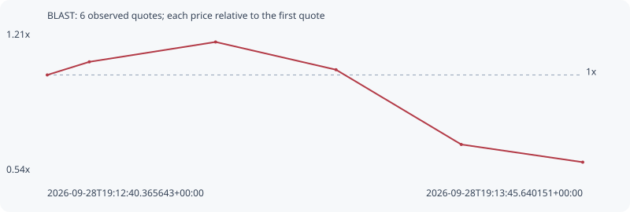

# BLAST

**solana** / `D4GkdYbVphmZEPr24kGRjZ3S6v4zkJEe4oYnh7ZTpump`

[All tokens](README.md) · [Market window](../README.md)

## Native assessments

- [2026-09-28T19:12:40.365643Z](../cases/74ae3bd3e72c9ff3.md): source parameters and model answers.

## Series 62602d9af8ad5b1d77b5

Pool: `not supplied`

[Complete series](../series/solana/62602d9af8ad5b1d77b5.json)

Every dot is a captured quote. Lines connect observations; the curve ends at the last available quote.

| Peak | Final | Return | Maximum drawdown |
| ---: | ---: | ---: | ---: |
| 1.1560x | 0.5872x | -41.28% | 49.20% |

### Complete quote timeline

| Time (UTC) | Price (USD) | Multiple | Evidence |
| --- | ---: | ---: | --- |
| 2026-09-28T19:12:40.365643+00:00 | 5.56835e-05 | 1.0000x | `capture:3af1faa1-2074-484e-893e-ed2c676e1576:rank:6` |
| 2026-09-28T19:12:45.490977+00:00 | 5.91348e-05 | 1.0620x | `capture:ac0279d6-7dd1-44b6-bf3e-910bf7b8eddf:rank:6` |
| 2026-09-28T19:13:00.884337+00:00 | 6.43701e-05 | 1.1560x | `capture:5867894f-39b4-4bcd-bd87-86394c63aab4:rank:7` |
| 2026-09-28T19:13:15.565374+00:00 | 5.70563e-05 | 1.0247x | `capture:ca31b3d4-ad60-4333-98b3-6d940a196f86:rank:6` |
| 2026-09-28T19:13:30.833894+00:00 | 3.736e-05 | 0.6709x | `capture:2beb38a4-bfac-4502-bbc3-8c8c0f943007:rank:6` |
| 2026-09-28T19:13:45.640151+00:00 | 3.26987e-05 | 0.5872x | `capture:4d31b656-3ffe-4768-bef6-377adf019420:rank:5` |

### Exit-policy timeline

Calculated from captured quotes under the window policy. Native assessments are linked separately above.

| Time (UTC) | Action | Price (USD) | Evidence |
| --- | --- | ---: | --- |
| 2026-09-28T19:12:40.365643+00:00 | BUY | 5.56835e-05 | `capture:3af1faa1-2074-484e-893e-ed2c676e1576:rank:6` |
| 2026-09-28T19:12:45.490977+00:00 | HOLD | 5.91348e-05 | `capture:ac0279d6-7dd1-44b6-bf3e-910bf7b8eddf:rank:6` |
| 2026-09-28T19:13:00.884337+00:00 | HOLD | 6.43701e-05 | `capture:5867894f-39b4-4bcd-bd87-86394c63aab4:rank:7` |
| 2026-09-28T19:13:15.565374+00:00 | HOLD | 5.70563e-05 | `capture:ca31b3d4-ad60-4333-98b3-6d940a196f86:rank:6` |
| 2026-09-28T19:13:30.833894+00:00 | SL | 3.736e-05 | `capture:2beb38a4-bfac-4502-bbc3-8c8c0f943007:rank:6` |
