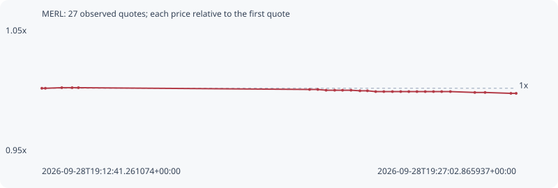

# MERL

**bsc** / `0xa0c56a8c0692bd10b3fa8f8ba79cf5332b7107f9`

[All tokens](README.md) · [Market window](../README.md)

## Native assessments

This contract is in the quote cohort; it has no native model assessment in this window.

## Series 80a5fb7e694c020d45e8

Pool: `not supplied`

[Complete series](../series/bsc/80a5fb7e694c020d45e8.json)

Every dot is a captured quote. Lines connect observations; the curve ends at the last available quote.

| Peak | Final | Return | Maximum drawdown |
| ---: | ---: | ---: | ---: |
| 1.0005x | 0.9958x | -0.42% | 0.47% |

### Complete quote timeline

| Time (UTC) | Price (USD) | Multiple | Evidence |
| --- | ---: | ---: | --- |
| 2026-09-28T19:12:41.261074+00:00 | 0.0275353 | 1.0000x | `capture:795a88f0-804c-4f14-a3e8-ce8d9318f6df:rank:98` |
| 2026-09-28T19:12:47.639745+00:00 | 0.0275353 | 1.0000x | `capture:c2d8bd1a-9ed6-4d75-91ae-006bea65a635:rank:98` |
| 2026-09-28T19:13:17.511052+00:00 | 0.0275485 | 1.0005x | `capture:87e92f15-0601-4987-bd47-ae2e9f91de16:rank:97` |
| 2026-09-28T19:13:36.268178+00:00 | 0.0275485 | 1.0005x | `capture:577859f6-aadc-4653-b269-a860dbe8c41c:rank:97` |
| 2026-09-28T19:13:47.694462+00:00 | 0.0275485 | 1.0005x | `capture:4e60f1a9-1927-46db-ae10-f1b1530de61d:rank:99` |
| 2026-09-28T19:20:47.599416+00:00 | 0.0275078 | 0.9990x | `capture:1ab71e23-e150-479b-a1fa-e2a362332d1e:rank:86` |
| 2026-09-28T19:21:02.616817+00:00 | 0.0275078 | 0.9990x | `capture:ec0d171f-d990-484a-94d1-c335d7f6e8fb:rank:88` |
| 2026-09-28T19:21:17.612081+00:00 | 0.0274903 | 0.9984x | `capture:cc46cbda-0be4-42ba-bcf4-4a03c9e7e894:rank:77` |
| 2026-09-28T19:21:33.217678+00:00 | 0.0274903 | 0.9984x | `capture:3a34cabb-e5ee-4ff6-9f92-f0839c39884f:rank:74` |
| 2026-09-28T19:21:47.485842+00:00 | 0.0274903 | 0.9984x | `capture:9e0730ff-182b-409c-b854-c06b993be570:rank:90` |
| 2026-09-28T19:22:02.883000+00:00 | 0.0274903 | 0.9984x | `capture:eb8228cb-dfba-443e-9576-ee214dcd3354:rank:93` |
| 2026-09-28T19:22:19.090071+00:00 | 0.0274775 | 0.9979x | `capture:30ef0b61-e0e1-4eba-95c6-de3dc48fe868:rank:78` |
| 2026-09-28T19:22:32.671189+00:00 | 0.0274775 | 0.9979x | `capture:5d031323-644d-4272-bacc-8a363d4b77cb:rank:82` |
| 2026-09-28T19:22:47.674643+00:00 | 0.0274589 | 0.9972x | `capture:c8838291-6f5a-42d9-9013-9d9421deb79e:rank:68` |
| 2026-09-28T19:23:02.516005+00:00 | 0.0274589 | 0.9972x | `capture:f8b60e63-80ce-442a-9ca7-659f2b5ca21d:rank:69` |
| 2026-09-28T19:23:18.123882+00:00 | 0.0274589 | 0.9972x | `capture:f689df34-2acf-42e7-a37b-1a7d50808302:rank:71` |
| 2026-09-28T19:23:33.140484+00:00 | 0.0274589 | 0.9972x | `capture:ef2304f7-c374-4b90-a3e4-d8976f05c226:rank:80` |
| 2026-09-28T19:23:47.927661+00:00 | 0.0274589 | 0.9972x | `capture:51aa913c-158f-4059-8727-ff1ace24834c:rank:80` |
| 2026-09-28T19:24:02.684719+00:00 | 0.0274589 | 0.9972x | `capture:77fa5264-b080-4409-8d15-3f5504293a7d:rank:81` |
| 2026-09-28T19:24:17.754261+00:00 | 0.0274589 | 0.9972x | `capture:9e642626-a894-4304-aad8-bfad3e85b1e6:rank:95` |
| 2026-09-28T19:24:32.694463+00:00 | 0.0274589 | 0.9972x | `capture:2934d705-4adf-40dc-b5ef-2f9f3edbbe61:rank:95` |
| 2026-09-28T19:24:47.591753+00:00 | 0.0274589 | 0.9972x | `capture:1cb45dcb-fe83-4fcc-8cfd-c5de8d369858:rank:96` |
| 2026-09-28T19:25:03.394485+00:00 | 0.0274589 | 0.9972x | `capture:f1b0620f-7caf-483d-8db4-440b4d786962:rank:96` |
| 2026-09-28T19:25:47.745538+00:00 | 0.0274388 | 0.9965x | `capture:b20e5ea5-a03d-4b94-91ce-404a72f5de9b:rank:96` |
| 2026-09-28T19:26:06.431923+00:00 | 0.0274388 | 0.9965x | `capture:a3278748-b5f3-45be-a966-ab473520d9c2:rank:92` |
| 2026-09-28T19:26:53.320509+00:00 | 0.0274186 | 0.9958x | `capture:5f09420c-1544-46ff-a2e4-39235f8f73a9:rank:87` |
| 2026-09-28T19:27:02.865937+00:00 | 0.0274186 | 0.9958x | `capture:bd21661a-974d-4bab-9276-4e2f7e7d279a:rank:90` |

### Exit-policy timeline

Calculated from captured quotes under the window policy. Native assessments are linked separately above.

| Time (UTC) | Action | Price (USD) | Evidence |
| --- | --- | ---: | --- |
| 2026-09-28T19:12:41.261074+00:00 | BUY | 0.0275353 | `capture:795a88f0-804c-4f14-a3e8-ce8d9318f6df:rank:98` |
| 2026-09-28T19:12:47.639745+00:00 | HOLD | 0.0275353 | `capture:c2d8bd1a-9ed6-4d75-91ae-006bea65a635:rank:98` |
| 2026-09-28T19:13:17.511052+00:00 | HOLD | 0.0275485 | `capture:87e92f15-0601-4987-bd47-ae2e9f91de16:rank:97` |
| 2026-09-28T19:13:36.268178+00:00 | HOLD | 0.0275485 | `capture:577859f6-aadc-4653-b269-a860dbe8c41c:rank:97` |
| 2026-09-28T19:13:47.694462+00:00 | HOLD | 0.0275485 | `capture:4e60f1a9-1927-46db-ae10-f1b1530de61d:rank:99` |
| 2026-09-28T19:20:47.599416+00:00 | HOLD | 0.0275078 | `capture:1ab71e23-e150-479b-a1fa-e2a362332d1e:rank:86` |
| 2026-09-28T19:21:02.616817+00:00 | HOLD | 0.0275078 | `capture:ec0d171f-d990-484a-94d1-c335d7f6e8fb:rank:88` |
| 2026-09-28T19:21:17.612081+00:00 | HOLD | 0.0274903 | `capture:cc46cbda-0be4-42ba-bcf4-4a03c9e7e894:rank:77` |
| 2026-09-28T19:21:33.217678+00:00 | HOLD | 0.0274903 | `capture:3a34cabb-e5ee-4ff6-9f92-f0839c39884f:rank:74` |
| 2026-09-28T19:21:47.485842+00:00 | HOLD | 0.0274903 | `capture:9e0730ff-182b-409c-b854-c06b993be570:rank:90` |
| 2026-09-28T19:22:02.883000+00:00 | HOLD | 0.0274903 | `capture:eb8228cb-dfba-443e-9576-ee214dcd3354:rank:93` |
| 2026-09-28T19:22:19.090071+00:00 | HOLD | 0.0274775 | `capture:30ef0b61-e0e1-4eba-95c6-de3dc48fe868:rank:78` |
| 2026-09-28T19:22:32.671189+00:00 | HOLD | 0.0274775 | `capture:5d031323-644d-4272-bacc-8a363d4b77cb:rank:82` |
| 2026-09-28T19:22:47.674643+00:00 | HOLD | 0.0274589 | `capture:c8838291-6f5a-42d9-9013-9d9421deb79e:rank:68` |
| 2026-09-28T19:23:02.516005+00:00 | HOLD | 0.0274589 | `capture:f8b60e63-80ce-442a-9ca7-659f2b5ca21d:rank:69` |
| 2026-09-28T19:23:18.123882+00:00 | HOLD | 0.0274589 | `capture:f689df34-2acf-42e7-a37b-1a7d50808302:rank:71` |
| 2026-09-28T19:23:33.140484+00:00 | HOLD | 0.0274589 | `capture:ef2304f7-c374-4b90-a3e4-d8976f05c226:rank:80` |
| 2026-09-28T19:23:47.927661+00:00 | HOLD | 0.0274589 | `capture:51aa913c-158f-4059-8727-ff1ace24834c:rank:80` |
| 2026-09-28T19:24:02.684719+00:00 | HOLD | 0.0274589 | `capture:77fa5264-b080-4409-8d15-3f5504293a7d:rank:81` |
| 2026-09-28T19:24:17.754261+00:00 | HOLD | 0.0274589 | `capture:9e642626-a894-4304-aad8-bfad3e85b1e6:rank:95` |
| 2026-09-28T19:24:32.694463+00:00 | HOLD | 0.0274589 | `capture:2934d705-4adf-40dc-b5ef-2f9f3edbbe61:rank:95` |
| 2026-09-28T19:24:47.591753+00:00 | HOLD | 0.0274589 | `capture:1cb45dcb-fe83-4fcc-8cfd-c5de8d369858:rank:96` |
| 2026-09-28T19:25:03.394485+00:00 | HOLD | 0.0274589 | `capture:f1b0620f-7caf-483d-8db4-440b4d786962:rank:96` |
| 2026-09-28T19:25:47.745538+00:00 | HOLD | 0.0274388 | `capture:b20e5ea5-a03d-4b94-91ce-404a72f5de9b:rank:96` |
| 2026-09-28T19:26:06.431923+00:00 | HOLD | 0.0274388 | `capture:a3278748-b5f3-45be-a966-ab473520d9c2:rank:92` |
| 2026-09-28T19:26:53.320509+00:00 | HOLD | 0.0274186 | `capture:5f09420c-1544-46ff-a2e4-39235f8f73a9:rank:87` |
| 2026-09-28T19:27:02.865937+00:00 | HOLD | 0.0274186 | `capture:bd21661a-974d-4bab-9276-4e2f7e7d279a:rank:90` |
