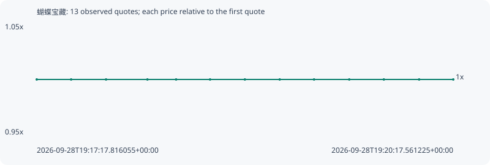

# 蝴蝶宝藏

**bsc** / `0x8b99e444b818d5ca55427501584b15aadd027777`

[All tokens](README.md) · [Market window](../README.md)

## Native assessments

This contract is in the quote cohort; it has no native model assessment in this window.

## Series df21cd63bfb94a4e53b6

Pool: `not supplied`

[Complete series](../series/bsc/df21cd63bfb94a4e53b6.json)

Every dot is a captured quote. Lines connect observations; the curve ends at the last available quote.

| Peak | Final | Return | Maximum drawdown |
| ---: | ---: | ---: | ---: |
| 1.0000x | 1.0000x | +0.00% | 0.00% |

### Complete quote timeline

| Time (UTC) | Price (USD) | Multiple | Evidence |
| --- | ---: | ---: | --- |
| 2026-09-28T19:17:17.816055+00:00 | 0.000133891 | 1.0000x | `capture:7f9359fa-2f23-4e78-9500-f9df7d85a6b2:rank:87` |
| 2026-09-28T19:17:32.654140+00:00 | 0.000133891 | 1.0000x | `capture:4e95b3e2-d20d-4729-ac41-d7699561b97b:rank:86` |
| 2026-09-28T19:17:47.717594+00:00 | 0.000133891 | 1.0000x | `capture:2cc72c7e-c2ae-4eb2-929b-e80f3d8c4e15:rank:83` |
| 2026-09-28T19:18:05.582121+00:00 | 0.000133891 | 1.0000x | `capture:07127a86-393c-4e05-bde5-d28a70a854fb:rank:84` |
| 2026-09-28T19:18:17.953086+00:00 | 0.000133891 | 1.0000x | `capture:ca903b0a-a9a8-4246-873f-5115402fbf9c:rank:85` |
| 2026-09-28T19:18:32.607444+00:00 | 0.000133891 | 1.0000x | `capture:86009bbc-85b0-465e-8657-55be8d6c15de:rank:85` |
| 2026-09-28T19:18:47.632598+00:00 | 0.000133891 | 1.0000x | `capture:bfa4352f-2279-41ec-a6fd-d3e101a21181:rank:82` |
| 2026-09-28T19:19:02.666276+00:00 | 0.000133891 | 1.0000x | `capture:6fe1da90-a254-48b3-b112-ab24c6060e81:rank:79` |
| 2026-09-28T19:19:17.488471+00:00 | 0.000133891 | 1.0000x | `capture:b87f439a-4825-4a6f-b17c-0b78464d9310:rank:81` |
| 2026-09-28T19:19:32.672995+00:00 | 0.000133891 | 1.0000x | `capture:ceae4194-4b79-45b3-9a66-758dd19e2a7b:rank:80` |
| 2026-09-28T19:19:47.615151+00:00 | 0.000133891 | 1.0000x | `capture:0dedf968-cc48-4422-8bbf-180ff2103dbf:rank:79` |
| 2026-09-28T19:20:02.835112+00:00 | 0.000133891 | 1.0000x | `capture:adbb19f8-5a81-4d70-8990-a6ffd414f250:rank:78` |
| 2026-09-28T19:20:17.561225+00:00 | 0.000133891 | 1.0000x | `capture:0feecf05-56c0-4db7-a137-f63b427a7830:rank:88` |

### Exit-policy timeline

Calculated from captured quotes under the window policy. Native assessments are linked separately above.

| Time (UTC) | Action | Price (USD) | Evidence |
| --- | --- | ---: | --- |
| 2026-09-28T19:17:17.816055+00:00 | BUY | 0.000133891 | `capture:7f9359fa-2f23-4e78-9500-f9df7d85a6b2:rank:87` |
| 2026-09-28T19:17:32.654140+00:00 | HOLD | 0.000133891 | `capture:4e95b3e2-d20d-4729-ac41-d7699561b97b:rank:86` |
| 2026-09-28T19:17:47.717594+00:00 | HOLD | 0.000133891 | `capture:2cc72c7e-c2ae-4eb2-929b-e80f3d8c4e15:rank:83` |
| 2026-09-28T19:18:05.582121+00:00 | HOLD | 0.000133891 | `capture:07127a86-393c-4e05-bde5-d28a70a854fb:rank:84` |
| 2026-09-28T19:18:17.953086+00:00 | HOLD | 0.000133891 | `capture:ca903b0a-a9a8-4246-873f-5115402fbf9c:rank:85` |
| 2026-09-28T19:18:32.607444+00:00 | HOLD | 0.000133891 | `capture:86009bbc-85b0-465e-8657-55be8d6c15de:rank:85` |
| 2026-09-28T19:18:47.632598+00:00 | HOLD | 0.000133891 | `capture:bfa4352f-2279-41ec-a6fd-d3e101a21181:rank:82` |
| 2026-09-28T19:19:02.666276+00:00 | HOLD | 0.000133891 | `capture:6fe1da90-a254-48b3-b112-ab24c6060e81:rank:79` |
| 2026-09-28T19:19:17.488471+00:00 | HOLD | 0.000133891 | `capture:b87f439a-4825-4a6f-b17c-0b78464d9310:rank:81` |
| 2026-09-28T19:19:32.672995+00:00 | HOLD | 0.000133891 | `capture:ceae4194-4b79-45b3-9a66-758dd19e2a7b:rank:80` |
| 2026-09-28T19:19:47.615151+00:00 | HOLD | 0.000133891 | `capture:0dedf968-cc48-4422-8bbf-180ff2103dbf:rank:79` |
| 2026-09-28T19:20:02.835112+00:00 | HOLD | 0.000133891 | `capture:adbb19f8-5a81-4d70-8990-a6ffd414f250:rank:78` |
| 2026-09-28T19:20:17.561225+00:00 | HOLD | 0.000133891 | `capture:0feecf05-56c0-4db7-a137-f63b427a7830:rank:88` |
