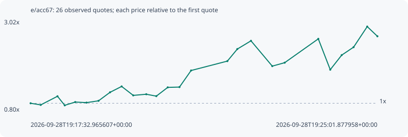

# e/acc67

**solana** / `4KPFYgMQg8Su7ZaqDduSYEZXPmh8fyUgot4yooZtpump`

[All tokens](README.md) · [Market window](../README.md)

## Native assessments

- [2026-09-28T19:17:32.965607Z](../cases/9ef2cfbb24fa2685.md): source parameters and model answers.

## Series 83716a4a23a90abafb97

Pool: `not supplied`

[Complete series](../series/solana/83716a4a23a90abafb97.json)

Every dot is a captured quote. Lines connect observations; the curve ends at the last available quote.

| Peak | Final | Return | Maximum drawdown |
| ---: | ---: | ---: | ---: |
| 2.8650x | 2.6296x | +162.96% | 29.21% |

### Complete quote timeline

| Time (UTC) | Price (USD) | Multiple | Evidence |
| --- | ---: | ---: | --- |
| 2026-09-28T19:17:32.965607+00:00 | 5.70112e-05 | 1.0000x | `capture:0f04cfe5-88a0-4a83-ae8d-85c5cb3cdc89:rank:20` |
| 2026-09-28T19:17:46.087880+00:00 | 5.47349e-05 | 0.9601x | `capture:ee91a1c6-bc99-4c7a-9cdc-bd6cb5478a9b:rank:18` |
| 2026-09-28T19:18:07.749963+00:00 | 6.67017e-05 | 1.1700x | `capture:b0fb1b47-4973-472f-9619-8480bc7d294e:rank:15` |
| 2026-09-28T19:18:17.126008+00:00 | 5.41385e-05 | 0.9496x | `capture:5ed98f51-d1e1-422a-81df-4186a8b0a0a2:rank:14` |
| 2026-09-28T19:18:30.722167+00:00 | 5.86768e-05 | 1.0292x | `capture:9f88d118-9108-4dff-bbfc-246eaed5ce38:rank:11` |
| 2026-09-28T19:18:45.386687+00:00 | 5.79038e-05 | 1.0157x | `capture:f533100a-ce62-4457-9107-42e7601ea5d7:rank:9` |
| 2026-09-28T19:19:00.883835+00:00 | 6.03909e-05 | 1.0593x | `capture:a2495d99-5671-4c7e-b87c-48f48d90f2f2:rank:6` |
| 2026-09-28T19:19:15.826416+00:00 | 7.22228e-05 | 1.2668x | `capture:ba1dc6a3-b8b7-461a-8110-8490f03539a5:rank:5` |
| 2026-09-28T19:19:30.814098+00:00 | 8.03518e-05 | 1.4094x | `capture:b25d90dc-c8db-4388-8a2b-d06541e5320f:rank:4` |
| 2026-09-28T19:19:45.817199+00:00 | 6.79387e-05 | 1.1917x | `capture:722d1b7b-ef4f-4ac5-883c-0557bae2b60b:rank:3` |
| 2026-09-28T19:20:02.715590+00:00 | 6.95196e-05 | 1.2194x | `capture:60ff17d8-3b18-4f61-9bc7-006afd324cf2:rank:2` |
| 2026-09-28T19:20:15.699547+00:00 | 6.68935e-05 | 1.1733x | `capture:10a94828-637f-4580-a9f7-2fbd34d8589a:rank:2` |
| 2026-09-28T19:20:30.480194+00:00 | 7.9041e-05 | 1.3864x | `capture:54722132-db1d-4a2b-8c1c-2b0e71d01430:rank:2` |
| 2026-09-28T19:20:45.683165+00:00 | 7.94649e-05 | 1.3938x | `capture:17963a37-fd65-46b6-8e1c-350082721f8c:rank:2` |
| 2026-09-28T19:21:00.690136+00:00 | 0.000102425 | 1.7966x | `capture:f2ff842d-38e9-4cbe-a281-98c17d5a5672:rank:3` |
| 2026-09-28T19:21:47.649380+00:00 | 0.000115461 | 2.0252x | `capture:0799ec6d-0e89-46b5-ae88-5695bf6c5fc3:rank:2` |
| 2026-09-28T19:22:00.569928+00:00 | 0.000132202 | 2.3189x | `capture:263cda40-4b31-4b2d-b168-fa4310edb46d:rank:1` |
| 2026-09-28T19:22:18.240717+00:00 | 0.000143614 | 2.5190x | `capture:546b2c55-1845-4da7-bc9c-4439cd0ccdba:rank:0` |
| 2026-09-28T19:22:45.783808+00:00 | 0.000108526 | 1.9036x | `capture:9558d322-c429-480b-885f-82f4481c8506:rank:0` |
| 2026-09-28T19:23:01.833252+00:00 | 0.000113268 | 1.9868x | `capture:c5462412-2da1-4432-8949-8fcd1492c57f:rank:0` |
| 2026-09-28T19:23:45.375171+00:00 | 0.000146331 | 2.5667x | `capture:1b404fa0-870b-4e7c-bafd-c3ef241c5093:rank:0` |
| 2026-09-28T19:24:00.852400+00:00 | 0.000103592 | 1.8170x | `capture:5205c587-4734-452c-b758-46c4814dded1:rank:0` |
| 2026-09-28T19:24:15.655418+00:00 | 0.000123775 | 2.1711x | `capture:5b9df0f6-51c0-4dbb-9de7-7df7a46bfee0:rank:0` |
| 2026-09-28T19:24:31.056437+00:00 | 0.000134825 | 2.3649x | `capture:971b5dda-397d-4fe7-b49e-94713bb088df:rank:2` |
| 2026-09-28T19:24:48.687179+00:00 | 0.000163337 | 2.8650x | `capture:feb72cbd-a170-4ba3-8a11-eb1df1686719:rank:1` |
| 2026-09-28T19:25:01.877958+00:00 | 0.000149917 | 2.6296x | `capture:fd6d01ae-d246-439e-ac58-27ae75880eb9:rank:1` |

### Exit-policy timeline

Calculated from captured quotes under the window policy. Native assessments are linked separately above.

| Time (UTC) | Action | Price (USD) | Evidence |
| --- | --- | ---: | --- |
| 2026-09-28T19:17:32.965607+00:00 | BUY | 5.70112e-05 | `capture:0f04cfe5-88a0-4a83-ae8d-85c5cb3cdc89:rank:20` |
| 2026-09-28T19:17:46.087880+00:00 | HOLD | 5.47349e-05 | `capture:ee91a1c6-bc99-4c7a-9cdc-bd6cb5478a9b:rank:18` |
| 2026-09-28T19:18:07.749963+00:00 | HOLD | 6.67017e-05 | `capture:b0fb1b47-4973-472f-9619-8480bc7d294e:rank:15` |
| 2026-09-28T19:18:17.126008+00:00 | HOLD | 5.41385e-05 | `capture:5ed98f51-d1e1-422a-81df-4186a8b0a0a2:rank:14` |
| 2026-09-28T19:18:30.722167+00:00 | HOLD | 5.86768e-05 | `capture:9f88d118-9108-4dff-bbfc-246eaed5ce38:rank:11` |
| 2026-09-28T19:18:45.386687+00:00 | HOLD | 5.79038e-05 | `capture:f533100a-ce62-4457-9107-42e7601ea5d7:rank:9` |
| 2026-09-28T19:19:00.883835+00:00 | HOLD | 6.03909e-05 | `capture:a2495d99-5671-4c7e-b87c-48f48d90f2f2:rank:6` |
| 2026-09-28T19:19:15.826416+00:00 | PROFIT | 7.22228e-05 | `capture:ba1dc6a3-b8b7-461a-8110-8490f03539a5:rank:5` |
| 2026-09-28T19:19:30.814098+00:00 | HOLD_BAG | 8.03518e-05 | `capture:b25d90dc-c8db-4388-8a2b-d06541e5320f:rank:4` |
| 2026-09-28T19:19:45.817199+00:00 | HOLD_BAG | 6.79387e-05 | `capture:722d1b7b-ef4f-4ac5-883c-0557bae2b60b:rank:3` |
| 2026-09-28T19:20:02.715590+00:00 | HOLD_BAG | 6.95196e-05 | `capture:60ff17d8-3b18-4f61-9bc7-006afd324cf2:rank:2` |
| 2026-09-28T19:20:15.699547+00:00 | HOLD_BAG | 6.68935e-05 | `capture:10a94828-637f-4580-a9f7-2fbd34d8589a:rank:2` |
| 2026-09-28T19:20:30.480194+00:00 | HOLD_BAG | 7.9041e-05 | `capture:54722132-db1d-4a2b-8c1c-2b0e71d01430:rank:2` |
| 2026-09-28T19:20:45.683165+00:00 | HOLD_BAG | 7.94649e-05 | `capture:17963a37-fd65-46b6-8e1c-350082721f8c:rank:2` |
| 2026-09-28T19:21:00.690136+00:00 | TP | 0.000102425 | `capture:f2ff842d-38e9-4cbe-a281-98c17d5a5672:rank:3` |
