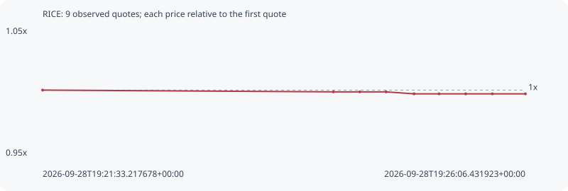

# RICE

**bsc** / `0xb5761f36fdfe2892f1b54bc8ee8babb2a1b698d3`

[All tokens](README.md) · [Market window](../README.md)

## Native assessments

This contract is in the quote cohort; it has no native model assessment in this window.

## Series 0bc71a97bc3654c84e2f

Pool: `not supplied`

[Complete series](../series/bsc/0bc71a97bc3654c84e2f.json)

Every dot is a captured quote. Lines connect observations; the curve ends at the last available quote.

| Peak | Final | Return | Maximum drawdown |
| ---: | ---: | ---: | ---: |
| 1.0000x | 0.9970x | -0.30% | 0.30% |

### Complete quote timeline

| Time (UTC) | Price (USD) | Multiple | Evidence |
| --- | ---: | ---: | --- |
| 2026-09-28T19:21:33.217678+00:00 | 0.00703287 | 1.0000x | `capture:3a34cabb-e5ee-4ff6-9f92-f0839c39884f:rank:99` |
| 2026-09-28T19:24:17.754261+00:00 | 0.00702285 | 0.9986x | `capture:9e642626-a894-4304-aad8-bfad3e85b1e6:rank:97` |
| 2026-09-28T19:24:32.694463+00:00 | 0.00702285 | 0.9986x | `capture:2934d705-4adf-40dc-b5ef-2f9f3edbbe61:rank:97` |
| 2026-09-28T19:24:47.591753+00:00 | 0.00702285 | 0.9986x | `capture:1cb45dcb-fe83-4fcc-8cfd-c5de8d369858:rank:98` |
| 2026-09-28T19:25:03.394485+00:00 | 0.00701164 | 0.9970x | `capture:f1b0620f-7caf-483d-8db4-440b4d786962:rank:82` |
| 2026-09-28T19:25:17.566680+00:00 | 0.00701164 | 0.9970x | `capture:89c3d45d-a145-4312-88dc-a4340e727616:rank:84` |
| 2026-09-28T19:25:32.640282+00:00 | 0.00701164 | 0.9970x | `capture:a41f01eb-b1b7-4ed5-a604-19b71e522502:rank:85` |
| 2026-09-28T19:25:47.745538+00:00 | 0.00701164 | 0.9970x | `capture:b20e5ea5-a03d-4b94-91ce-404a72f5de9b:rank:82` |
| 2026-09-28T19:26:06.431923+00:00 | 0.00701164 | 0.9970x | `capture:a3278748-b5f3-45be-a966-ab473520d9c2:rank:94` |

### Exit-policy timeline

Calculated from captured quotes under the window policy. Native assessments are linked separately above.

| Time (UTC) | Action | Price (USD) | Evidence |
| --- | --- | ---: | --- |
| 2026-09-28T19:21:33.217678+00:00 | BUY | 0.00703287 | `capture:3a34cabb-e5ee-4ff6-9f92-f0839c39884f:rank:99` |
| 2026-09-28T19:24:17.754261+00:00 | HOLD | 0.00702285 | `capture:9e642626-a894-4304-aad8-bfad3e85b1e6:rank:97` |
| 2026-09-28T19:24:32.694463+00:00 | HOLD | 0.00702285 | `capture:2934d705-4adf-40dc-b5ef-2f9f3edbbe61:rank:97` |
| 2026-09-28T19:24:47.591753+00:00 | HOLD | 0.00702285 | `capture:1cb45dcb-fe83-4fcc-8cfd-c5de8d369858:rank:98` |
| 2026-09-28T19:25:03.394485+00:00 | HOLD | 0.00701164 | `capture:f1b0620f-7caf-483d-8db4-440b4d786962:rank:82` |
| 2026-09-28T19:25:17.566680+00:00 | HOLD | 0.00701164 | `capture:89c3d45d-a145-4312-88dc-a4340e727616:rank:84` |
| 2026-09-28T19:25:32.640282+00:00 | HOLD | 0.00701164 | `capture:a41f01eb-b1b7-4ed5-a604-19b71e522502:rank:85` |
| 2026-09-28T19:25:47.745538+00:00 | HOLD | 0.00701164 | `capture:b20e5ea5-a03d-4b94-91ce-404a72f5de9b:rank:82` |
| 2026-09-28T19:26:06.431923+00:00 | HOLD | 0.00701164 | `capture:a3278748-b5f3-45be-a966-ab473520d9c2:rank:94` |
