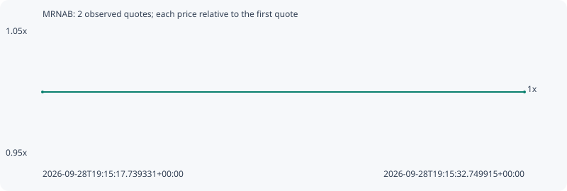

# MRNAB

**bsc** / `0x5fd86da9b05abe396fe9d02a4a213a7c00556503`

[All tokens](README.md) · [Market window](../README.md)

## Native assessments

This contract is in the quote cohort; it has no native model assessment in this window.

## Series be851a92aa81753b35e3

Pool: `not supplied`

[Complete series](../series/bsc/be851a92aa81753b35e3.json)

Every dot is a captured quote. Lines connect observations; the curve ends at the last available quote.

| Peak | Final | Return | Maximum drawdown |
| ---: | ---: | ---: | ---: |
| 1.0000x | 1.0000x | +0.00% | 0.00% |

### Complete quote timeline

| Time (UTC) | Price (USD) | Multiple | Evidence |
| --- | ---: | ---: | --- |
| 2026-09-28T19:15:17.739331+00:00 | 198.503 | 1.0000x | `capture:08cc1e53-32bc-48e9-9abe-0b7caf40b440:rank:94` |
| 2026-09-28T19:15:32.749915+00:00 | 198.503 | 1.0000x | `capture:81e75e19-4c52-4e91-ba7d-af89c6539b19:rank:95` |

### Exit-policy timeline

Calculated from captured quotes under the window policy. Native assessments are linked separately above.

| Time (UTC) | Action | Price (USD) | Evidence |
| --- | --- | ---: | --- |
| 2026-09-28T19:15:17.739331+00:00 | BUY | 198.503 | `capture:08cc1e53-32bc-48e9-9abe-0b7caf40b440:rank:94` |
| 2026-09-28T19:15:32.749915+00:00 | HOLD | 198.503 | `capture:81e75e19-4c52-4e91-ba7d-af89c6539b19:rank:95` |
