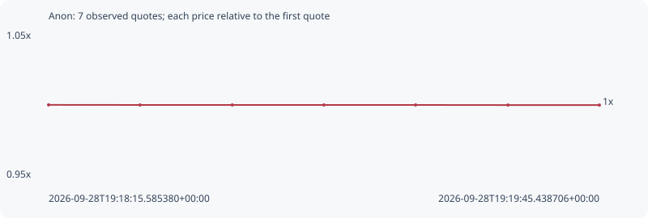

# Anon

**robinhood** / `0x79bbf4508b1391af3a0f4b30bb5fc4aa9ab0e07c`

[All tokens](README.md) · [Market window](../README.md)

## Native assessments

This contract is in the quote cohort; it has no native model assessment in this window.

## Series 656ac3dab886349ede0a

Pool: `not supplied`

[Complete series](../series/robinhood/656ac3dab886349ede0a.json)

Every dot is a captured quote. Lines connect observations; the curve ends at the last available quote.

| Peak | Final | Return | Maximum drawdown |
| ---: | ---: | ---: | ---: |
| 1.0000x | 0.9999x | -0.01% | 0.01% |

### Complete quote timeline

| Time (UTC) | Price (USD) | Multiple | Evidence |
| --- | ---: | ---: | --- |
| 2026-09-28T19:18:15.585380+00:00 | 0.329051 | 1.0000x | `capture:ea19027f-d2c1-43cc-973f-0d8eb46ed64e:rank:38` |
| 2026-09-28T19:18:30.489414+00:00 | 0.329031 | 0.9999x | `capture:c5cd70df-4ca4-4388-b3c5-f977fa86f8a2:rank:40` |
| 2026-09-28T19:18:45.550203+00:00 | 0.329031 | 0.9999x | `capture:728d4974-5fe3-40a8-8e99-2139c59da3e3:rank:43` |
| 2026-09-28T19:19:00.487408+00:00 | 0.329031 | 0.9999x | `capture:297e4fae-3bb5-49eb-b490-a4f34898851c:rank:43` |
| 2026-09-28T19:19:15.451095+00:00 | 0.329031 | 0.9999x | `capture:0bcc0576-3637-4b2c-b0e4-f9e05871b187:rank:45` |
| 2026-09-28T19:19:30.512866+00:00 | 0.329008 | 0.9999x | `capture:bb499bdc-159a-4072-a450-312045f32cef:rank:44` |
| 2026-09-28T19:19:45.438706+00:00 | 0.329008 | 0.9999x | `capture:59b12f7b-2112-42c7-834a-a2eb9bcaee3d:rank:47` |

### Exit-policy timeline

Calculated from captured quotes under the window policy. Native assessments are linked separately above.

| Time (UTC) | Action | Price (USD) | Evidence |
| --- | --- | ---: | --- |
| 2026-09-28T19:18:15.585380+00:00 | BUY | 0.329051 | `capture:ea19027f-d2c1-43cc-973f-0d8eb46ed64e:rank:38` |
| 2026-09-28T19:18:30.489414+00:00 | HOLD | 0.329031 | `capture:c5cd70df-4ca4-4388-b3c5-f977fa86f8a2:rank:40` |
| 2026-09-28T19:18:45.550203+00:00 | HOLD | 0.329031 | `capture:728d4974-5fe3-40a8-8e99-2139c59da3e3:rank:43` |
| 2026-09-28T19:19:00.487408+00:00 | HOLD | 0.329031 | `capture:297e4fae-3bb5-49eb-b490-a4f34898851c:rank:43` |
| 2026-09-28T19:19:15.451095+00:00 | HOLD | 0.329031 | `capture:0bcc0576-3637-4b2c-b0e4-f9e05871b187:rank:45` |
| 2026-09-28T19:19:30.512866+00:00 | HOLD | 0.329008 | `capture:bb499bdc-159a-4072-a450-312045f32cef:rank:44` |
| 2026-09-28T19:19:45.438706+00:00 | HOLD | 0.329008 | `capture:59b12f7b-2112-42c7-834a-a2eb9bcaee3d:rank:47` |
